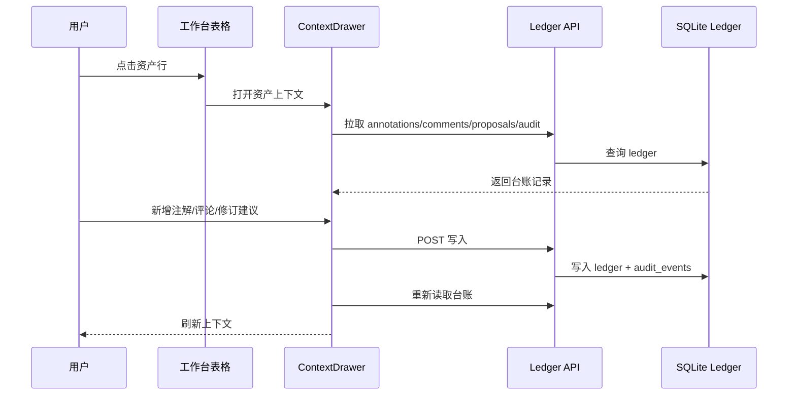

# Ledger UI Phase 2 Implementation

## 1. 实施范围

本阶段把阶段 1 的 SQLite ledger API 接入前端工作台：

- 表格行变成资产入口。
- 新增统一 `ContextDrawer`。
- 抽屉支持详情、注解、评论、修订建议、审计事件 5 个 tab。
- 本体对象、关系、指标字典和 KPI 树保持 canonical read-only。
- 所有新增内容写入 SQLite ledger，不直接覆盖 canonical 表。

## 2. 已接入模块

| 模块 | 资产类型 | 行为 |
|---|---|---|
| 对象本体 | `ontology_object`, `ontology_link` | 只读详情 + 注解/评论/修订建议 |
| 标签工程 | `tag` | 详情 + 注解/评论/修订建议 |
| 维度工程 | `dimension` | 详情 + 注解/评论/修订建议 |
| 指标工程 | `metric` | 详情 + 注解/评论/修订建议 |
| 指标字典 2.0 | `metric` | 只读详情 + 注解/评论/修订建议 |
| 指标体系树 | `metric` | 只读详情 + 注解/评论/修订建议 |
| 血缘与质量 | `lineage_edge`, `governance_task` | 详情 + 注解/评论/修订建议 |
| ChatBI 语义 | `chatbi_context` | 详情 + 注解/评论/修订建议 |
| 决策闭环 | `decision_log`, `action_task` | 详情 + 注解/评论/修订建议 |

## 3. 交互流

## 4. 前端组件

| 组件 | 说明 |
|---|---|
| `DataTable` | 增加行点击和键盘 Enter/Space 打开资产 |
| `ContextDrawer` | 右侧资产上下文抽屉 |
| `FieldList` | 展示资产字段 |
| `LedgerList` | 展示注解、评论、修订建议、审计事件 |
| `makeAsset` | 把表格行转换为统一 `AssetRef` |

## 5. 验证证据

本地服务端口：`127.0.0.1:5185`

已验证：

- `npm run check`：通过。
- `npm run build`：通过。
- `/` 静态页面返回构建产物。
- `/api/deploy/health` 返回 `ok=true` 和 `database.ledger.writable=true`。
- 构建产物包含抽屉关键文案：`资产上下文抽屉`、`新增注解`、`提交修订建议`、`canonical read-only`、`ledger writable`。
- API smoke 验证 annotation/comment/revision proposal 创建和读取通过。
- `codex_phase2_smoke` 测试数据已清理。

未完成：

- 本地未安装 `playwright` 包，因此本阶段没有执行浏览器自动点击 E2E。
- 尚未部署腾讯云。
- 尚未做阶段 3 AI 知识库索引。

## 6. 下一步

进入阶段 3 前建议先做一次轻量浏览器人工验收：

1. 打开指标字典。
2. 点击任意 L3 指标。
3. 在右侧抽屉新增注解。
4. 提交修订建议。
5. 查看审计 tab 是否出现写入事件。

通过后再推进 AI 知识库主题域和本地检索。
