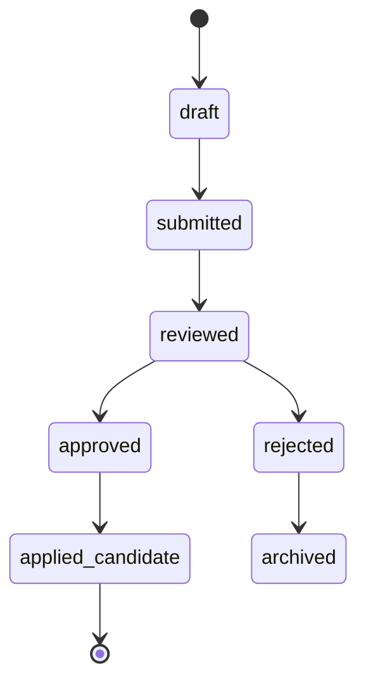
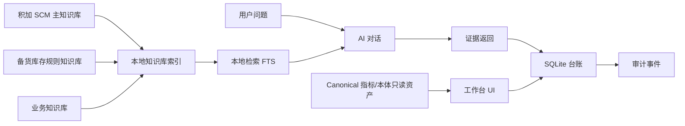

# 二次迭代数据模型设计

## 1. 设计原则

- Canonical 资产只读：`ontology_objects`、`ontology_links`、`metrics`、`dimensions` 等已有基础资产不被 UI 直接覆盖。
- 工作台操作写入 SQLite ledger：注解、评论、修订建议、流程、AI 对话、检索证据全部进入新台账表。
- 软删除优先：没有登录前不做不可逆删除，所有删除动作记录为 `archived` 或 `voided`。
- 证据优先：AI 答案、指标修订和知识库卡片都必须保留 source path、片段、置信说明。
- 可迁移：SQLite 表设计保持接近未来 Postgres 形态，避免后续重构成本过高。

## 2. 资产分层

| 层级 | 表/对象 | 可写性 | 说明 |
|---|---|---|---|
| Canonical 本体层 | `ontology_objects`, `ontology_links` | 只读 | 只允许注解、评论、修订建议 |
| Canonical 指标层 | `metrics`, `metric_dimensions`, `kpi_tree` | 只读 | 指标字典 2.0 不直接改 |
| 可编辑治理层 | `tags`, `dimensions` 的候选扩展 | 可写候选 | 新增/编辑先写入候选表或 revision |
| Ledger 台账层 | 注解、评论、修订建议、流程、审计 | 可写 | 本轮核心增量 |
| AI 知识层 | 知识库主题、卡片、chunks、检索证据 | 可写索引 | 来源文件保持只读，索引可重建 |

## 3. 新增核心表

### 3.1 通用注解与评论

```sql
CREATE TABLE asset_annotations (
  id TEXT PRIMARY KEY,
  asset_type TEXT NOT NULL,
  asset_id TEXT NOT NULL,
  title TEXT NOT NULL,
  body TEXT NOT NULL,
  annotation_type TEXT NOT NULL,
  status TEXT NOT NULL DEFAULT 'active',
  created_by TEXT NOT NULL DEFAULT 'local_user',
  created_at TEXT NOT NULL,
  updated_at TEXT NOT NULL
);

CREATE TABLE asset_comments (
  id TEXT PRIMARY KEY,
  asset_type TEXT NOT NULL,
  asset_id TEXT NOT NULL,
  body TEXT NOT NULL,
  parent_id TEXT,
  status TEXT NOT NULL DEFAULT 'active',
  created_by TEXT NOT NULL DEFAULT 'local_user',
  created_at TEXT NOT NULL
);
```

适用资产：

- `ontology_object`
- `ontology_link`
- `metric`
- `dimension`
- `tag`
- `kb_card`
- `lineage_edge`
- `quality_rule`
- `kpi_canvas_node`

### 3.2 修订建议

```sql
CREATE TABLE revision_proposals (
  id TEXT PRIMARY KEY,
  asset_type TEXT NOT NULL,
  asset_id TEXT NOT NULL,
  proposal_type TEXT NOT NULL,
  current_value TEXT,
  proposed_value TEXT NOT NULL,
  reason TEXT NOT NULL,
  evidence_refs TEXT NOT NULL,
  status TEXT NOT NULL DEFAULT 'draft',
  reviewer TEXT,
  review_note TEXT,
  created_by TEXT NOT NULL DEFAULT 'local_user',
  created_at TEXT NOT NULL,
  updated_at TEXT NOT NULL
);
```

状态机：



说明：

- `approved` 不代表已经改写 canonical。
- `applied_candidate` 代表已经进入候选资产或后续开发任务。
- 若未来增加登录，可将 `created_by` 和 `reviewer` 替换为用户表外键。

### 3.3 治理流程与审计

```sql
CREATE TABLE workflow_instances (
  id TEXT PRIMARY KEY,
  workflow_type TEXT NOT NULL,
  asset_type TEXT NOT NULL,
  asset_id TEXT NOT NULL,
  status TEXT NOT NULL DEFAULT 'open',
  priority TEXT NOT NULL DEFAULT 'medium',
  owner TEXT,
  due_date TEXT,
  created_by TEXT NOT NULL DEFAULT 'local_user',
  created_at TEXT NOT NULL,
  updated_at TEXT NOT NULL
);

CREATE TABLE workflow_steps (
  id TEXT PRIMARY KEY,
  workflow_id TEXT NOT NULL,
  step_key TEXT NOT NULL,
  step_name TEXT NOT NULL,
  status TEXT NOT NULL DEFAULT 'pending',
  note TEXT,
  completed_by TEXT,
  completed_at TEXT,
  FOREIGN KEY (workflow_id) REFERENCES workflow_instances(id)
);

CREATE TABLE audit_events (
  id TEXT PRIMARY KEY,
  event_type TEXT NOT NULL,
  asset_type TEXT,
  asset_id TEXT,
  payload TEXT NOT NULL,
  actor TEXT NOT NULL DEFAULT 'local_user',
  created_at TEXT NOT NULL
);
```

### 3.4 AI 知识库

```sql
CREATE TABLE kb_domains (
  id TEXT PRIMARY KEY,
  name TEXT NOT NULL,
  description TEXT NOT NULL,
  source_scope TEXT NOT NULL,
  status TEXT NOT NULL DEFAULT 'active',
  created_at TEXT NOT NULL
);

CREATE TABLE kb_sources (
  id TEXT PRIMARY KEY,
  domain_id TEXT NOT NULL,
  source_type TEXT NOT NULL,
  source_path TEXT NOT NULL,
  title TEXT NOT NULL,
  checksum TEXT,
  extracted_at TEXT,
  status TEXT NOT NULL DEFAULT 'indexed',
  FOREIGN KEY (domain_id) REFERENCES kb_domains(id)
);

CREATE TABLE kb_cards (
  id TEXT PRIMARY KEY,
  domain_id TEXT NOT NULL,
  source_id TEXT NOT NULL,
  title TEXT NOT NULL,
  summary TEXT NOT NULL,
  business_terms TEXT NOT NULL,
  related_assets TEXT NOT NULL,
  evidence_level TEXT NOT NULL,
  status TEXT NOT NULL DEFAULT 'active',
  created_at TEXT NOT NULL,
  FOREIGN KEY (domain_id) REFERENCES kb_domains(id),
  FOREIGN KEY (source_id) REFERENCES kb_sources(id)
);

CREATE TABLE kb_chunks (
  id TEXT PRIMARY KEY,
  card_id TEXT NOT NULL,
  source_id TEXT NOT NULL,
  chunk_text TEXT NOT NULL,
  chunk_index INTEGER NOT NULL,
  token_estimate INTEGER,
  metadata TEXT NOT NULL,
  FOREIGN KEY (card_id) REFERENCES kb_cards(id),
  FOREIGN KEY (source_id) REFERENCES kb_sources(id)
);
```

本地检索第一阶段可以先用 SQLite FTS5：

```sql
CREATE VIRTUAL TABLE kb_chunks_fts
USING fts5(chunk_text, title, business_terms, content='kb_chunks', content_rowid='rowid');
```

### 3.5 AI 对话与证据

```sql
CREATE TABLE ai_chat_sessions (
  id TEXT PRIMARY KEY,
  title TEXT NOT NULL,
  scope_domains TEXT NOT NULL,
  status TEXT NOT NULL DEFAULT 'active',
  created_at TEXT NOT NULL,
  updated_at TEXT NOT NULL
);

CREATE TABLE ai_chat_messages (
  id TEXT PRIMARY KEY,
  session_id TEXT NOT NULL,
  role TEXT NOT NULL,
  content TEXT NOT NULL,
  answerability TEXT,
  created_at TEXT NOT NULL,
  FOREIGN KEY (session_id) REFERENCES ai_chat_sessions(id)
);

CREATE TABLE ai_retrieval_evidence (
  id TEXT PRIMARY KEY,
  message_id TEXT NOT NULL,
  source_id TEXT NOT NULL,
  card_id TEXT,
  chunk_id TEXT,
  score REAL,
  evidence_text TEXT NOT NULL,
  evidence_path TEXT NOT NULL,
  created_at TEXT NOT NULL,
  FOREIGN KEY (message_id) REFERENCES ai_chat_messages(id)
);
```

回答分级：

- `supported`：本地证据足够支撑。
- `partial`：有相关证据，但不足以完整回答。
- `insufficient`：证据不足，必须拒答或建议补充数据。
- `conflict`：知识库之间存在冲突，需要人工裁决。

### 3.6 指标体系画布

```sql
CREATE TABLE kpi_canvas_nodes (
  id TEXT PRIMARY KEY,
  metric_id TEXT,
  node_type TEXT NOT NULL,
  label TEXT NOT NULL,
  level TEXT NOT NULL,
  x REAL NOT NULL,
  y REAL NOT NULL,
  width REAL NOT NULL,
  height REAL NOT NULL,
  style TEXT NOT NULL,
  status TEXT NOT NULL DEFAULT 'active',
  created_at TEXT NOT NULL,
  updated_at TEXT NOT NULL
);

CREATE TABLE kpi_canvas_edges (
  id TEXT PRIMARY KEY,
  source_node_id TEXT NOT NULL,
  target_node_id TEXT NOT NULL,
  relation_type TEXT NOT NULL,
  label TEXT,
  style TEXT NOT NULL,
  FOREIGN KEY (source_node_id) REFERENCES kpi_canvas_nodes(id),
  FOREIGN KEY (target_node_id) REFERENCES kpi_canvas_nodes(id)
);
```

## 4. CRUD 权限矩阵

| 资产 | Create | Read | Update | Delete | 本轮策略 |
|---|---|---|---|---|---|
| 本体对象 | 否 | 是 | 否 | 否 | 只读，写注解/评论/修订建议 |
| 本体关系 | 否 | 是 | 否 | 否 | 只读，写注解/评论/修订建议 |
| 指标字典 2.0 | 否 | 是 | 否 | 否 | 只读，写注解/评论/修订建议 |
| 标签 | 是 | 是 | 是 | 软删除 | 台账化治理 |
| 维度候选 | 是 | 是 | 是 | 软删除 | 通过流程后再进入正式维度 |
| 指标候选 | 是 | 是 | 是 | 软删除 | 不直接污染指标字典 2.0 |
| 知识库索引 | 是 | 是 | 重建 | 软删除 | 来源只读，索引可重建 |
| AI 对话 | 是 | 是 | 仅标题/归档 | 归档 | 保留证据 |
| 决策任务 | 是 | 是 | 是 | 归档 | 审计记录必留 |

## 5. API 设计

### 5.1 Ledger 通用接口

| 方法 | 路径 | 用途 |
|---|---|---|
| `GET` | `/api/ledger/:assetType/:assetId/annotations` | 读取注解 |
| `POST` | `/api/ledger/:assetType/:assetId/annotations` | 新增注解 |
| `PATCH` | `/api/ledger/annotations/:id` | 更新注解状态或内容 |
| `GET` | `/api/ledger/:assetType/:assetId/comments` | 读取评论 |
| `POST` | `/api/ledger/:assetType/:assetId/comments` | 新增评论 |
| `POST` | `/api/revision-proposals` | 创建修订建议 |
| `PATCH` | `/api/revision-proposals/:id/review` | 审核修订建议 |

### 5.2 AI 知识库接口

| 方法 | 路径 | 用途 |
|---|---|---|
| `GET` | `/api/kb/domains` | 主题域列表 |
| `GET` | `/api/kb/cards` | 知识卡搜索和筛选 |
| `GET` | `/api/kb/cards/:id` | 知识卡详情 |
| `POST` | `/api/kb/reindex` | 重建本地索引 |
| `POST` | `/api/ai-chat/local` | 本地检索问答 |
| `GET` | `/api/ai-chat/sessions/:id` | 对话与证据回放 |

### 5.3 指标画布接口

| 方法 | 路径 | 用途 |
|---|---|---|
| `GET` | `/api/kpi-canvas` | 读取节点和边 |
| `PATCH` | `/api/kpi-canvas/nodes/:id/layout` | 保存节点位置 |
| `GET` | `/api/kpi-canvas/nodes/:id/context` | 节点详情、证据、注解 |
| `POST` | `/api/kpi-canvas/nodes/:id/revision-proposals` | 对节点提交修订建议 |

## 6. 数据流



## 7. 数据质量约束

- 所有写入表必须有 `created_at`。
- 所有修改类表必须有 `updated_at`。
- 所有用户可编辑内容必须写 `audit_events`。
- `revision_proposals.evidence_refs` 不允许为空。
- `ai_chat_messages.answerability=insufficient` 时，回答正文必须包含无法证明原因。
- `kb_sources.source_path` 必须保留原始相对路径或绝对路径，便于追溯。

## 8. 迁移顺序

1. 增加 ledger schema 和迁移脚本。
2. 为现有 read-only 资产增加注解/评论读取接口。
3. 增加修订建议接口。
4. 增加知识库主题域和本地索引。
5. 增加 AI 本地检索问答。
6. 增加指标画布节点/边生成与交互存储。
7. 接入审计事件和健康检查。

## 9. 未确定项

- SQLite FTS 是否足够支撑中文分词。第一阶段可用简单 tokenizer，第二阶段评估外部 embedding。
- 无登录状态下 `created_by` 只能使用 `local_user` 或浏览器本地昵称，不能作为正式权限证据。
- DeepSeek/Kimi 接入需要单独确认模型、密钥、调用边界、日志脱敏和费用控制。
