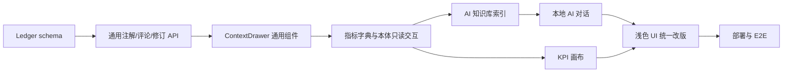

# 二次迭代实施计划

## 1. 目标

把当前展示型原型升级为可操作的供应链数据治理工作台。

本轮完成后，应具备：

- SQLite 工作台账本。
- 所有工作台基础 CRUD 或台账化交互。
- 指标体系画布。
- AI 知识库主题域。
- 本地检索 + 证据返回的 AI 对话。
- 浅色咨询风格 UI。

## 2. 阶段计划

### 阶段 1：SQLite 台账基座

| 任务 | 预计 | 依赖 | 完成标准 |
|---|---:|---|---|
| 编写 ledger schema 迁移 | 4h | 当前 SQLite | 新表可创建，重复执行安全 |
| 增加审计事件写入工具 | 3h | schema | 写操作自动记录 `audit_events` |
| 增加注解/评论 API | 4h | schema | 任意资产可读写注解和评论 |
| 增加修订建议 API | 4h | schema | 可创建、查询、审核修订建议 |
| 增加健康检查字段 | 2h | API | `/api/deploy/health` 返回 ledger 状态 |

### 阶段 2：工作台通用交互

| 任务 | 预计 | 依赖 | 完成标准 |
|---|---:|---|---|
| 实现 `ContextDrawer` | 5h | 前端现有布局 | 支持详情、证据、注解、评论、修订建议 tab |
| 实现 `AnnotationPanel` | 4h | 注解 API | 能新增、编辑、归档注解 |
| 实现 `RevisionProposalForm` | 4h | 修订 API | 能从各资产页面提交建议 |
| 更新 10 个既有工作台 | 8h | 通用组件 | 每页都有可操作入口 |
| 增加审计日志视图 | 4h | audit API | 能查看最近操作 |

### 阶段 3：AI 知识库

| 任务 | 预计 | 依赖 | 完成标准 |
|---|---:|---|---|
| 建立主题域 seed | 3h | 三大知识库路径 | 主题域可查询 |
| 实现知识源扫描 | 5h | 本地文件 | 生成 `kb_sources` |
| 实现知识卡/片段索引 | 8h | SQLite FTS | 可按关键词搜索知识卡 |
| 实现 AI 知识库页面 | 6h | API | 可浏览主题域、卡片、来源证据 |
| 建立资产 crosswalk | 5h | 指标/本体数据 | 知识卡可关联指标、对象、规则 |

### 阶段 4：本地 AI 对话

| 任务 | 预计 | 依赖 | 完成标准 |
|---|---:|---|---|
| 实现本地检索服务 | 5h | FTS 索引 | 输入问题返回 top evidence |
| 实现回答生成模板 | 4h | 检索服务 | 输出支持/部分/不足/冲突四类答案 |
| 实现对话台账 | 4h | AI chat 表 | 问题、答案、证据可回放 |
| 实现 AI 对话页面 | 6h | API | 对话流和证据面板可用 |
| 增加拒答机制 | 3h | 模板 | 证据不足时不编造结论 |

### 阶段 5：指标体系画布

| 任务 | 预计 | 依赖 | 完成标准 |
|---|---:|---|---|
| 从 MECE V2 生成画布节点 | 5h | 指标数据 | L0-L3 节点可生成 |
| 实现画布布局算法 | 6h | 节点数据 | 默认布局可阅读 |
| 实现点击详情抽屉 | 4h | ContextDrawer | 节点详情、证据、注解可见 |
| 实现展开/收起和搜索 | 5h | 画布组件 | 可定位 L3 指标 |
| 保存节点布局 | 3h | canvas API | 拖拽位置可持久化 |

### 阶段 6：浅色咨询风格 UI

| 任务 | 预计 | 依赖 | 完成标准 |
|---|---:|---|---|
| 重构全局 layout | 5h | 现有 React | 浅色侧边导航、顶部栏、主工作区 |
| 重写设计 token | 3h | CSS | 使用暖灰背景、navy/accent/sage/ochre |
| 更新卡片/表格/按钮状态 | 6h | token | 视觉统一、信息层级清晰 |
| 移动端和窄屏适配 | 4h | layout | 页面不重叠、不溢出 |
| 截图视觉验收 | 3h | 本地服务 | 关键页面截图通过 |

### 阶段 7：部署与 E2E 验收

| 任务 | 预计 | 依赖 | 完成标准 |
|---|---:|---|---|
| 本地 build/check | 2h | 实现完成 | 构建通过 |
| 本地 API smoke | 2h | 服务启动 | health、ledger、kb、chat、canvas API 通过 |
| 浏览器 E2E | 4h | 本地服务 | 关键工作流能在页面完成 |
| Docker 镜像构建 | 2h | build | 镜像可启动 |
| 腾讯云灰度部署 | 4h | 服务器 | 容器 healthy，HTTPS 页面可访问 |
| 生产只读验收 | 3h | 部署 | 无外部模型调用、无业务系统写回 |

## 3. 关键依赖

- 当前 SQLite 文件和数据导入脚本。
- 三大知识库的本地文件路径。
- MECE V2 指标蓝图 JSON。
- 当前 React/Vite/Node 服务结构。
- 现有腾讯云 Docker/Nginx 部署环境。

## 4. 风险与缓解

| 风险 | 影响 | 缓解 |
|---|---|---|
| 无登录导致误操作不可归属 | 中 | 使用 `local_user`、审计日志、软删除；后续再加登录 |
| 中文 FTS 检索质量不足 | 中 | 第一阶段关键词检索，第二阶段接 embedding 或外部模型 |
| 指标字典被误改 | 高 | canonical 表只读，所有改动进入 `revision_proposals` |
| 画布节点过多难读 | 中 | 默认展示 L0-L2，按需展开 L3 |
| UI 改版影响既有页面 | 中 | 先做 layout/token，再逐页迁移 |
| 外部模型过早接入导致证据链不稳 | 高 | 本轮不接外部模型，只做本地检索和模板化回答 |

## 5. 验收用例

| 用例 | 步骤 | 预期 |
|---|---|---|
| 本体对象注解 | 打开对象本体 -> 选择 SKU -> 新增注解 | 注解写入 SQLite，详情抽屉展示 |
| 指标修订建议 | 打开指标字典 -> 搜索库存相关指标 -> 提交修订建议 | canonical 未改，proposal 为 `draft/submitted` |
| KPI 画布点击 | 打开指标体系画布 -> 点击 L3 指标 | 右侧展示指标详情和注解入口 |
| AI 知识检索 | 打开 AI 知识库 -> 搜索“备货业务库存” | 返回规则卡和来源路径 |
| AI 对话拒答 | 提问当前知识库无法证明的问题 | 返回证据不足，不编造答案 |
| 决策任务闭环 | 从 AI 答案保存为洞察 -> 创建行动任务 | `decision_logs/action_tasks/audit_events` 有记录 |

## 6. 推荐执行顺序

## 7. 完成定义

- 文档、代码、数据库迁移、部署说明同步更新。
- 本地 `npm run check` 和 `npm run build` 通过。
- API smoke 覆盖 health、ledger、kb、chat、canvas。
- 浏览器 E2E 覆盖至少 6 条验收用例。
- 腾讯云部署完成后，公网 HTTPS 可访问。
- closeout 明确说明：是否调用外部模型、是否写生产业务系统、是否仍为 prototype。
