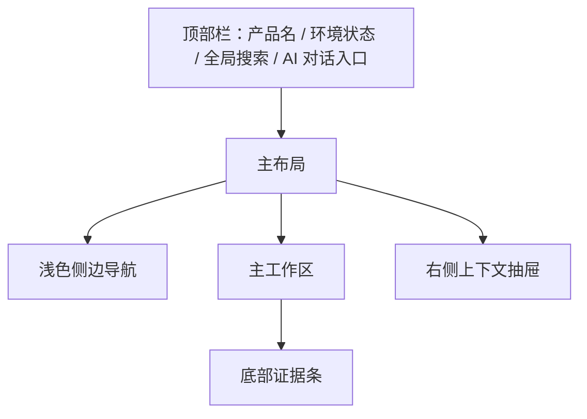
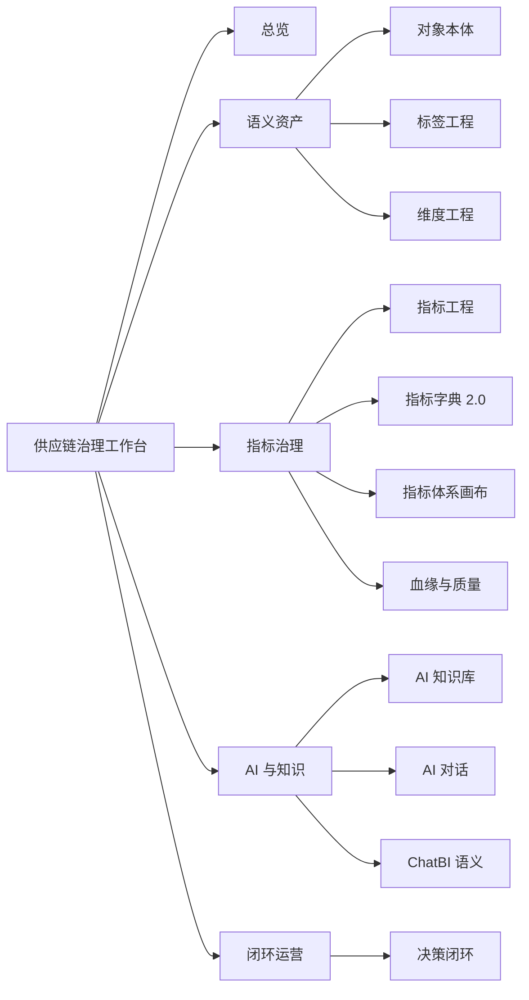
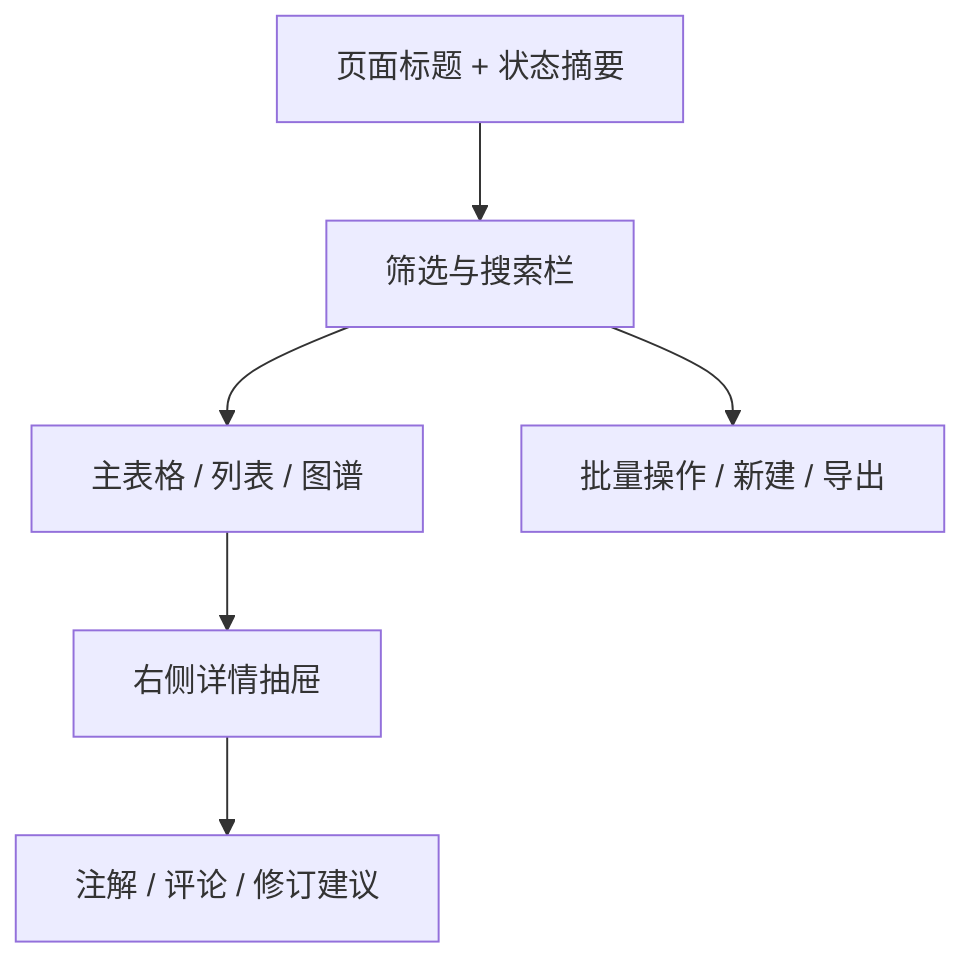
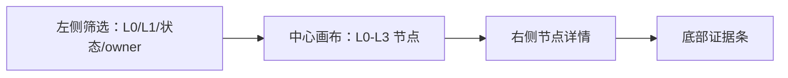
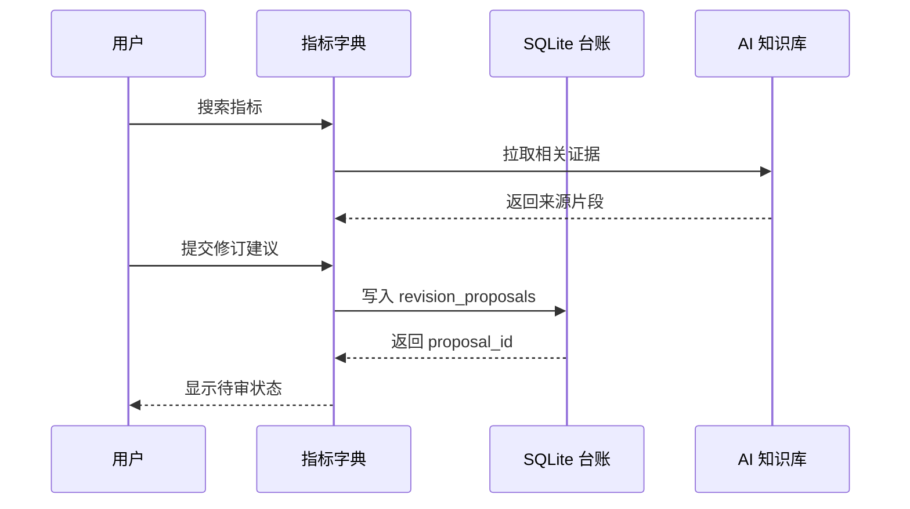
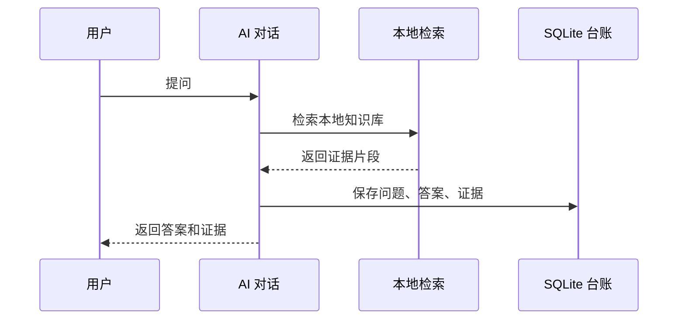
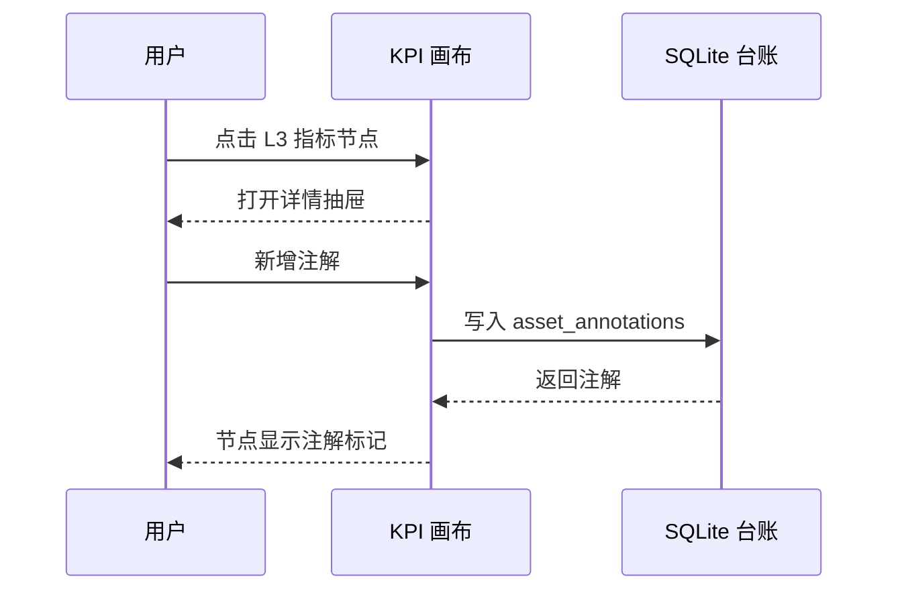

# 二次迭代 UI 信息架构

## 1. 设计目标

本轮 UI 从“深色后台导航 + 展示卡片”升级为“浅色咨询风格 + 可操作治理工作台”。

体验目标：

- 用户一进入页面就能判断治理健康度、待办风险和最近变更。
- 每个资产详情都有右侧上下文抽屉，承载证据、注解、评论和修订建议。
- 指标体系画布成为核心工作入口，而不是静态层级表。
- AI 知识库和 AI 对话要明确展示证据，不制造“无引用结论”。
- 页面视觉参考 Umbrex 的专业咨询调性：浅底、细线、克制色彩、强信息层级。

## 2. 全局布局



布局规则：

- 顶部栏高度保持紧凑，承载全局搜索和状态，不做营销型 hero。
- 左侧导航使用浅底，不使用深色底。
- 主工作区按“筛选区 -> 操作区 -> 结果区”组织。
- 右侧抽屉用于资产上下文，避免页面跳转打断治理流。
- 底部证据条只在 AI、指标、血缘、知识库相关页面出现。

## 3. 导航结构



侧边导航分组：

- 总览
- 语义资产：对象本体、标签工程、维度工程
- 指标治理：指标工程、指标字典 2.0、指标体系画布、血缘与质量
- AI 与知识：AI 知识库、AI 对话、ChatBI 语义
- 闭环运营：决策闭环

## 4. 页面模板

### 4.1 标准工作台模板

适用于标签、维度、指标工程、血缘质量、决策闭环。



关键组件：

- 状态摘要：总数、待审、已认证、风险、最近更新。
- 筛选栏：状态、owner、生命周期、知识库来源、对象类型。
- 主表格：固定首列，支持行点击。
- 右侧抽屉：详情、证据、注解、评论、修订建议四个 tab。

### 4.2 对象本体工作台

本体只读，但允许讨论和建议。

页面结构：

- 左侧对象类型列表：SKU、Listing、Supplier、PO、Warehouse、InventoryBatch 等。
- 中间对象关系图：展示对象类型和关系。
- 右侧对象详情：属性、关系、状态、关联指标、关联标签。
- 操作区：新增注解、评论、提交修订建议。

禁用动作：

- 不显示“编辑本体对象”主按钮。
- 不显示“删除对象”按钮。
- 不直接保存对象属性变更。

### 4.3 指标字典 2.0

指标字典保持 canonical read-only。

页面结构：

- 顶部：指标搜索、L0/L1/L2/L3 筛选、认证状态筛选。
- 中间：指标表格，显示口径、粒度、方向、owner、可用维度、状态。
- 右侧：指标详情，含公式、字段映射、血缘、知识库证据。
- 操作：注解、评论、修订建议、复制引用。

### 4.4 指标体系画布



节点交互：

- 单击：选中节点，打开详情。
- 双击：展开或收起子节点。
- 右键或更多菜单：新增注解、评论、修订建议、复制节点引用。
- 拖拽：调整局部布局，保存到 `kpi_canvas_nodes`。
- 搜索：定位节点并高亮上下游路径。

节点视觉：

- L0：深蓝边框、轻填充。
- L1：中等字号、宽卡片。
- L2：细线卡片。
- L3：小节点，按认证状态显示边框颜色。
- 有风险或证据不足：使用 ochre 状态点，不用大面积警告色。

### 4.5 AI 知识库

页面结构：

- 顶部主题域卡片：积加系统语义域、备货库存规则域、供应链运营方法域、指标体系蓝图域、数据质量与血缘域、决策场景域。
- 左侧筛选：来源知识库、主题域、资产类型、证据等级、更新时间。
- 中间知识卡列表：标题、摘要、业务术语、关联指标/对象。
- 右侧知识卡详情：原文片段、来源路径、crosswalk、相关问题。

核心动作：

- 搜索知识卡。
- 查看来源证据。
- 将知识卡关联到指标、对象、标签或维度。
- 提交知识卡整理建议。

### 4.6 AI 对话

页面结构：

- 左侧：知识范围选择、主题域开关、历史对话。
- 中间：对话流。
- 右侧：证据面板，展示命中的知识卡、片段、路径、证据等级。
- 底部：输入框、提问模板、保存为洞察、保存为修订建议。

回答规则：

- 每条答案必须有证据面板。
- 证据不足时展示“当前知识库无法证明”，并列出建议补充的数据。
- 出现知识库冲突时展示冲突来源，不做单边裁决。

## 5. 关键用户流

### 5.1 指标口径修订流



### 5.2 AI 知识问答流



### 5.3 KPI 画布注解流



## 6. 组件清单

| 组件 | 用途 |
|---|---|
| `ShellLayout` | 顶部栏、侧边导航、主区、抽屉 |
| `WorkbenchHeader` | 页面标题、状态摘要、主操作 |
| `FilterRail` | 统一筛选控件 |
| `AssetTable` | 资产列表 |
| `ContextDrawer` | 详情、证据、注解、评论、修订建议 |
| `AnnotationPanel` | 注解和评论 |
| `RevisionProposalForm` | 修订建议表单 |
| `EvidenceStrip` | 底部证据条 |
| `KpiCanvas` | 指标画布 |
| `KnowledgeDomainGrid` | AI 知识库主题域 |
| `EvidenceChat` | 本地检索问答 |
| `StatusBadge` | 生命周期状态 |

## 7. 设计 Token

```css
:root {
  --bg: #f7f4ef;
  --surface: #ffffff;
  --surface-alt: #fbfaf7;
  --ink: #2f353b;
  --muted: #6c7a89;
  --navy: #203a5f;
  --line: #ddd6cc;
  --accent: #b65a3c;
  --sage: #5e7d62;
  --ochre: #b8872b;
  --radius-sm: 6px;
  --radius-md: 8px;
  --shadow-soft: 0 12px 28px rgba(36, 43, 51, 0.08);
}
```

## 8. 可访问性要求

- 所有按钮有明确文本或 `aria-label`。
- 状态不能只依赖颜色，必须有文字或图标。
- 表格支持键盘焦点。
- 画布节点选中后要在右侧抽屉提供等价文本详情。
- 对话证据列表可通过键盘访问。

## 9. 验收清单

- 侧边导航为浅色，不再使用深色背景。
- 每个工作台有明确的主操作和次操作。
- 本体和指标字典不出现直接编辑 canonical 的按钮。
- KPI 画布节点可点击并打开详情。
- AI 知识库可按主题域浏览。
- AI 对话返回证据，不支持无证据结论。
- UI 色彩符合专业咨询风格，不使用高饱和科技蓝紫大渐变。
