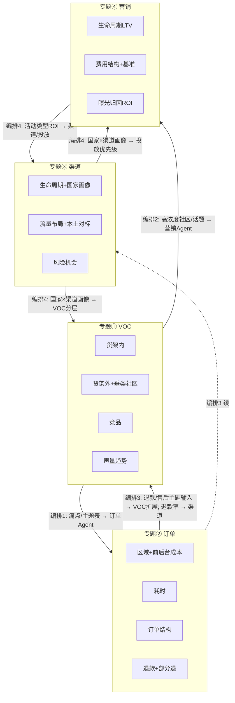

# 交叉故事线 — 编排总图

> 在主规划 8.5 交叉催化总图基础上，补充「编排节点」：每条边的具体产出物与消费 Agent、建议实现顺序。供 Phase 2 按单条交叉线开发与联调。

---

## 一、四条交叉线总览（与主规划 8.1～8.4 对应）

| 交叉线 | 名称 | 主规划章节 | 核心数据流 |
|--------|------|------------|------------|
| 交叉线 1 | VOC → 订单与商品优化 | 8.1 | VOC 痛点/主题 → 订单 Agent → 建议组合与卖点 |
| 交叉线 2 | 社媒 VOC → 垂类投放与营销 ROI | 8.2 | VOC 高浓度社区/话题 → 营销 Agent → 投放形式与 ROI |
| 交叉线 3 | 订单与退款 → 反哺 VOC 与产品组合 | 8.3 | 退款归因/部分退 → VOC 扩展售后主题、渠道健康度 |
| 交叉线 4 | 渠道与营销 → 反哺 VOC 与产品 | 8.4 | 国家×渠道画像 + ROI → VOC 分层规则、投放优先级 |

---

## 二、交叉催化总图（含编排节点）

---

## 三、编排节点表（谁在何时消费谁的数据、产出给谁）

| 编排编号 | 上游产出 | 产出 Agent | 消费 Agent | 下游产出物 | 所属交叉线 |
|----------|----------|------------|------------|------------|------------|
| 1 | 痛点/主题表、建议卖点方向 | VOC & 消费者洞察 | 订单 & 成本 & 退款 & 仓网 | 建议组合清单、建议卖点清单 | 交叉线 1 |
| 2 | 高浓度社区/话题表、建议投放方向 | VOC & 消费者洞察 | 营销 & LTV & 项目 ROI | 高浓度社区清单、建议投放形式 + ROI | 交叉线 2 |
| 3a | 退款归因表、部分退组合表、售后/退款主题输入表 | 订单 & 成本 & 退款 & 仓网 | VOC & 消费者洞察 | 售后/退款主题 VOC 摘要、双重视图结论 | 交叉线 3 |
| 3b | 退款率/异常国家渠道 | 订单 & 成本 & 退款 & 仓网 | 渠道 & 国家运营 | 渠道健康度与风险预警（纳入退款） | 交叉线 3 |
| 4a | 国家×渠道画像、生命周期、流量结构 | 渠道 & 国家运营 | VOC & 消费者洞察 | VOC 分层分析规则（按战略角色/流量结构） | 交叉线 4 |
| 4b | 国家×渠道画像、活动类型 ROI | 渠道 & 国家运营、营销 & LTV & 项目 ROI | 营销 & LTV & 项目 ROI | 投放优先级建议（加码/守住/收缩） | 交叉线 4 |
| 4c | 活动类型 ROI、精细化 ROI | 营销 & LTV & 项目 ROI | 渠道 & 国家运营 | 渠道策略与费用校准（可选） | 交叉线 4 / 专题③④ 常规 |

---

## 四、建议 Phase 2 实现顺序

| 顺序 | 交叉线 | 建议理由 |
|------|--------|----------|
| **1（首条试点）** | **交叉线 3**（订单与退款 → 反哺 VOC 与产品组合） | 数据依赖清晰（订单+退款表已有多表设计），业务价值直接（退款与 VOC 穿透、客服与组合优化）；可与专题② 子课题④ 同步开发，先做「售后/退款主题输入表」与 VOC 扩展。 |
| 2 | 交叉线 1（VOC → 订单与商品优化） | 依赖专题① 痛点产出与专题② 组合/卖点能力；适合在专题①② 单专题跑通后联调。 |
| 3 | 交叉线 2（社媒 VOC → 垂类投放与营销 ROI） | 依赖货架外/垂类社区 VOC 与专题④ 活动类型/ROI 模型；可放在垂类社区数据与营销 ROI 基准就绪后。 |
| 4 | 交叉线 4（渠道与营销 → 反哺 VOC 与产品） | 依赖专题③④ 国家×渠道画像与 ROI 全量产出；适合作为四条交叉线的收口，统一「分层解读 VOC」与「投放优先级」。 |

---

## 五、与 Phase 1 交付物的对应

- **交叉线详细说明**：见本目录下 `交叉线1_VOC到订单与商品优化.md` ～ `交叉线4_渠道与营销反哺VOC与产品.md`。
- **专题故事线**：见 `Phase1_故事线与智能体/专题故事线/` 下 4 条专题故事线文档。
- **Agent 画像与 Skill 映射**：见 `ref/roles_skills/` 下 6 份 Agent 画像与 `agent_skill_映射表.csv`。
- **主规划 8.5 概念图**：见 `数智决策-AI效能作战室-产品与项目规划.md` 第八节。
