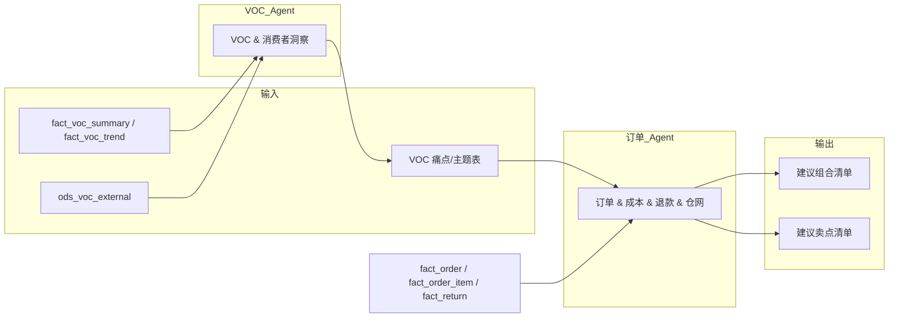

# 交叉线 1：VOC → 订单与商品优化

> 与主规划 8.1 对应。

---

## 1. 故事线概述

使用 **专题① VOC** 挖掘到的用户痛点与场景需求，反向驱动 **专题②** 优化订单的售卖组合（哪些 SKU 应捆绑、哪些应拆卖）、商品详情页与卖点（主图/标题/A+ 突出哪些痛点），减少因「信息不对称」导致的退货与差评；可选 **专题③** 在部分国家/渠道优先上线「痛点导向」的详情与组合，做 A/B 测试。

**数据流一句话**：VOC 主题/痛点表 → 订单组合与退款归因表、商品主图/卖点表；输出「建议组合」与「建议卖点」清单。

---

## 2. 触发条件

- **定期跑批**：专题① VOC 分析按周/月产出痛点与主题后，触发本交叉线。
- **按需请求**：业务提出「某国家/渠道/品类需要组合与卖点建议」时，可指定输入范围后触发。
- **可选**：某专题② 子课题（如组合策略）跑批完成后，自动拉取最新 VOC 痛点做联合建议。

---

## 3. 参与 Agent

| 顺序 | Agent | 角色 | 说明 |
|------|--------|------|------|
| 1 | VOC & 消费者洞察 | 主输出 | 产出痛点/主题/场景清单、建议卖点方向 |
| 2 | 订单 & 成本 & 退款 & 仓网 | 消费 + 主输出 | 消费 VOC 痛点，结合订单组合与退款归因，产出建议组合与卖点清单 |
| 3 | 渠道 & 国家运营 | 协作（可选） | 提供国家/渠道优先级，供「优先在哪些国家/渠道上线」决策 |

---

## 4. 输入

| Agent | 输入表/接口 | 说明 |
|-------|-------------|------|
| VOC Agent | fact_voc_summary, fact_voc_trend, ods_voc_external, dim_voc_tag | 专题① 常规输入 |
| 订单 Agent | VOC 痛点/主题表（来自 VOC Agent 输出）、fact_order, fact_order_item, fact_return, dim_campaign | 订单与退款表与 01/05 一致 |
| 渠道 Agent（可选） | fact_channel_country_month, fact_channel_health | 国家×渠道优先级 |

---

## 5. 输出

| 阶段 | 产出物 | 格式 | 最终交付物 |
|------|--------|------|------------|
| VOC → 订单 | 痛点/主题清单、建议卖点方向 | 表 + 清单 | — |
| 订单 Agent | 建议组合清单（哪些 SKU 捆绑/拆卖）、建议卖点清单（主图/标题/A+ 突出点） | 表 + 清单 | **建议组合清单**、**建议卖点清单** |
| 渠道 Agent（可选） | 国家/渠道优先级建议 | 清单 | 供上线顺序决策 |

---

## 6. 数据流（表/字段级）

| 流向 | 表/字段 | 说明 |
|------|---------|------|
| A 表 → Agent X | fact_voc_summary（voc_cnt, tag_l2, tag_l3, bad_rate 等）→ VOC Agent | 货架内痛点与主题 |
| ods_voc_external（topic_tags, sentiment_polarity）→ VOC Agent | 货架外高潜需求与场景 |
| VOC Agent 输出 → 订单 Agent | 痛点/主题表（主题编码、痛点描述、建议卖点方向） | 结构化清单 |
| fact_order, fact_order_item, fact_return → 订单 Agent | 组合、退款归因、部分退 | 现有订单与退款分析 |
| 订单 Agent → 输出 | 建议组合清单（SKU 组合、捆绑/拆卖建议）、建议卖点清单（主图/标题/A+ 要点） | 最终交付物 |
