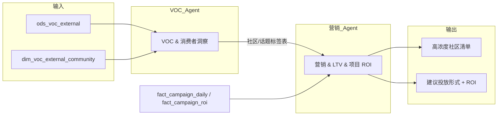

# 交叉线 2：社媒 VOC → 目标客群浓度 → 垂类投放 → 营销 ROI

> 与主规划 8.2 对应。

---

## 1. 故事线概述

使用 **专题①** 社媒与垂类社区（含 BabyCenter、The Bump、Mumsnet、Peanut 等）的 VOC，识别 **目标客群浓度高的社区与话题**；在 **专题④** 中针对这些社区做垂类社群/社区广告投放或内容合作，提升触达精准度；用 **国家-渠道-活动类型** 的 ROI 模型评估「垂类投放」的费效，形成「VOC 发现高浓度人群 → 投放 → ROI 提升」的闭环。

**数据流一句话**：VOC 社区/话题标签表 → 投放计划与费用表、曝光与转化表 → ROI 结果表；输出「高浓度社区清单」与「建议投放形式」。

---

## 2. 触发条件

- **定期跑批**：专题① 货架外/垂类社区 VOC 按周/月产出高浓度社区与话题后，触发本交叉线。
- **按需请求**：营销提出「需要垂类投放选址与形式建议」时，可指定国家/品类后触发。
- **可选**：专题④ 活动类型与 ROI 基准就绪后，自动将「垂类投放」纳入活动类型做专项 ROI 评估。

---

## 3. 参与 Agent

| 顺序 | Agent | 角色 | 说明 |
|------|--------|------|------|
| 1 | VOC & 消费者洞察 | 主输出 | 产出高浓度社区与话题清单、人群特征与建议投放方向 |
| 2 | 营销 & LTV & 项目 ROI | 消费 + 主输出 | 消费 VOC 高浓度清单，制定/评估垂类投放计划，产出 ROI 结果与建议投放形式 |

---

## 4. 输入

| Agent | 输入表/接口 | 说明 |
|-------|-------------|------|
| VOC Agent | ods_voc_external, dim_voc_external_community, fact_voc_external_daily（可选） | 货架外/垂类社区 VOC |
| 营销 Agent | VOC 高浓度社区/话题表（来自 VOC Agent）、fact_campaign_daily, fact_campaign_roi, dim_campaign_type | 活动与 ROI 表与 01/05 一致 |

---

## 5. 输出

| 阶段 | 产出物 | 格式 | 最终交付物 |
|------|--------|------|------------|
| VOC Agent | 高浓度社区清单、话题与人群特征、建议投放方向 | 表 + 清单 | — |
| 营销 Agent | 垂类投放计划（或评估结果）、ROI 结果、建议投放形式 | 表 + 清单 | **高浓度社区清单**、**建议投放形式**（含 ROI 结论） |

---

## 6. 数据流（表/字段级）

| 流向 | 表/字段 | 说明 |
|------|---------|------|
| ods_voc_external（platform, community_name, topic_tags, sentiment_polarity）→ VOC Agent | 垂类社区帖子/评论与标签 |
| VOC Agent 输出 → 营销 Agent | 高浓度社区/话题表（community_name, topic_tag, country_scope, 建议投放方向） | 结构化清单 |
| fact_campaign_daily, fact_campaign_roi → 营销 Agent | 投放费用、曝光、归因销售额、ROAS | 评估垂类投放费效 |
| 营销 Agent → 输出 | 高浓度社区清单（可含优先级）、建议投放形式（渠道/形式/预算建议）+ ROI 结果 | 最终交付物 |
