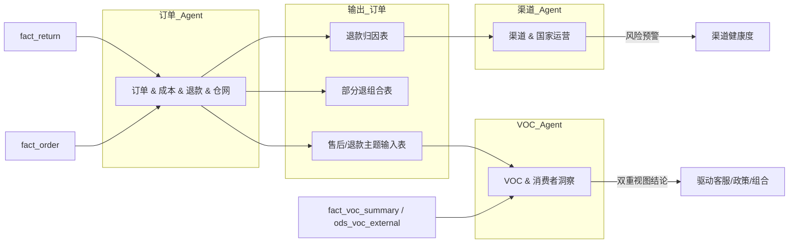

# 交叉线 3：订单与退款 → 反哺 VOC 与产品组合

> 与主规划 8.3 对应。

---

## 1. 故事线概述

**专题②** 的退款多维归因与「部分退」组合分析，可反哺 **专题①**：在 VOC 分析中增加「售后/退款」主题，与社媒差评中的售后声量打通，形成「订单侧问题 + 用户原话」的双重视图，驱动客服话术、退换货政策与产品组合设计。**专题②** 输出可同时进入 **专题③**：某国家/渠道若退款率异常，可纳入渠道健康度与风险预警。

**数据流一句话**：退款归因表、部分退组合表 → VOC 主题扩展（售后/退款）、渠道健康度指标。

---

## 2. 触发条件

- **定期跑批**：专题② 退款归因与部分退组合按周/月产出后，触发本交叉线。
- **按需请求**：客服/产品提出「需要售后与退款维度的 VOC 穿透」时触发。
- **可选**：专题③ 渠道健康度跑批时，自动拉取退款率与部分退结论做风险指标。

---

## 3. 参与 Agent

| 顺序 | Agent | 角色 | 说明 |
|------|--------|------|------|
| 1 | 订单 & 成本 & 退款 & 仓网 | 主输出 | 产出退款归因表、部分退组合表、组合优化清单、售后/退款主题输入表 |
| 2 | VOC & 消费者洞察 | 消费 + 扩展 | 消费订单 Agent 的售后/退款主题输入，扩展 VOC 中「售后/退款」主题，产出双重视图结论 |
| 3 | 渠道 & 国家运营 | 消费（可选） | 消费退款率/异常国家渠道，纳入渠道健康度与风险预警 |

---

## 4. 输入

| Agent | 输入表/接口 | 说明 |
|-------|-------------|------|
| 订单 Agent | fact_return, fact_order, fact_order_item, dim_return_reason | 与 01/05 一致 |
| VOC Agent | 售后/退款主题输入表（来自订单 Agent）、fact_voc_summary, ods_voc_external（售后/退款相关标签） | 扩展主题用 |
| 渠道 Agent（可选） | 退款率/异常清单（来自订单 Agent 或 fact_channel_health）、fact_channel_country_month | 健康度与风险 |

---

## 5. 输出

| 阶段 | 产出物 | 格式 | 最终交付物 |
|------|--------|------|------------|
| 订单 Agent | 退款归因表、部分退组合表、组合优化清单、**售后/退款主题输入表** | 表 + 清单 | 供 VOC 与渠道消费 |
| VOC Agent | 售后/退款主题的 VOC 摘要、订单侧问题 + 用户原话双重视图 | 表 + 文本 | **双重视图结论**（驱动客服话术、退换货政策、产品组合） |
| 渠道 Agent（可选） | 纳入退款维度的渠道健康度与风险预警 | 看板/表 | 风险预警更新 |

---

## 6. 数据流（表/字段级）

| 流向 | 表/字段 | 说明 |
|------|---------|------|
| fact_return（return_reason_code, is_partial_return, order_id, sku_id）→ 订单 Agent | 退款归因与部分退分析 |
| 订单 Agent 输出 → VOC Agent | 售后/退款主题输入表（原因编码、组合、国家/渠道、建议标签） | 与 VOC 标签打通 |
| fact_voc_summary、ods_voc_external（售后/退款相关）→ VOC Agent | 用户原话与声量 |
| VOC Agent → 输出 | 订单侧问题 + 用户原话双重视图、建议话术/政策/组合 | 最终交付物 |
| 订单 Agent 输出 → 渠道 Agent | 退款率/异常国家渠道 | 健康度与风险指标 |
