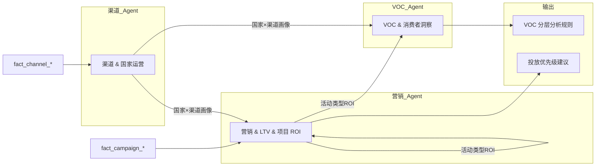

# 交叉线 4：渠道与营销 → 反哺 VOC 与产品

> 与主规划 8.4 对应。

---

## 1. 故事线概述

**专题③** 的国家画像与渠道生命周期、**专题④** 的流量布局与活动类型 ROI，可反哺 **专题①**：在不同国家/渠道做 VOC 采样时，按「战略角色」与「流量结构」分层解读（如成熟市场看复购与 NPS，新兴市场看首次触达与价格敏感度）；并为 **专题④** 的「按国家-渠道-活动类型」精细化 ROI 提供「哪些国家/渠道值得加码投放」的输入。

**数据流一句话**：国家×渠道画像表、活动类型 ROI 表 → VOC 分层分析规则、投放优先级建议。

---

## 2. 触发条件

- **定期跑批**：专题③ 国家画像与生命周期、专题④ 活动类型 ROI 按周/月产出后，触发本交叉线。
- **按需请求**：需要「VOC 分层解读规则」或「投放优先级」时触发。
- **可选**：专题① VOC 跑批前，自动拉取最新国家/渠道画像与 ROI 做分层与优先级输入。

---

## 3. 参与 Agent

| 顺序 | Agent | 角色 | 说明 |
|------|--------|------|------|
| 1 | 渠道 & 国家运营 | 主输出 | 产出国家×渠道画像、生命周期、流量结构、风险机会 |
| 2 | 营销 & LTV & 项目 ROI | 主输出 | 产出活动类型 ROI、国家-渠道-活动类型精细化 ROI |
| 3 | VOC & 消费者洞察 | 消费 | 消费画像与 ROI，产出 VOC 分层分析规则（按国家/渠道战略角色与流量结构） |
| 4 | 营销 Agent（二次） | 消费 | 消费渠道画像与 ROI，产出投放优先级建议（哪些国家/渠道加码） |

---

## 4. 输入

| Agent | 输入表/接口 | 说明 |
|-------|-------------|------|
| 渠道 Agent | fact_channel_country_month, fact_channel_traffic, fact_channel_health, dim_channel | 与 01/05 一致 |
| 营销 Agent | fact_campaign_daily, fact_campaign_roi, dim_campaign_type | 与 01/05 一致 |
| VOC Agent | 国家×渠道画像表、活动类型 ROI 表（来自渠道与营销 Agent） | 分层规则用 |
| 营销 Agent（二次） | 国家×渠道画像表、活动类型 ROI 表 | 投放优先级用 |

---

## 5. 输出

| 阶段 | 产出物 | 格式 | 最终交付物 |
|------|--------|------|------------|
| 渠道 Agent | 国家×渠道画像、生命周期、流量结构、风险机会 | 表 + 看板 | — |
| 营销 Agent | 活动类型 ROI、国家-渠道-活动类型精细化 ROI | 表 | — |
| VOC Agent | **VOC 分层分析规则**（成熟市场/新兴市场等解读维度） | 文档/配置 | **VOC 分层分析规则** |
| 营销 Agent（二次） | **投放优先级建议**（哪些国家/渠道加码） | 清单 | **投放优先级建议** |

---

## 6. 数据流（表/字段级）

| 流向 | 表/字段 | 说明 |
|------|---------|------|
| fact_channel_country_month（lifecycle_stage, gmv, margin 等）→ 渠道 Agent | 国家×渠道画像 |
| fact_campaign_roi（country_code, channel_id, campaign_type, roas）→ 营销 Agent | 活动类型 ROI |
| 渠道/营销 Agent 输出 → VOC Agent | 国家×渠道画像表、ROI 表 | 按战略角色与流量结构分层解读 VOC |
| 渠道/营销 Agent 输出 → 营销 Agent | 国家×渠道画像、ROI 表 | 计算投放优先级（加码/守住/收缩） |
| VOC Agent → 输出 | VOC 分层分析规则（成熟/新兴等） | 最终交付物 |
| 营销 Agent → 输出 | 投放优先级建议 | 最终交付物 |
