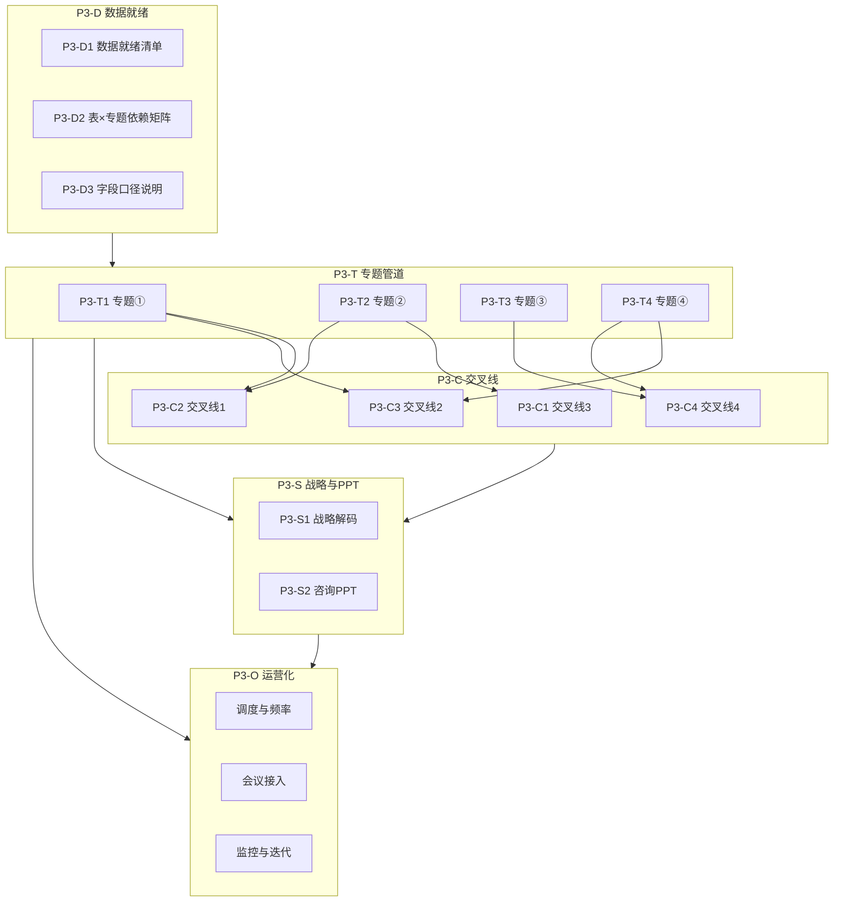

# Phase 3 全专题与运营化 — 详细计划（调整版）

## 一、前提与范围

- **Phase2 状态**：MVP 与联调测试暂缓；已产出的设计（[00_Phase2_MVP_实施清单.md](../Phase2_MVP_开发/00_Phase2_MVP_实施清单.md)）、管道骨架（`data_example/scripts/run_phase2_topic2_pipeline.py`、`run_phase2_crossline3_pipeline.py`）、mock 生成（`generate_phase2_mock_data.py`）与「mock 回退」逻辑保留，作为 Phase3 实现时的参考与复用基础。
- **Phase3 目标**：在数仓表就绪的前提下，将 **4 大专题（14 子课题）** 与 **4 条交叉故事线** 全部按 Phase1 故事线 + Agent 画像实现并产品化；接入日常经营例会与专项会议，完成**运营化**。
- **设计基线**：Phase1 交付物为唯一需求与验收来源，不在此计划中重复定义业务逻辑，仅做实施拆解与依赖排序。

---

## 二、Phase1 / Phase2 可复用资产摘要（供 Phase3 直接引用）

| 类型 | 路径/清单 | 用途 |
|------|-----------|------|
| 专题故事线 | [Phase1_故事线与智能体/专题故事线/](../Phase1_故事线与智能体/专题故事线/) 下 4 条专题 + 00_故事线文档模板 | 每专题的步骤、负责 Agent、输入表、输出物 |
| Agent 画像与 Skill | [ref/roles_skills/](../../ref/roles_skills/) 下 6 份 Agent 画像 + agent_skill_映射表.csv | 输入表、Skills/脚本、输出格式 |
| 交叉线编排 | [Phase1_故事线与智能体/交叉故事线/](../Phase1_故事线与智能体/交叉故事线/) 下 4 条交叉线文档 + 交叉故事线_编排总图.md | 触发条件、参与 Agent、输入输出、数据流、建议实现顺序 |
| 治理模板 | crossline_评估模板.md、ppt_page_template_mapping.md（ref/roles_skills/） | 交叉线健康度与 Phase 优先级、PPT 页型映射 |
| 数据契约 | [01_专题课题_数据需求矩阵](../全局数据资源整合/01_专题课题_数据需求矩阵.md)、[05_数仓表结构与主键设计](../全局数据资源整合/05_数仓表结构与主键设计.md) | 表名、字段、主键、粒度 |
| Phase2 骨架与 mock | data_example/scripts/run_phase2_topic2_pipeline.py、run_phase2_crossline3_pipeline.py、generate_phase2_mock_data.py；phase2_mock/、ref/phase2_io/ | 专题② 与交叉线3 的管道结构、mock 回退与 IO 约定 |

---

## 三、Phase3 工作包拆分（WBS）

### 3.1 数据就绪与契约（P3-D）

- **P3-D1**：与数仓确认 01/05 中**首期上线表**清单、取数方式（库/API/文件）、更新频率、环境与权限；形成《Phase3 数据就绪清单》文档（可放在本目录或 ref/data_index/）。
- **P3-D2**：按专题与交叉线拆分「每张表被哪些专题/交叉线消费」，产出《表 × 专题/交叉线 依赖矩阵》，便于排期与联调时按表就绪顺序启动管道。
- **P3-D3**：为每条专题/交叉线在 ref/data_index/ 或本目录下补充**字段清单与口径说明**（与 01/05 命名一致），供开发与验收时口径校验。

**产出**：数据就绪清单、表×专题/交叉线依赖矩阵、字段口径说明；**前置条件**：数仓首期表（至少 fact_order、fact_return、fact_voc_summary 等）可查或可文件同步。

---

### 3.2 专题端到端管道（P3-T）

按 4 个专题分别实现「取数 → 宽表/中间表 → 分析逻辑/Skill → 结构化输出」，与 Agent 画像及对应故事线一致。

- **P3-T1 专题① 全域 VOC 数据洞察**  
  - 输入表：fact_voc_summary、fact_voc_trend、fact_voc_brand_summary、ods_voc_external、dim_voc_tag、dim_voc_external_community、dim_brand（见 [专题① 故事线](../Phase1_故事线与智能体/专题故事线/专题①_全域VOC数据洞察_故事线.md) 第 4 节）。  
  - 输出：货架内痛点亮点清单、高潜需求与第二大单品候选池、高浓度社区清单、本土化话术与卖点、声量趋势雷达与机会风险清单、VOC 分层分析规则（交叉线4 用）、专题① 结论摘要。  
  - 可复用：run_专题一分析.py、ref/books/maternal_social_voc、voc社媒平台目录；**待实现**：情绪/主题标注与高潜需求挖掘、竞品声量对比与本土化话术。

- **P3-T2 专题② 线上订单数量与质量提升**  
  - 输入表：fact_order、fact_order_item、fact_return、fact_order_cost 或 fact_order 成本字段、fact_order_fulfillment（可选）、dim_warehouse、dim_order_type、dim_return_reason、dim_campaign。  
  - 输出：前后台成本归因表、订单节点诊断表、毛利额归因表与组合策略建议、退款归因表与部分退组合分析、**售后/退款主题输入表**（供交叉线3）。  
  - 可复用：Phase2 骨架 run_phase2_topic2_pipeline.py、run_专题二_Sheet2_双平台费率归因.py、run_专题四_Sheet4_*、build_sheet2/4_*；**待实现**：子课题② 耗时诊断、子课题④ 退款归因与主题输入表逻辑（含 topic2_refund_attribution 字段设计）。

- **P3-T3 专题③ 分国家渠道运营健康度提升**  
  - 输入表：fact_channel_country_month、fact_channel_traffic、fact_channel_health、dim_channel、dim_channel_lifecycle、dim_traffic_source、ods_competitor_traffic（可选）。  
  - 输出：生命周期表与国家画像、流量结构表与对标结论、差异化运营策略表、风险机会雷达与决策矩阵、专题③ 结论摘要。  
  - 可复用：无现有脚本；**待实现**：全部子课题①～③ 的取数与分析逻辑（见 [专题③ 故事线](../Phase1_故事线与智能体/专题故事线/专题③_分国家渠道运营健康度提升_故事线.md)）。

- **P3-T4 专题④ 营销项目类型 ROI 量化提升**  
  - 输入表：fact_campaign_daily、fact_campaign_roi、fact_user_lifecycle、fact_user_campaign、fact_order、dim_campaign、dim_campaign_type、dim_ltv_segment。  
  - 输出：LTV 分段与增量表、费用结构与活动分类与 ROI 基准表、归因模型说明与精细化 ROI 表、专题④ 结论摘要。  
  - 可复用：run_专题四_Sheet4_* 思路；**待实现**：LTV 与活动类型 ROI、曝光归因与精细化 ROI。

**统一约定**：每个专题管道产出写入统一目录（如 `phase3_outputs/topic{1,2,3,4}/`），文件名与故事线/Agent 画像中的「输出物」命名一致，便于交叉线与 PPT Agent 消费。

---

### 3.3 交叉故事线管道（P3-C）

按 [交叉故事线_编排总图](../Phase1_故事线与智能体/交叉故事线/交叉故事线_编排总图.md) 中的**建议实现顺序**依次实现：交叉线3 → 交叉线1 → 交叉线2 → 交叉线4。

- **P3-C1 交叉线3（订单与退款 → 反哺 VOC 与产品组合）**  
  - 上游：专题② 产出的退款归因表、部分退组合表、**售后/退款主题输入表**。  
  - 实现：在专题② 管道稳定产出 topic2_refund_attribution 与 refund_theme_input_for_voc 后，复用或扩展 run_phase2_crossline3_pipeline.py；VOC Agent 消费主题输入表，扩展「售后/退款」主题并产出双重视图结论；可选：渠道 Agent 消费退款率/异常国家渠道，更新渠道健康度。  
  - 验收：ref/phase2_io/refund_theme_input_for_voc 被 VOC 侧消费；双重视图结论可交付客服/产品。

- **P3-C2 交叉线1（VOC → 订单与商品优化）**  
  - 上游：专题① 痛点/主题表、建议卖点方向；专题② 订单组合与退款归因。  
  - 实现：订单 Agent 消费 VOC 痛点表 + 订单/退款表，产出建议组合清单与建议卖点清单；可选渠道 Agent 提供国家/渠道优先级。  
  - 验收：建议组合清单、建议卖点清单可交付产品/运营。

- **P3-C3 交叉线2（社媒 VOC → 垂类投放 → 营销 ROI）**  
  - 上游：专题① 高浓度社区/话题表；专题④ 活动与 ROI 表。  
  - 实现：营销 Agent 消费高浓度社区清单，制定/评估垂类投放并产出 ROI 与建议投放形式。  
  - 验收：高浓度社区清单与建议投放形式（含 ROI）可交付营销。

- **P3-C4 交叉线4（渠道与营销 → 反哺 VOC 与产品）**  
  - 上游：专题③ 国家×渠道画像；专题④ 活动类型 ROI。  
  - 实现：VOC Agent 消费画像与 ROI，产出 VOC 分层分析规则；营销 Agent 消费画像与 ROI，产出投放优先级建议。  
  - 验收：VOC 分层分析规则、投放优先级建议可交付分析与投放决策。

**依赖**：每条交叉线依赖其上游专题管道已就绪；P3-C1 与 P3-T2 强耦合，P3-C4 依赖 P3-T3 与 P3-T4。

---

### 3.4 战略解码与咨询 PPT（P3-S）

- **P3-S1 战略解码 Agent**  
  - 输入：各专题结论表、交叉线产出、crossline_评估模板（含 4 条线状态与效果）、目标与预算（若已结构化）。  
  - 实现：跨专题结论聚合、业财一体化视角的优先级与实施建议、目标达成与偏差分析（若输入目标表）；更新交叉线评估表中各线 status/effect_metrics。  
  - 产出：战略校准建议、跨专题结论摘要、Phase 优先级建议。

- **P3-S2 咨询 PPT Agent**  
  - 输入：各 Agent 输出、ppt_page_template_mapping.md、ref/AIPPT/、mckinsey_ppt_skills。  
  - 实现：按专题/交叉线模块映射到页型与图表类型，生成汇报用 PPT 页或 Markdown 大纲 + 图表数据；覆盖 4 专题 + 4 交叉线的关键结论页。  
  - 产出：专题汇报 PPT、执行摘要与关键结论页、交叉线结论页。

**依赖**：P3-S1/S2 依赖各专题与交叉线管道已有稳定输出；PPT 页型与数据源需与 ppt_page_template_mapping 保持一致并随实现补充条目。

---

### 3.5 运营化（P3-O）

- **P3-O1 调度与频率**：为各专题管道与交叉线管道定义**跑批频率**（如专题②/交叉线3 按周、专题① 按周/月）；使用 cron/工作流引擎或脚本封装实现定时触发，输出写入约定目录并带时间戳或分区。
- **P3-O2 接入会议与消费方**：与经营例会、专项会议对齐——哪些会议消费哪些专题/交叉线产出（如月度经营会消费战略解码摘要 + 4 专题结论页；退款改善专项消费交叉线3 双重视图）。确定**交付物形式**（PPT/看板链接/邮件摘要）与**责任人**。
- **P3-O3 监控与迭代**：基于 crossline_评估模板定期更新 4 条交叉线的 status、effect_metrics；建立「数据口径校验 + 端到端跑通 + 业务验收」的迭代节奏（与 [02_接下来开发计划与流程](../项目总览/02_接下来开发计划与流程.md) 第三节开发流程一致）。

**产出**：调度配置或文档、会议—交付物—责任人映射表、迭代与验收记录。

---

## 四、依赖关系与建议顺序

**Phase3 建议执行顺序（概要）**：  
1. **P3-D** 与数仓对齐并落盘依赖矩阵与口径说明。  
2. **P3-T2（专题②）** 优先打通（与 Phase2 骨架衔接），并完成 topic2_refund_attribution 与 refund_theme_input_for_voc 的产出。  
3. **P3-C1（交叉线3）** 紧随其后，实现退款→VOC 与可选渠道健康度。  
4. **P3-T1（专题①）** 与 **P3-T3、P3-T4** 按数仓表就绪情况并行或错峰开发。  
5. **P3-C2、P3-C3、P3-C4** 按编排总图顺序，在上游专题就绪后依次实现。  
6. **P3-S1/S2** 在至少 2 个专题 + 1 条交叉线稳定产出后即可启动，逐步覆盖全量。  
7. **P3-O** 在主要管道与战略/PPT 产出稳定后，接入调度与会议并固化迭代节奏。

---

## 五、产出物与验收（Phase3 层级）

| 类别 | 产出物 | 验收标准 |
|------|--------|----------|
| 数据与契约 | 数据就绪清单、表×专题/交叉线依赖矩阵、字段口径说明 | 与数仓与 01/05 一致；研发可据此取数与校验 |
| 专题管道 | 4 个专题管道可跑通，输出物符合各故事线第 5 节与 Agent 画像 | 端到端无报错；输出表/清单可被下游消费 |
| 交叉线 | 4 条交叉线管道可跑通，产出物符合交叉线文档第 5 节 | 编排节点表中所列产出物均存在且格式正确 |
| 战略与 PPT | 战略解码产出、按 ppt_page_template_mapping 的 PPT 页 | 管理层可用的摘要与汇报页 |
| 运营化 | 调度配置、会议—交付物—责任人映射、迭代与验收记录 | 至少 1 个会议正式消费 Phase3 产出；交叉线评估表定期更新 |

---

## 六、与现有文档的衔接

- **主规划**：[数智决策-AI效能作战室-产品与项目规划.md](../数智决策-AI效能作战室-产品与项目规划.md) 第十节「Phase 3：4 大专题 + 交叉故事线全量落地；运营化与迭代」— 本计划为其展开版，不改变目标，仅细化工作包与顺序。  
- **开发流程**：[02_接下来开发计划与流程.md](../项目总览/02_接下来开发计划与流程.md) 第三节「需求→设计→开发→联调与验收」— Phase3 每个工作项仍按该流程单次迭代执行。  
- **里程碑**：[01_里程碑与甘特草图.md](../项目总览/01_里程碑与甘特草图.md) — 建议在「Phase 3：全专题与交叉故事线落地」下增加子里程碑：数据就绪、专题①②③④ 管道上线、交叉线 3/1/2/4 上线、战略与 PPT 上线、运营化接入。
