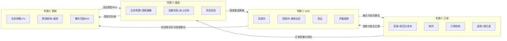

# 数智决策-AI效能作战室 · 产品与项目规划（完整版）

> 依据 [专题规划4-12.pdf](专题规划4-12.pdf) 的 4 大专题与 14 个子课题（含流程闭环），整合数据输入层、5+1 智能体、专题故事线与交叉催化设计。  
> 最后更新：按用户补充的 6 点优化与「专题①~④ 交叉分析故事线」修订。

---

## 一、整体定位与目标

- **产品定位**：面向 60–80 亿规模、以 Momcozy 可穿戴吸奶器为大单品的母婴出海企业的「数智决策-AI效能作战室」，整合内部数据资产、行业知识与多角色智能体，支持从战略到执行的闭环决策。
- **核心目标**：
  - 围绕 **4 大专题 × 14 个子课题**（含流程闭环），为每个专题提供：**故事线 → 结构化分析框架 → 多智能体协同 → 标准化产出（报表/PPT/结论）**。
  - 明确 **数据源层**（Excel/底表/API）与 **数据资产层**（宽表/结果表），形成输入契约。
  - 以 **5+1 个大智能体** 承载全部课题，避免角色过多难以调试。
  - 专题方案优先于技术架构；四大专题之间通过 **交叉分析故事线** 形成互相催化、完美闭环。

---

## 二、4 大专题与 14 子课题（对齐 PDF）

| 大专题 | 时间窗口 | 子课题 | 核心指标/闭环 |
|--------|----------|--------|----------------|
| **① 全域 VOC 数据洞察** | 2026Q2 | ① 货架内用户声音→服务质量与体验 | NPS、复购率、LTV |
| | | ② 货架外原生用户声音→人-AI 挖掘高潜需求 | 第二大单品 |
| | | ③ 货架内外本土竞品用户声音→营销本土化 | 转化率、促销ROI |
| | | ④ 全域VOC声量趋势→渠道拓展与流量布局 | 广告ROI |
| | 流程闭环 | 服务闭环 + 大单品商机洞察闭环（用户→AI→IPMS） | |
| **② 线上订单数量与质量提升** | 2026Q1–Q2 | ① 订单量区域结构→后台成本（仓网/库存）归因 | 仓网、库存 |
| | | ② 订单平均耗时与核心节点诊断 | 库存周转、呆滞库存 |
| | | ③ 订单类型与订单价结构→毛利额归因 | 品类优化、促销vs非促销、组合vs非组合、品单价×客品数 |
| | | ④ 退款订单多维归因→各业务域改善 | 用户/服务/产品 |
| | 流程闭环 | 业财一体化设计，成本-收入链路打通 | |
| **③ 分国家渠道运营健康度提升** | 2026Q3 | ① 渠道生命周期管理与战略校准 | |
| | | ② 渠道差异性分析与差异化运营策略 | 产品、营销 |
| | | ③ 渠道风险预警与机会点识别 | |
| | 流程闭环 | 渠道画像→产品适配→营销推广→仓网布局 | |
| **④ 营销项目类型 ROI 量化提升** | 2026Q4 | ① 用户精准营销与生命周期二次增长曲线 | LTV |
| | | ② 广告费、促销折扣、推广费、会员运营费结构 | 费效比 |
| | | ③ 平台广告费与产品促销形式精细化运营 | ROAS、促销毛利增量ROI |
| | 流程闭环 | 曝光→浏览→下单→加购→复购→裂变→浏览 | |

---

## 三、数据架构：数据源层 + 数据资产层

### 3.1 数据源层（Data Sources）

- **Excel/CSV**  
  - `data_example/data/专题一：分析数据总表.xlsx`（Sheet①~⑧）：平台×区域×月份、费率、SPU、订单结构、购物篮等。  
  - 未来：订单明细表（区域、订单类型、耗时节点、退款原因、客品数、品单价等）、营销项目明细表、外部曝光量表。
- **数仓/数据库底表**（规划）  
  - 订单事实、订单明细、SKU/SPU 维度、用户生命周期、费用分摊表等，与 `ref/data_index.md` 指标字典对应。
- **外部/社媒**  
  - Reddit、亚马逊评论、专业母婴垂类社区（见下）；未来可接广告/曝光 API。

### 3.2 数据资产层（Data Assets）

- 分析宽表与结果表：`data_example/outputs/*.xlsx`、专题归因表、SPU 箱体表、购物篮汇总表。  
- VOC 结构化：`ref/books/maternal_social_voc/` 日志与标注表、货架内/外/竞品统一编码表。  
- 品牌与行业：`ref/company_info/`、`insights/maternal_brand/`、`ref/books/` 萃取文档。  

智能体与 Skills 只消费「数据资产层」；数据源层通过脚本/ETL 写入资产层，并受 `ref/data_index.md` 契约约束。

---

## 四、专题① 全域 VOC 数据洞察（2026Q2）— 故事线与补充

### 4.1 总故事线

「从货架内 NPS/差评 → 货架外高潜需求与第二大单品 → 本土竞品声音与营销本土化 → 全域声量趋势与渠道/流量布局 → 服务闭环 + IPMS 大单品闭环。」

### 4.2 子课题与数据/分析要点

- **课题① 货架内用户声音**  
  数据源：各渠道评论/满意度表（亚马逊、独立站、TikTok Shop 等）。  
  分析：情绪+主题+场景标注，驱动 NPS/复购率/LTV 的痛点与亮点识别。  

- **课题② 货架外原生用户声音（含补充）**  
  - **补充**：除 Reddit 等泛社媒外，纳入 **专业母婴垂类内容社区**，作为高浓度需求与第二大单品线索来源。  
  - 覆盖社区示例：**BabyCenter、The Bump、What to Expect、theAsianparent、Mumsnet、Glow、Peanut** 等。  
  - 数据源：上述社区帖子/评论抓取表（可先人工或爬虫采样，再统一打标签）。  
  - 分析：与货架内统一编码（功能/场景/情绪/价格），做人-AI 协同挖掘未被满足的高潜需求，输出第二大单品候选池。  

- **课题③ 货架内外本土竞品用户声音**  
  数据源：竞品在货架内+货架外（含垂类社区）的声量样本。  
  分析：与我们对比，提炼营销本土化的调性与话术清单，支撑转化率与促销ROI 优化。  

- **课题④ 全域VOC声量趋势**  
  数据源：按时间×渠道聚合的声量主题表、品牌/品类提及。  
  分析：趋势雷达，指导渠道拓展与流量布局，输出广告ROI 优化方向。  

### 4.3 流程闭环

- 服务闭环：消费者→客服→产品质量→产品企划→产品研发。  
- 大单品商机洞察闭环：用户→数字化AI智能体→IPMS产品企划。

---

## 五、专题② 线上订单数量与质量提升（2026Q1–Q2）— 故事线与补充

### 5.1 总故事线

「订单量增长与区域结构 → 每笔订单的卖出一块钱前后台成本 + 用户价值认同与客件数对配送成本的影响 → 订单耗时与节点诊断 → 订单类型/订单价结构对毛利额的归因 → 退款反向穿透订单与VOC，区分故意比较 vs 组合设计问题。」

### 5.2 子课题与数据/分析要点（含补充）

- **课题① 订单量区域结构对后台成本的影响（大幅补充）**  
  - 除「订单量×区域→仓网/库存」外，需 **融合每笔订单的前台成本与后台成本**，落实到 **卖出 1 元钱，前台、后台各承担多少成本**（与现有 data_example 专题一二口径一致）。  
  - **订单下钻推理**：  
    - 按订单维度看：用户是「买得更贵了」还是「买得更便宜但买得更多件了」？  
    - 据此 **倒推用户对该品类产品的价值认同与定位**（愿意为单价付费 vs 愿意为多件/囤货付费）。  
  - **客件数对后台配送成本的影响**：  
    - 分析「客件数/客品数」与单均配送成本、仓内拣货/打包成本的关系，识别高件数订单对履约成本与利润的边际影响。  
  - 数据源：订单明细（区域、订单类型、件数、品单价、前台/后台成本分摊）、仓网/库存表。  

- **课题② 订单平均耗时与核心节点**  
  数据源：订单状态时间戳（下单→支付→出库→交运→清关→签收）。  
  分析：瓶颈节点识别，库存周转天数与呆滞库存关联。  

- **课题③ 订单类型与订单价结构对毛利额归因**  
  保持现有设计：促销vs非促销、组合vs非组合、品单价×客品数对毛利额的贡献与稀释；输出品类优化与组合策略建议。  

- **课题④ 退款订单多维归因（补充：反向倒推订单 + 穿透VOC）**  
  - **反向倒推到订单**：  
    - 区分 **用户为比较而故意为之**（如多规格/多颜色下单，试后退一部分）与 **产品组合设计问题**（如常被一起买的两色/两码，导致高频「买二退一」或部分退）。  
    - 对「部分退」订单做专项分析：SKU 组合、颜色/规格组合、渠道、国家，找出设计或陈列可优化的组合。  
  - **社媒差评与VOC 穿透**：  
    - 社媒上对品牌的差评若集中 in **售后与退款**，需穿透到 VOC 分析：  
      - 将「退款原因」「客服话术」「物流体验」等标签与 VOC 主题打通；  
      - 在专题① 的 VOC 输出中增加「售后/退款」主题的专项摘要，供专题② 改善服务与流程。  
  - 数据源：退款明细（原因、订单ID、商品、部分退标记）、订单组合信息、VOC 中售后/退款相关主题表。  

### 5.3 流程闭环

业财一体化设计，成本-收入链路打通；订单质量与退款改善反向驱动产品组合与客服/流程。

---

## 六、专题③ 分国家渠道运营健康度提升（2026Q3）— 故事线与补充

### 6.1 总故事线

「建立分国家的各渠道生命周期体系与国家画像 → 同国家内不同流量布局的差异化 + 对标本土品牌流量布局形成同频共振 → 再做差异化运营 → 风险预警与机会识别。」

### 6.2 子课题与数据/分析要点（含补充）

- **课题① 渠道生命周期管理与战略校准（补充）**  
  - **建立分国家的各渠道生命周期体系**：  
    - 按国家×渠道（亚马逊/独立站/TikTok/线下 KA 等）打生命周期阶段（导入/成长/成熟/衰退），并形成 **国家画像**（规模、增速、利润结构、用户结构、竞争强度等）。  
  - 数据源：国家×渠道×时间的经营宽表、渠道属性表。  

- **课题② 渠道差异性分析与差异化运营策略（补充）**  
  - **同国家不同流量布局的差异化**：  
    - 在同一国家内，区分自然流、付费广告、红人/内容、促销活动等流量来源的占比与转化表现。  
  - **对标本土品牌流量布局，形成同频共振效应**：  
    - 分析本土竞品在该国的流量结构（哪些渠道/媒介为主），先做「同频」——在主流阵地有存在感；再结合我们优势做「差异化」（如我们在某类媒介或某个人群上更聚焦）。  
  - 输出：国家×渠道的差异化运营策略（产品/营销/费用/库存）。  

- **课题③ 渠道风险预警与机会点识别**  
  保持：指标阈值与趋势预警，风险与机会雷达，加码/守住/收缩/观望矩阵。  

### 6.3 流程闭环

渠道画像 → 产品适配 → 营销推广 → 仓网布局 → 再回到渠道画像。

---

## 七、专题④ 营销项目类型 ROI 量化提升（2026Q4）— 故事线与补充

### 7.1 总故事线

「建立营销活动类型与项目的分类及预算提报规则 → 建立各类营销活动的 ROI 基准 → 结合外部曝光量构建因营销活动带来的销售额算法模型 → 按国家-渠道-活动类型做精细化 ROI 测算。」

### 7.2 子课题与数据/分析要点（含补充）

- **课题① 用户精准营销与生命周期二次增长曲线**  
  保持：LTV 分段、各项目类型在分段内的 LTV 增量，二次增长曲线。  

- **课题② 广告费、促销折扣、推广费、会员运营费结构（补充）**  
  - **建立营销活动类型与项目的分类及预算提报规则**：  
    - 对「营销活动类型」（如品牌广告、效果广告、促销、会员运营、KOL、内容、大促等）与「项目」做统一分类与命名规范；  
    - 定义每类活动的预算提报流程、审批口径与归口部门，便于后续 ROI 与费效分析对齐。  
  - **建立各类营销活动的 ROI 基准**：  
    - 按活动类型（或国家×渠道×活动类型）设定历史或行业 ROI/ROAS 基准线，用于评估当期的「达标/超标/不及格」。  
  - 数据源：营销项目明细（类型、费用、归属渠道/国家）、费用结构汇总表。  

- **课题③ 平台广告费与产品促销形式精细化运营（补充）**  
  - **结合外部曝光量，找到因营销活动带来的销售额算法模型**：  
    - 在可能获取外部曝光/触达数据的前提下，建立「曝光→触达→转化→销售额」的归因或统计模型；  
    - 按 **国家-渠道-活动类型** 拆分，对「因营销活动带来的销售额」做精细化测算，进而计算各格子的 ROI。  
  - 数据源：内部投放与促销明细、外部曝光/触达数据（若有）、订单与收入表。  

### 7.3 流程闭环

曝光→浏览→下单→加购→复购→裂变→再浏览；项目类型→阶段→ROI→预算分配。

---

## 八、专题①~④ 交叉分析故事线（互相催化、完美闭环）

以下故事线将四个大专题串联，形成「用 VOC 改订单与商品」「用社媒找人群做投放提 ROI」「用订单与退款反哺 VOC」「用渠道与营销反哺 VOC 与产品」的闭环。

### 8.1 VOC → 订单与商品优化

- **故事线**：  
  使用 **专题① VOC** 挖掘到的用户痛点与场景需求，反向驱动：  
  - **专题②**：优化订单的 **售卖组合**（哪些 SKU 应捆绑、哪些应拆卖）、**商品详情页与卖点**（主图/标题/A+ 突出哪些痛点），减少因「信息不对称」导致的退货与差评。  
  - **专题③**：在部分国家/渠道优先上线「痛点导向」的详情与组合，做 A/B 测试。  
- **数据流**：VOC 主题/痛点表 → 订单组合与退款归因表、商品主图/卖点表；输出「建议组合」与「建议卖点」清单。

### 8.2 社媒 VOC → 目标客群浓度 → 垂类投放 → 营销 ROI

- **故事线**：  
  使用 **专题①** 社媒与垂类社区（含 BabyCenter、The Bump、Mumsnet、Peanut 等）的 VOC，识别 **目标客群浓度高的社区与话题**；  
  - 在 **专题④** 中，针对这些社区做 **垂类社群/社区广告投放** 或内容合作，提升触达精准度；  
  - 用 **国家-渠道-活动类型** 的 ROI 模型评估「垂类投放」的费效，形成「VOC 发现高浓度人群 → 投放 → ROI 提升」的闭环。  
- **数据流**：VOC 社区/话题标签表 → 投放计划与费用表、曝光与转化表 → ROI 结果表；输出「高浓度社区清单」与「建议投放形式」。

### 8.3 订单与退款 → 反哺 VOC 与产品组合

- **故事线**：  
  **专题②** 的退款多维归因与「部分退」组合分析，可反哺：  
  - **专题①**：在 VOC 分析中增加「售后/退款」主题，与社媒差评中的售后声量打通，形成「订单侧问题 + 用户原话」的双重视图，驱动客服话术、退换货政策与产品组合设计。  
  - **专题③**：某国家/渠道若退款率异常，可纳入渠道健康度与风险预警。  
- **数据流**：退款归因表、部分退组合表 → VOC 主题扩展（售后/退款）、渠道健康度指标。

### 8.4 渠道与营销 → 反哺 VOC 与产品

- **故事线**：  
  **专题③** 的国家画像与渠道生命周期、**专题④** 的流量布局与活动类型 ROI，可反哺：  
  - **专题①**：在不同国家/渠道做 VOC 采样时，按「战略角色」与「流量结构」分层解读（如成熟市场看复购与 NPS，新兴市场看首次触达与价格敏感度）；  
  - 为 **专题④** 的「按国家-渠道-活动类型」精细化 ROI 提供「哪些国家/渠道值得加码投放」的输入。  
- **数据流**：国家×渠道画像表、活动类型 ROI 表 → VOC 分层分析规则、投放优先级建议。

### 8.5 交叉催化总图（概念）

---

## 九、5+1 智能体与专题/课题映射

| 智能体 | 主责专题 | 主责子课题 | 关键输入 |
|--------|----------|------------|----------|
| **VOC & 消费者洞察 Agent** | ① | ①~④ | 货架内/外/垂类社区/VOC 表、竞品声量 |
| **订单 & 成本 & 退款 & 仓网 Agent** | ② | ①~④ | 订单明细、前后台成本、退款、仓网/库存 |
| **渠道 & 国家运营 Agent** | ③ | ①~③ | 国家×渠道宽表、流量布局、本土对标 |
| **营销 & LTV & 项目 ROI Agent** | ④ | ①~③ | 营销项目明细、用户生命周期、曝光/归因 |
| **战略解码 & 业财一体化 Agent** | 横跨 ①~④ | 流程闭环与战略校准 | 各专题结论表 |
| **咨询PPT & 故事线 Agent** | 横切 | 全部 | 各 Agent 输出，ref/AIPPT、mckinsey_ppt_skills |

交叉分析故事线由多 Agent 协作完成：例如「VOC→订单优化」由 VOC Agent 主输出、订单 Agent 消费；「退款→VOC 穿透」由订单 Agent 主输出、VOC Agent 扩展主题。

---

## 十、实施阶段（简要）

- **Phase 0**：补齐 `ref/data_index.md`、`ref/AIPPT/`、`ref/data_report/`、`ref/roles_skills/`；完成 PDF 专题与课题的正式映射与数据契约（含订单、退款、营销、VOC 垂类社区等）。  
- **Phase 1**：固化 4 大专题故事线与本规划中的补充点；完成 5+1 Agent 画像与专题/课题映射；设计 4 条交叉分析故事线的数据流与产出物。  
- **Phase 2**：优先实现 1~2 条专题的端到端工作流（含数据源→资产层→Agent→PPT）；实现 1 条交叉故事线（如 VOC→订单组合建议）。  
- **Phase 3**：4 大专题 + 交叉故事线全量落地；运营化与迭代。

---

## 十一、可行性简述

- **优势**：现有 data_example、ref/books、insights、Skills 已覆盖毛利、订单结构、购物篮、VOC 方法论；仅需将课题严格对齐 PDF 并补充垂类社区、订单级前后台、退款反推、国家画像与流量对标、营销分类与 ROI 模型、交叉故事线。  
- **风险**：部分数据源（垂类社区抓取、外部曝光、订单级成本分摊）需逐步建设；交叉故事线依赖多 Agent 与数据口径统一，建议先做 1~2 条试点。  
- **结论**：在专题方案优先、智能体收敛为 5+1、数据输入层与交叉故事线明确的前提下，方案可执行且能形成闭环。

---

**文档版本**：v1.0（含 6 点补充与专题①~④ 交叉分析故事线）  
**保存位置**：`main_project_lute/数智决策-AI效能作战室-产品与项目规划.md`
