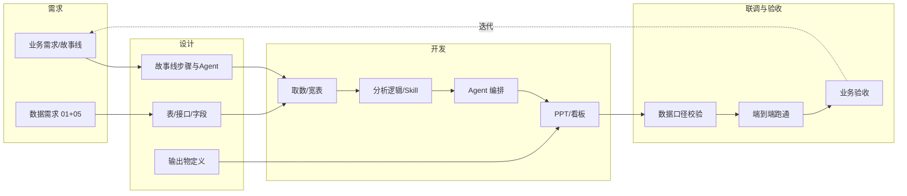

# 接下来开发计划与流程（数仓交接后）

> 全局数据资源整合已交给数仓团队后，产品与研发侧应执行的**开发工作**与**开发流程**说明。与主项目 Phase 0 收尾、Phase 1～2 对齐。

---

## 一、当前状态与依赖关系

| 事项 | 状态 | 负责方 |
|------|------|--------|
| 全局数据资源整合（01～05 + 主键/表结构） | 已交付数仓，排期开发中 | 数仓 |
| Phase 0：ref/data_index、AIPPT、data_report、roles_skills 等基础骨架 | 待补齐（可与开发并行） | 产品/分析 |
| Phase 1：智能体画像与故事线编排设计 | 待执行 | 产品/研发 |
| Phase 2：MVP 端到端工作流（数据→Agent→PPT） | 依赖 Phase 1 + 数仓首期表 | 研发 |

**原则**：数仓按 01+05 产出**首期表**（建议先 fact_order / fact_return / fact_voc_summary 等）后，研发即可启动「取数→分析→Agent→PPT」的 MVP；Phase 1 的设计工作可与数仓开发并行，不阻塞。

---

## 二、接下来应执行的开发工作（按阶段）

### 2.1 Phase 0 收尾（与数仓并行，约 1～2 周）

| 序号 | 工作项 | 产出 | 说明 |
|------|--------|------|------|
| P0-1 | 补齐 ref 基础骨架 | `ref/data_index/` 与现有 BI 指标字典的索引或链接；`ref/AIPPT/` 下 1～2 份 PPT 范例；`ref/data_report/` 下 1 份经营/专题报告样例；`ref/roles_skills/` 下 5+1 Agent 角色与技能清单（初版） | 供 Phase 1 智能体画像与 Phase 2 的 PPT Agent 使用 |
| P0-2 | 数据契约对齐 | 与数仓确认：首期上线表清单、取数方式（库/API/文件）、更新频率、权限与环境 | 避免 MVP 开发时取数口径不一致 |

### 2.2 Phase 1：故事线与智能体设计（约 2～3 周）

| 序号 | 工作项 | 产出 | 说明 |
|------|--------|------|------|
| P1-1 | 专题故事线标准化模板 | 每条专题一条「故事线文档」：业务问题 → 输入数据（表/字段）→ 分析步骤（步骤序号 + 负责 Agent）→ 输出物（表/看板/PPT 页） | 对应主规划第四节～第七节，落成可执行模板 |
| P1-2 | 5+1 Agent 画像与 Skill 映射 | 每个 Agent 一份画像：使命、输入（表/接口）、调用的 Skills/脚本、输出格式；与 01 矩阵中「库表建议」的对应关系 | 可落成 `ref/roles_skills/` 下的 Markdown 或配置表 |
| P1-3 | 交叉分析故事线编排节点 | 4 条交叉故事线（VOC→订单、社媒VOC→投放→ROI、退款→VOC、渠道/营销→VOC）的**编排图**：触发条件、参与 Agent、输入输出、数据流 | 用于 Phase 2 实现「跨专题联动」时的开发清单 |

### 2.3 Phase 2：MVP 端到端工作流（约 4～6 周）

| 序号 | 工作项 | 产出 | 说明 |
|------|--------|------|------|
| P2-1 | 选定 MVP 专题与数据范围 | 建议：**专题②（订单与退款）** 或 **专题①（VOC 货架内）** 其一为首个端到端；明确使用的数仓表（如 fact_order, fact_return, fact_voc_summary）与时间范围 | 与数仓首期上线表对齐 |
| P2-2 | 数据层 → 资产层 取数与宽表 | 从数仓/API/文件取数，生成专题所需**分析宽表**（如 订单成本归因宽表、退款归因宽表）；脚本或低代码可放在 `data_example/` 或单独 pipeline 目录 | 智能体只消费「资产层」 |
| P2-3 | 专题分析逻辑与 Agent 调用链 | 按 P1-1 故事线实现：问题拆解 → 调用对应 Agent（或封装好的分析函数/Skills）→ 生成结构化结论（表/JSON） | 先实现「单专题单 Agent」再扩展多 Agent 协作 |
| P2-4 | 咨询PPT Agent 与汇报产出 | 将分析结论按 ref/AIPPT 范例生成 2～3 页 PPT（或 Markdown 大纲 + 图表数据）；可对接现有 mckinsey_ppt_skills 或自研模板 | 形成「提问 → 分析 → PPT」闭环 |
| P2-5 | 一条交叉故事线试点 | 例如「退款→VOC 穿透」：fact_return + 退款原因 → 触发 VOC Agent 扩展「售后/退款」主题 → 输出主题摘要表或看板 | 验证跨 Agent、跨表的数据流与产出物 |

### 2.4 Phase 3（全专题与运营化，后续规划）

**说明**：Phase2 MVP 与联调测试暂缓，以 **Phase3 详细计划** 为准推进全专题与运营化。详细工作包、依赖关系与验收标准见：[Phase3_全专题与运营化/00_Phase3_详细计划.md](../Phase3_全专题与运营化/00_Phase3_详细计划.md)。

- 将 4 大专题、14 子课题全部按「故事线模板 + Agent 映射」实现；
- 4 条交叉故事线全部上线；
- 接入日常经营例会与专项会议（运营化）。

---

## 三、开发流程（单次迭代通用）

以下流程适用于**每个工作项**（如「实现专题② 课题① 的取数与分析」「实现 VOC→订单组合建议 交叉线」），可循环执行直至验收通过。

### 3.1 需求（Input）

- **业务需求**：来自主规划「专题故事线」或「交叉故事线」；产品/业务方提供：要回答的问题、使用场景、谁消费结果（管理层/分析岗）。
- **数据需求**：以 01_专题课题_数据需求矩阵 + 05_数仓表结构与主键设计 为准；与数仓确认本迭代使用的**表、字段、时间范围、更新频率**。

**产出**：本迭代的「需求清单」（问题列表 + 所需表/字段 + 验收标准）。

### 3.2 设计（Design）

- **故事线步骤与 Agent**：把本迭代要实现的专题或交叉线拆成「步骤序号 + 每步由谁（哪个 Agent 或脚本）执行 + 输入/输出」。
- **表/接口/字段**：明确本迭代从数仓读哪些表、哪些字段、过滤条件（如国家、时间）；若用 API 或文件，约定格式与路径。
- **输出物定义**：本迭代最终交付物（如：订单成本归因表、2 页 PPT、一条「退款→VOC 主题」的接口或表）。

**产出**：本迭代的「设计说明」（步骤表 + 数据映射表 + 输出物规格）。

### 3.3 开发（Development）

- **取数/宽表**：按设计从数仓/API/文件取数，加工成分析宽表或中间表；脚本可版本管理、可复跑。
- **分析逻辑 / Skill**：实现归因、下钻、标签等计算逻辑；可封装为可复用的 Skill 或函数，供多专题调用。
- **Agent 编排**：按设计调用对应 Agent（或封装好的分析模块），串联输入→分析→输出；若为多 Agent 协作，明确调用顺序与数据传递方式。
- **PPT / 看板**：将分析结果生成 PPT 页或看板所需的数据/图表；对接 PPT 模板或 BI 工具。

**产出**：可运行的取数脚本、分析代码/Skill、Agent 调用链、PPT 或看板产出。

### 3.4 联调与验收（Verify）

- **数据口径校验**：对比数仓直查与宽表/分析结果，确认指标口径一致（如 GMV、退货率、成本率等）。
- **端到端跑通**：从「触发问题/参数」到「产出 PPT 或看板」全链路跑通，无报错、无缺数。
- **业务验收**：业务/产品确认：结论是否贴合故事线、是否可直接用于汇报或决策。

**产出**：验收通过标记、已知问题清单（若有）、下迭代优化项。

---

## 四、建议执行顺序（时间线）

| 时间段 | 执行内容 | 产出 |
|--------|----------|------|
| **第 1～2 周** | Phase 0 收尾（P0-1、P0-2）+ Phase 1 启动（P1-1 专题故事线模板） | ref 骨架、数据契约确认、1～2 条专题故事线文档 |
| **第 3～4 周** | Phase 1 继续（P1-2 Agent 画像、P1-3 交叉故事线编排）+ 与数仓对齐首期表 | roles_skills 初版、4 条交叉线编排图、首期表清单 |
| **第 5 周起** | Phase 2 MVP：选定专题②或①，按「开发流程」做 需求→设计→开发→联调→验收 | 首个专题端到端：取数→分析→PPT；可选 1 条交叉线试点 |
| **第 8～10 周** | MVP 稳定 + 第二条专题或第二条交叉线 | 2 个专题或 1 专题 + 1 交叉线 可交付 |

---

## 五、与主项目文档的对应关系

- **主规划**：[数智决策-AI效能作战室-产品与项目规划.md](../数智决策-AI效能作战室-产品与项目规划.md) — Phase 0～3 定义、5+1 Agent、故事线。
- **里程碑**：[01_里程碑与甘特草图.md](01_里程碑与甘特草图.md) — 阶段与时间占位。
- **数据基线**：`main_project_lute/全局数据资源整合/` 下 01+05 — 数仓已接手；研发按 01 的「所需核心指标/字段」与 05 的「表/主键」做取数与开发。
- **本文档**：数仓交接后「接下来做什么」与「怎么做」的执行清单与流程，随 Phase 推进可更新。

---

**文档版本**：v1.0  
**维护**：随 Phase 1～2 推进更新「当前状态」与「建议执行顺序」。
