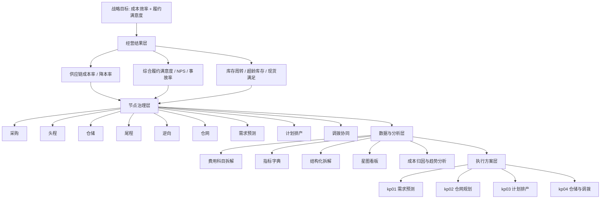

# 供应链专题项目分层蓝图

## 1. 核心判断

`scm/` 不是单一资料目录，而是供应链专题的项目分枝。当前目录已经形成三条主线：

| 主线 | 当前资产 | 作用 |
|---|---|---|
| 方法论底座 | `01_书籍知识萃取报告.md` | 从《全链路管理》抽取“进-存-销”“盘货-补货”“数据三层架构”等基础模型 |
| 指标体系 | `02_Momcozy_KPI体系设计.md`、`03_指标树图可视化/` | 建立成本满意度、履约满意度和综合供应链满意度指标树 |
| 成本专题包 | `供应链成本指标全链路优化/` | 供应链成本效率专项的重点专题包，承接 data / plan / reference / report / tactic 五类外部文档关系和本地重建任务 |

当前的大框架不是“只做供应链成本率”，而是：

```text
供应链专题
├─ 经营结果层：供应链成本率、库存周转、采购降本、超龄库存、履约满意度
├─ 指标体系层：成本满意度 50% + 履约满意度 50% = 综合供应链满意度
├─ 节点治理层：采购、头程、仓储、尾程、逆向、直邮、仓网、预测、计划、调拨
├─ 数据分析层：费用口径、指标字典、结构化拆解、主题宽表、分析视图
└─ 执行方案层：需求预测、仓网规划、计划排产、仓储与调拨协同
```

## 2. 蓝图分层

### L0. 战略目标层

| 目标 | 当前证据 | 解释 |
|---|---|---|
| 降低全链路供应链成本率 | `02_Momcozy_KPI体系设计.md` 中 `SC-L1-001 全链路供应链成本率 ≤18%` | 成本治理主轴，按进货、存货、销货拆分 |
| 提升综合履约满意度 | `03_指标树图可视化/README.md` 中“成本 50% + 履约 50%” | 避免单纯降本牺牲交付体验 |
| 提升库存和资金效率 | `01_书籍知识萃取报告.md` 中“盘货表/补货表”“库存周转” | 成本问题背后是计划、库存和资金占用问题 |
| 建立可运营的供应链分析体系 | `供应链成本指标全链路优化/` 中 data / plan / report / tactic 文件组 | 从外部文档占位看，目标已从报告走向可执行专题包 |

### L1. 业务结果层

| 结果指标 | 所属主题 | 主要责任域 |
|---|---|---|
| 全链路供应链成本率 | 成本效率 | CFO / 供应链 VP |
| 物流费用增长率 / 销售额增长率 | 成本效率 | 供应链 VP |
| 全链路同比降本率 | 成本效率 | 供应链 VP |
| 综合履约满意度指数 | 履约体验 | 供应链 VP |
| 履约 NPS、物流差评率、履约事故率 | 履约体验 | 客服 / 质控 / 物流 |
| 库存周转天数、库龄结构健康度、现货满足率 | 库存健康 | 计划 / 仓储 |

### L2. 节点治理层

| 节点 | 归属 | 当前资料证据 | 后续研究重点 |
|---|---|---|---|
| 采购 | 成本满意度 | `02_Momcozy_KPI体系设计.md`、`（data）供应链成本效率-指标体系.md` | 采购费率、供应商分层、降本率、采购结构 |
| 头程 | 成本满意度 / 履约时效 | `02_Momcozy_KPI体系设计.md` | 海运/空运单位成本、头程时效、整柜率、清关时效 |
| 仓储 | 成本满意度 / 库存健康 | `02_Momcozy_KPI体系设计.md`、`03_指标树图可视化/` | 仓储成本率、长期仓储费、库容、盘点准确率 |
| 尾程 | 成本满意度 / 履约体验 | `02_Momcozy_KPI体系设计.md` | 尾程配送成本率、承诺时效、配送达成率 |
| 逆向 / 退换补发 | 成本满意度 / 质量体验 | `01_书籍知识萃取报告.md`、`02_Momcozy_KPI体系设计.md` | 退货处理成本、返仓价值、原因编码 |
| 小包直邮 | 成本效率 / 渠道策略 | `供应链成本指标全链路优化/` 占位资料 | 成本-时效边界、渠道适用范围 |
| 仓网规划 | 结构优化 | `（tactic）kp02-仓网规划执行方案.md` | 区域库存位置、卫星仓、调拨收益 |
| 需求预测 | 计划能力 | `（tactic）kp01-需求预测执行方案.md` | MAPE、Bias、预测覆盖率、补货触发 |
| 计划排产 | 计划能力 | `（tactic）kp03-计划排产执行方案.md` | PSI、补货版本、PO 和在途联动 |
| 仓储与调拨协同 | 执行闭环 | `（tactic）kp04-仓储与调拨协同执行方案.md` | 调拨阈值、库龄与缺货双触发、调拨成功率 |

### L3. 数据与分析层

| 分类 | 目录材料 | 当前成熟度 | 判断 |
|---|---|---|---|
| 数据需求 | `（data）专题分析数据需求底表.md` | 已本地重建 | 已形成字段需求、粒度、主题宽表、P0 取数清单和质量验收 |
| 费用科目 | `（data）供应链履约费用科目拆解明细.md` | 已本地重建 | 已拆解采购、头程、仓储、尾程、退换补发、小包直邮等费用科目 |
| 指标字典 | `（data）供应链指标体系-指标字典.md` | 已本地重建 | 已抽出 `SC-*` 与 `FD-*` 核心指标，可继续转为指标种子表 |
| 结构化拆解 | `（data）供应链指标体系-结构化拆解.md` | 已本地重建 | 已承接 L1/L2/L3/L4 指标分层和 tactic 节点映射 |
| 成本分析思路 | `（plan）供应链成本分析思路.md` | 已本地重建 | 已与本地 36% 方案链路合并校准，形成诊断链路和输出物 |
| 看板设计 | `（plan）供应链多维分析星图看板设计.md` | 已本地重建 | 已转化为 dashboard 信息架构、交互规则和 MVP 范围 |
| 产品化拆分 | `01_专题包_产品化拆分与数据任务蓝图.md` | 已完成首版 | 已拆出指标字典、主题宽表、看板 PRD、SQL / Agent 数据任务和验收顺序 |
| 指标树可视化 | `03_指标树图可视化/` | 完整 | 当前 `scm/` 最成熟的可视资产 |

### L4. 执行方案层

| 执行包 | 文件 | 当前状态 | 需要补强 |
|---|---|---|---|
| 需求预测 | `（tactic）课题一：kp01-需求预测执行方案.md` | URL 占位 | 需要本地化：输入字段、预测粒度、回测机制、输出动作 |
| 仓网规划 | `（tactic）课题一：kp02-仓网规划执行方案.md` | URL 占位 | 需要本地化：仓网角色、区域策略、调拨收益公式 |
| 计划排产 | `（tactic）课题一：kp03-计划排产执行方案.md` | URL 占位 | 需要本地化：PSI、PO、在途、生产/采购版本控制 |
| 仓储与调拨协同 | `（tactic）课题一：kp04-仓储与调拨协同执行方案.md` | URL 占位 | 需要本地化：缺货/库龄双阈值、调拨优先级、执行闭环 |

## 3. 资产分类

### 3.1 `scm/` 内部资产

| 分层 | 文件或目录 | 分类 | 处理策略 |
|---|---|---|---|
| 蓝图入口 | `00_供应链专题_项目分层蓝图.md` | 正式架构资产 | 作为后续供应链研究入口 |
| 方法论底座 | `01_书籍知识萃取报告.md` | 正式知识资产 | 保留，作为模型来源 |
| KPI 体系 | `02_Momcozy_KPI体系设计.md` | 正式指标资产 | 保留，后续拆成指标字典和看板口径 |
| 可视化资产 | `03_指标树图可视化/` | 正式可视化资产 | 保留 HTML / XMind / ASCII 多格式 |
| 外部专题包 | `供应链成本指标全链路优化/` | 重点专题包 | 保留并优先本地化；当前不能当完整正文使用 |

### 3.2 支撑资料资产

`ref/books/` 中存在大量供应链知识资产，它们不是 `scm/` 主资产，但应作为供应链专题的证据层与方案层支撑。

| 支撑层 | 代表路径 | 用途 |
|---|---|---|
| 书籍萃取 | `ref/books/20-供应链出海从战略到执行实战指南-宫迅伟.md` 到 `32-全链路管理电商供应链运营实操要领及案例-陈凤霞.md` | 提供出海、供应链大数据、采购、库存、仓储、物流、逆向等方法论 |
| 36% 方案链路 | `ref/books/供应链36%方案_Page6节点/00-方案逻辑推理故事线概览.md` 到 `11-重点节点04-仓储与调拨协同执行方案.md` | 提供“证据 -> 诊断 -> 方案 -> 平台 -> 路线 -> 重点节点”的完整推理链 |
| 汇报资产 | `ref/books/供应链36%方案_Page6节点/12-总监汇报PPT大纲...` 到 `17-Gamma实战粘贴版Prompt...` | 提供管理层汇报与 Gamma 生成资产 |
| 成本分析正式稿 | `ref/books/供应链36%方案_Page6节点/供应链课题/` | 提供 MAT 周期成本分析口径、费用深拆、正式稿叙事 |

## 4. 大框架蓝图



## 5. 当前缺口

| 缺口 | 影响 | 建议 |
|---|---|---|
| `供应链成本指标全链路优化/` 原始文件多数是 URL 占位 | 若不重建正文，无法直接用于深度研究或产品化 | 已新增专题包蓝图，完成 Data、Plan、Report、Tactic 层首版本地重建、首版产品化拆分、`SCM-DATA-001/002/003/004/005/006` 规格、`SCM-BI-001/002/003/004` PRD、`SCM-AGENT-001/002/003` 任务规格、`SCM-RUNTIME-001` 原型运行时规格路由、`SCM-SOURCE-001` 真实数据源确认矩阵、`SCM-SOURCE-002` 真实源系统确认包、`SCM-DQ-001` 样本质量校验规格和 `SCM-SQL-001` SQL 初稿前置规格；下一步等待真实样本和 DQ 通过后创建可执行 SQL 草稿 |
| `scm/` 缺少 README 或总入口 | 新进入专题时难以判断材料顺序 | 本文先承担入口职责；后续可再抽一个短 README |
| `scm/02` 指标体系很完整，但没有独立指标字典表 | 难以直接给 Data Agent、看板或 SQL 复用 | 已在专题包指标字典中抽出 `SC-*`、`FD-*`，并转成 `SCM-DATA-001` 指标种子表规格 |
| 36% 方案主内容在 `ref/books/供应链36%方案_Page6节点/`，没有迁入 `scm/` | 供应链专题资产分散 | 先保持支撑层关系，待确认后再决定是否迁移核心方案 |
| 执行方案仍停在文档层 | 还不能直接进入项目管理或数据产品开发 | kp01-kp04 已补输入字段、输出动作、Owner、验证指标；SCM Agent 原型运行时规格路由已接入，源表确认矩阵、源系统确认包、DQ 规格和 SQL 前置规格已完成，下一步补真实数据源、样本和动作台账 |

## 6. 后续研究顺序

1. 固定蓝图：以本文为 `scm/` 分枝入口。
2. 本地化外部占位：`（data）`、`（plan）` 与 `（report）` 正文已完成首版。
3. 校对专题包内部链路：Data -> Plan -> Report -> Tactic 的指标、Owner、阶段目标是否一致。
4. 产品化专题包：`01_专题包_产品化拆分与数据任务蓝图.md` 已完成首版，`SCM-DATA-001` 指标种子表规格和 `SCM-DATA-002` 成本主题宽表规格已落到现有 Data 层文件。
5. `SCM-BI-001` 经营结果总览 PRD 和 `SCM-BI-002` 成本结构归因 PRD 已落入看板设计与视图清单。
6. `SCM-BI-003` 库存健康 PRD 和 `SCM-BI-004` 逆向闭环 PRD 已落入看板设计与视图清单。
7. `SCM-DATA-003` 库存健康宽表规格和 `SCM-DATA-006` 逆向物流宽表规格已落入 Data 层文件。
8. `SCM-DATA-004` 供应商绩效宽表规格和 `SCM-DATA-005` 履约稳定宽表规格已落入 Data 层文件。
9. `SCM-AGENT-001` 成本异常诊断、`SCM-AGENT-002` 库存健康诊断和 `SCM-AGENT-003` 管理层摘要任务规格已落入产品化蓝图。
10. `SCM-RUNTIME-001` 已接入 Data Agent 意图识别、Skills 路由和原型处理器；三类 SCM 输入可命中对应 `scm-*` 虚拟任务，真实宽表未接入时输出 Grey 状态。
11. `SCM-SOURCE-001` 已落入 Data 层入口，固定本地证据盘点、目标宽表源表确认矩阵、源表确认问题清单和数据质量门槛。
12. `SCM-SOURCE-002` 已落入 Data 层入口，固定源域登记表、目标宽表样本包、权限环境清单、验收状态和外部确认决策。
13. `SCM-DQ-001` 已落入 Data 层入口，固定通用 DQ 检查项、目标宽表专项检查、结果记录模板、验收门槛和输出边界。
14. `SCM-SQL-001` 已落入 Data 层入口，固定 SQL 构建顺序、结构契约、P0 字段契约、审查清单和非生产模板。
15. 下一步等待业务或数据团队补真实库名、表名、字段、Owner、权限和样本数据；执行 DQ 通过后再创建可执行 SQL 草稿。
16. 如拿到钉钉原文，按专题包蓝图逐项合并差异。
