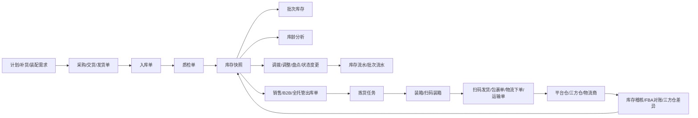

# 积加 ERP 仓库模块实采指标血缘与知识库建设计划

## 业务主链路

仓库模块不是一个单独的库存查询模块，而是计划、采购、入库、质检、仓内作业、出库、物流、三方仓、稽核共同作用后的库存结果层。

## 页面到血缘节点

| 血缘节点 | 上游 | 下游 | 页面 |
|---|---|---|---|
| 仓库主数据 | 系统配置 | 所有仓库事实表 | 仓库资料 |
| 库位主数据 | 仓库主数据 | 自营仓库存、拣货、装箱 | 库位资料 |
| 容器主数据 | 仓库主数据 | 装箱任务、扫码装箱、运输单 | 容器资料 |
| 期初批次 | 仓库主数据、SKU 主数据 | 批次库存、批次流水、库龄 | 库存批次初始化 |
| 库存快照 | 入库、出库、调拨、调整、三方仓同步 | 库龄、补货、可售、对账 | 仓库库存、产品库存、自营仓库存、平台仓库存 |
| 批次库存 | 入库、采购、交货、发货、状态变动 | 库龄、货值、成本追踪 | 批次库存 |
| 库存流水 | 所有库存变动单据 | 库存快照可解释性 | 库存流水 |
| 批次流水 | 批次入库、出库、预占、调拨、替换 | 批次库存可解释性 | 批次流水 |
| 入库收货 | 采购交货、发货单 | 质检、库存增加 | 入库单 |
| 质检 | 入库送检 | 良品/次品库存、实交量 | 质检单 |
| 调拨 | 库存快照、调拨计划 | 出库、在途、调入 | 调拨单 |
| 调整 | 人工调整、审核 | 库存流水、库存快照 | 调整单 |
| 盘点 | 账面库存、实盘库存 | 盈亏调整、库存流水 | 盘点单 |
| 状态变更 | 良品/次品/其他质量状态 | 库存快照、库存流水 | 库存状态变更单 |
| 装配 | 组合 SKU、包材、装配需求 | 成品库存、包材消耗 | 装配单 |
| 装箱 | 出库单、调拨单、容器 | 包裹、运输、发货 | 装箱任务、扫码装箱 |
| 销售出库 | 销售订单、库存分配 | 拣货、扫码发货、包裹 | 销售出库单 |
| 拣货 | 出库单、库位库存 | 验货、发货 | 拣货任务 |
| 发货 | 拣货任务、包裹、物流配置 | 物流下单、运输、平台履约 | 扫码发货 |
| 包裹 | 出库、发货、物流渠道 | 费用、申报、运输 | 包裹单 |
| 物流下单 | 包裹、报关、物流商 | 运单、跟踪、异常 | 物流下单、物流商在线申报 |
| 运输 | 包裹集合、发货仓、目的仓 | 实际费用、发运完成 | 运输单 |
| 三方仓入库 | 调拨、发货、三方仓服务商 | 三方仓状态、三方仓库存 | 三方仓入库预报单、三方仓入库单 |
| 三方仓出库 | 销售/B2B/大货出库 | 三方仓发货、实际费用 | 三方仓销售出库单、三方仓大货出库单 |
| 库存稽核 | ERP 库存、三方仓库存、FBA 报告 | 差异处理、财务结账 | 三方仓库存差异、月度FBA报告差异、FBA库存对账 |

## 二次重采后的血缘优先级修正

二次重采证据见 `warehouse-live-rerun-evidence-draft-20260604.md`。血缘建设不应从空页假设出发，而应按当前可见数据量和业务闭环优先级推进。

| 优先级 | 血缘链路 | 当前证据 | 先落库对象 |
|---|---|---|---|
| P0 | 仓库/产品/平台仓库存 -> 库存快照 | 仓库库存 49、产品库存 29319、平台仓库存 6684 | `fact_inventory_snapshot`、`fact_platform_inventory_snapshot` |
| P0 | 批次库存 -> 库龄/成本/货值 | 批次库存 279915 | `fact_batch_inventory_snapshot`、`fact_batch_flow` |
| P0 | 调拨/调整/其它出入库 -> 库存流水 | 调拨单、调整单、其它出入库均有数据 | `fact_inventory_flow`、`fact_transfer_order_line`、`fact_adjustment_order_line` |
| P1 | 销售出库 -> 包裹 -> 物流/运输 | 销售出库单、包裹单、运输单均有数据 | `fact_delivery_order_line`、`fact_package_line`、`fact_transport_order_line` |
| P1 | 三方仓入库/出库 -> 三方仓状态同步 | 三方仓入库预报、入库单、大货出库单有数据 | `fact_third_party_order_line` |
| P1 | 三方仓库存差异 -> 稽核处理 | 三方仓库存差异 781 | `fact_inventory_reconciliation_diff` |
| P2 | 入库/质检/库龄/FBA 对账 | 当前筛选为空或页签有量但列表为空 | 先做导出校验，再确认事实表粒度 |

## 建议数据库模型

### 维表

| 表名 | 主键 | 说明 |
|---|---|---|
| dim_warehouse | warehouse_id | 仓库主数据，包含仓库类型、国家、省份、启用状态 |
| dim_storage_bin | bin_id | 库区、货架、库位、上下架属性 |
| dim_container_rule | container_rule_id | 容器编码规则、容器类型、生成数量 |
| dim_product_sku | sku_id | SKU、MSKU、ASIN、FNSKU、产品名称、品类、品牌 |
| dim_platform_site | platform_site_id | 平台、站点、店铺、平台仓类型 |
| dim_supplier | supplier_id | 供应商维度，用于质检、入库、批次成本 |
| dim_logistics_provider | logistics_provider_id | 物流商、物流渠道、申报模板 |
| dim_status_code | status_code_id | 标准状态枚举，统一入库、调拨、出库、物流、对账状态 |

### 快照事实表

| 表名 | 建议粒度 | 关键指标 |
|---|---|---|
| fact_inventory_snapshot | snapshot_date + warehouse_id + sku_id + platform_site_id | 总库存、在库、良品、次品、可用、预占、在途、计采交合计量 |
| fact_bin_inventory_snapshot | snapshot_date + warehouse_id + bin_id + sku_id + quality_status | 总数量、出库占用数量、可用数量 |
| fact_platform_inventory_snapshot | snapshot_date + platform_site_id + warehouse_id + asin/msku | 总数量、在库量、已发货量、待入库量、货件在途量、15/30 天销量 |
| fact_batch_inventory_snapshot | snapshot_date + batch_no + sku_id + warehouse_id | 批次数量、采购成本、头程成本、货值、状态 |
| fact_inventory_age_snapshot | snapshot_date + sku_id + warehouse_id + age_bucket | 库龄数量、库龄货值、质量范围 |

### 流水事实表

| 表名 | 建议粒度 | 关键字段 |
|---|---|---|
| fact_inventory_flow | flow_id | 关联单据、操作类型、可用出入数、不良品出入数、前后库存 |
| fact_batch_flow | batch_flow_id | 初始批次号、操作类型、子操作类型、产品质量、数量、操作人 |
| fact_stock_status_change | status_change_id + sku_id | 从库存状态、到库存状态、变更数量、变更原因 |
| fact_adjustment_order_line | adjustment_order_id + sku_id | 调整仓库、调出/调入平台站点、状态、处理时间 |
| fact_stock_count_line | stock_count_order_id + sku_id | 盘点仓、盘点方式、盈亏数量 |
| fact_other_inout_line | order_id + sku_id + direction | 其他入库或出库数量、子操作类型、审核人、审核时间 |

### 作业单据事实表

| 表名 | 建议粒度 | 关键指标 |
|---|---|---|
| fact_inbound_receipt_line | receipt_order_id + sku_id | 应收货量、已收货量、退货量、送检量、已检量 |
| fact_quality_order_line | quality_order_id + sku_id | 送检量、抽检量、抽检次品率、质检良品量、实交量 |
| fact_transfer_order_line | transfer_order_id + sku_id | 调拨量、已出运、已调入、参考采购成本、参考头程成本 |
| fact_assembly_order_line | assembly_order_id + sku_id | 装配量、包材消耗/获得、整单人工费 |
| fact_packing_task_line | packing_task_id + sku_id | 发货量、已装箱数量、装箱员、发货仓 |
| fact_delivery_order_line | delivery_order_id + sku_id | 出库状态、出库时间、物流渠道、异常、订单平台 |
| fact_picking_task_line | picking_task_id + sku_id | 待拣货量、已拣货量、拣货总件数、波次号、拣货员 |
| fact_package_line | package_id + order_id | 运单号、跟踪号、预估费用、实际费用、目的国家、订单状态 |
| fact_logistics_order_line | logistics_order_id + package_id | 物流商请求状态、报关信息、重量、体积、异常类型、异常原因 |
| fact_transport_order_line | transport_order_id + package_id | 发货数量、运费、揽收方式、发货仓、目的仓、发运时间 |
| fact_third_party_order_line | third_party_order_id + sku_id | 三方仓单号、三方仓状态、计划入库数、已入库数、实际费用、异常信息 |
| fact_inventory_reconciliation_diff | reconciliation_id + sku_id | ERP 库存、外部系统库存、差异数量、差异类型、处理状态 |

## 知识库结构设计

建议把知识库拆成 4 层，不直接把所有页面字段塞进一份长文档：

| 层级 | 内容 | 存储形式 |
|---|---|---|
| 页面层 | ERP 页面、菜单分组、URL、筛选器、字段、按钮、页签 | page dictionary |
| 业务对象层 | 仓库、SKU、批次、入库单、质检单、调拨单、出库单、包裹、三方仓单 | entity dictionary |
| 指标层 | 指标名称、口径、公式、粒度、来源页面、刷新频率 | metric dictionary |
| 血缘层 | 指标由哪些事实表、哪些单据、哪些状态变更生成 | lineage graph |

### 建议知识图谱节点

| 节点类型 | 示例 |
|---|---|
| Module | warehouse |
| Page | 仓库库存、产品库存、销售出库单 |
| Entity | warehouse, sku, batch, inbound_order, outbound_order, package |
| Metric | available_qty, reserved_qty, inventory_variance_qty |
| Field | 可用量、预占量、出入前可用、可用出入数 |
| Status | 待收货、待入库、待拣货、已出库、处理失败 |
| SourceSystem | Jijia ERP, FBA Report, Third-party Warehouse |

### 建议知识图谱边

| 边类型 | 例子 |
|---|---|
| page_contains_field | 产品库存 contains 可用量 |
| field_defines_metric | 可用量 defines wh_available_qty |
| metric_derived_from | wh_available_qty derived_from fact_inventory_snapshot |
| fact_updated_by_order | fact_inventory_snapshot updated_by 销售出库单 |
| order_generates_flow | 调整单 generates 库存流水 |
| entity_has_status | 调拨单 has_status 调拨在途 |
| reconciliation_compares | 三方仓库存差异 compares ERP可用量 and 三方仓可用量 |

## 建设计划

| 阶段 | 目标 | 产出 |
|---|---|---|
| 1. 页面字段冻结 | 基于本轮 40 个页面，确认字段、菜单、页签和按钮 | 页面数据字典、页面到实体映射 |
| 2. 导出字段校验 | 通过 ERP 导出或下载中心获取真实列名、字段类型、隐藏列 | export column dictionary |
| 3. 指标口径评审 | 与计划、采购、仓库、物流、财务确认 P0/P1 指标公式 | metric contract |
| 4. 数据模型落库 | 建维表、快照事实表、流水事实表、单据事实表、对账事实表 | warehouse mart schema |
| 5. 血缘图谱建设 | 把页面、字段、指标、事实表、业务单据做图谱化 | lineage graph |
| 6. 指标服务化 | 为 BI、预警、补货、库龄、对账提供统一口径 | semantic metric layer |
| 7. 监控与治理 | 校验刷新、缺失值、对账差异、异常状态 | data quality dashboard |

## P0 数据集市落地顺序

1. `dim_warehouse`、`dim_product_sku`、`dim_platform_site`。
2. `fact_inventory_snapshot`、`fact_inventory_flow`。
3. `fact_batch_inventory_snapshot`、`fact_batch_flow`、`fact_inventory_age_snapshot`。
4. `fact_inbound_receipt_line`、`fact_quality_order_line`。
5. `fact_delivery_order_line`、`fact_picking_task_line`、`fact_package_line`。
6. `fact_inventory_reconciliation_diff`、`fact_fba_monthly_variance`。

## 关键治理规则

- 快照表必须带 `snapshot_date` 或 `snapshot_at`，避免把实时状态误当历史。
- 流水表必须保留 `source_order_no`、`operation_type`、`created_at`，否则无法解释库存变化。
- 状态字段统一进 `dim_status_code`，页面中文状态作为展示值，不作为模型主键。
- 金额指标必须同时保留原币、本位币、币种和汇率月份。
- 三方仓、FBA、平台仓口径必须保留 `source_system`，不能和 ERP 自营仓库存混成一个无来源字段。
- 对账差异必须保留处理状态和处理时间，不能只保留差异数量。
