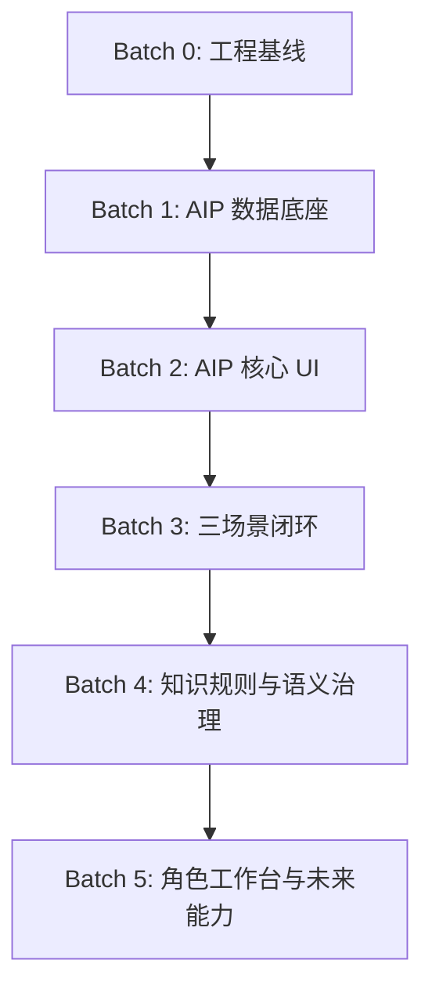

# 供应链 AIP 工作台 PRD v2.0 综合落地执行计划与 TODO

## 1. 执行结论

PRD v2.0 的落地不应重开一个新项目，也不应重写现有原型。正确路径是：在当前 `scm-data-governance-workbench-v0` 上做增量升级。

执行主线：

```text
保留 13 个治理工作台
-> 统一验收基线和 release register
-> 增加 AIP 对象实例层
-> 增加 Object 360
-> 增加 Agent Execution Trace
-> 增加 Recommendation Card
-> 改造 Command Center 第一屏
-> 用负库存、断货、库龄/超储三个场景做端到端验收
-> 再进入知识规则、角色工作台、provider、write-back
```

本计划把旧剩余 TODO 与 PRD v2.0 合并为 5 个开发批次：

| 批次 | 目标 | 时间建议 | 结果 |
|---|---|---:|---|
| Batch 0 | 收口工程基线和验收口径 | 2-3 天 | 后续开发有统一 source of truth |
| Batch 1 | AIP 数据底座 | 4-6 天 | 对象、trace、行动卡表和 API 可用 |
| Batch 2 | AIP 核心 UI | 6-8 天 | Command Center、Object 360、Trace、Recommendation 可操作 |
| Batch 3 | 三大业务场景闭环 | 5-7 天 | 负库存、断货、库龄/超储能演示和验收 |
| Batch 4 | 知识规则与语义治理补齐 | 8-12 天 | ChatBI 可回答性、证据导出、知识规则候选 |
| Batch 5 | 角色工作台和未来能力 | 4-8 周 | 计划/采购/库存/物流/成本工作台和 provider 前置治理 |

## 2. 当前基线

### 2.1 已实现并必须复用

| 能力 | 当前状态 | PRD v2.0 复用方式 |
|---|---|---|
| 13 个工作台模块 | 已部署可访问原型 | 不删除，作为治理底座 |
| SQLite ledger | 已有 annotation/comment/revision/workflow/audit/AI KB/AI feedback | 继续作为 Phase 1 账本 |
| `workbench_operations` | 已覆盖 13 个模块治理型 CRUD 基础版 | Recommendation Card 可生成 operation |
| KPI 画布 | 已有节点、连线、路径、高亮、抽屉、导出 | 增加对象图谱模式和场景路径 |
| 血缘质量 | 已有 rule/issue 基础工作流 | 增加对象级质量和 evidence gap |
| AI 知识库 | 已有 6 主题域、295 cards、945 chunks、1918 crosswalks | 升级为知识规则候选层 |
| AI 对话 | 本地证据检索、问法样本、反馈闭环 | 增加 trace 和行动卡入口 |
| ChatBI 语义治理 | 已有上下文认证和 fail-closed dry-run | 增加可回答性评分和 NL2Object 门禁 |
| 决策闭环 | 已有 action task 状态机 | 升级为 Recommendation Card + Action Tier |
| 审计日志 | 已有聚合、筛选、时间线 | 增加 trace/action/object event 审计 |
| Browser Harness | 已用于导航和 DOM 强校验 | 增加 AIP Phase 1 验收开关 |

### 2.2 旧 TODO 的处理方式

| 旧 TODO | 当前处理 |
|---|---|
| P0 工程验收、迁移、画布、质量、浅色 UI | 视为已完成基线，不返工 |
| P1 候选流、workflow、路径解释、决策状态机、ChatBI 认证、审计日志 | 视为已完成基础版，后续只增强 |
| P2 知识源、质量评分、stale、crosswalk、问法样本、反馈 | 视为已完成基础版，后续补规则运行层 |
| P2 ChatBI 可回答性评分 | 并入 Batch 4 |
| P2 AI 检索证据导出 | 并入 Batch 4 |
| P3 provider adapter、prompt 版本、call 审计 | 后置 Batch 5，必须等 trace/eval 稳定 |
| P3 RBAC 设计、SQLite -> Postgres | 后置 Batch 5，先做设计和迁移触发条件 |

### 2.3 强约束

- 不新增登录；保留 `actor/local_user` 和未来 role 字段。
- 不允许导入业务数据入口；允许 JSON/Excel 导出。
- 短期继续 SQLite，不在 Phase 1 切 Postgres。
- 外部模型 provider 默认关闭。
- 不执行自由 `NL2SQL`，只允许 `NL2Metric/NL2Object`。
- 不写回积加、ERP、WMS、TMS。
- 本体和指标字典 2.0 保持只读。
- 生产站点只允许只读 smoke；台账写入 smoke 默认只在本地或显式授权 staging 执行。

## 3. 目标架构落地顺序



关键依赖：

- `Object 360` 依赖 `object_instances`、`object_identity_links`、`object_events`。
- `Agent Execution Trace` 依赖 AI 对话和 ChatBI 的现有 evidence。
- `Recommendation Card` 依赖 trace、object、workflow、audit。
- `Command Center` 依赖对象风险、行动卡、workflow、质量摘要。
- 三大场景闭环依赖对象、trace、行动卡、知识证据。

## 4. Batch 0：工程基线与验收口径

目标：把当前状态收敛成可继续开发的稳定基线。

| ID | 任务 | 预计 | 影响文件 | 依赖 | Done Criteria |
|---|---|---:|---|---|---|
| AIP-B0-001 | 建 release register | 3h | `docs/release-register-20260619.md` | 无 | 记录当前部署 URL、SHA、release、health、验证命令，解决多 SHA 记录不一致 |
| AIP-B0-002 | 更新验收矩阵到 PRD v2.0 | 4h | `docs/e2e-acceptance-matrix-20260618.md` | PRD v2.0 | 增加 Command Center、Object 360、Trace、Recommendation、三场景验收 |
| AIP-B0-003 | 增加 AIP smoke flags 设计 | 3h | `scripts/smoke-browser-harness.sh`、`scripts/smoke-p0.mjs` | Browser Harness | 设计 `REQUIRE_AIP_PHASE1=1`、`REQUIRE_AIP_SCENARIOS=1` |
| AIP-B0-004 | 梳理 API health 扩展字段 | 2h | `server/index.mjs` | 无 | health 设计包含 object/trace/recommendation counts 和边界字段 |
| AIP-B0-005 | 确认本地写入 smoke 边界 | 2h | `docs/e2e-acceptance-matrix-20260618.md` | 无 | 文档明确生产只读、本地 ledger 写入、staging 授权写入三层 |

验收命令：

```bash
npm run check
npm run build
npm run smoke:p0
SCM_WORKBENCH_URL=https://scm.lute-tlz-dddd.top/ npm run smoke:browser
```

## 5. Batch 1：AIP 数据底座

目标：先补齐数据模型、API、seed 和审计，不先做复杂 UI。

### 5.1 SQLite migration

| ID | 任务 | 预计 | 影响文件 | Done Criteria |
|---|---|---:|---|---|
| AIP-B1-001 | 新增 migration `007_aip_phase1_objects_traces_recommendations.sql` | 6h | `scripts/migrations/007_aip_phase1_objects_traces_recommendations.sql` | 幂等创建 `object_instances`、`object_identity_links`、`object_events`、`agent_execution_traces`、`agent_trace_steps`、`recommendation_cards`、`recommendation_transitions`、`action_policy_tiers` |
| AIP-B1-002 | 在 server 启动时 ensure AIP schema | 4h | `server/index.mjs` | `ensureAipPhase1Schema()` 与 migration 字段一致 |
| AIP-B1-003 | 建索引和约束 | 3h | migration | 对 `object_type/object_key`、`target_object_type/target_object_id`、`trace_id`、`approval_status` 建索引 |
| AIP-B1-004 | health 增加 AIP counts | 2h | `server/index.mjs` | `/api/deploy/health` 返回 `aip.objectInstances`、`aip.traces`、`aip.recommendations` |

### 5.2 对象种子与映射

| ID | 任务 | 预计 | 影响文件 | Done Criteria |
|---|---|---:|---|---|
| AIP-B1-005 | 设计对象种子生成器 | 6h | `scripts/import-assets.mjs` 或新脚本 | 从现有 metrics、ontology、kb crosswalk 和 sample data 生成首批对象 |
| AIP-B1-006 | 生成 10 类对象种子 | 8h | SQLite data | 至少有 SKU、Listing、Supplier、PO、Shipment、Warehouse、InventoryBatch、ForecastVersion、CostEvent、ReturnOrder |
| AIP-B1-007 | 建 SKU identity mapping 初版 | 4h | SQLite data | 支持 SKU/MSKU/FNSKU/ASIN placeholder 关系，证据标注为 seed/draft |
| AIP-B1-008 | 对象挂指标/标签/知识卡 | 8h | crosswalk seed | Object 360 能取到关联指标、标签、知识卡、质量问题 |
| AIP-B1-009 | 对象事件 seed | 6h | SQLite data | 生成负库存、断货、库龄/超储、PO 延期等事件样例 |

### 5.3 API

| ID | 任务 | 预计 | API | Done Criteria |
|---|---|---:|---|---|
| AIP-B1-010 | 对象列表 API | 4h | `GET /api/aip/objects` | 支持 type/status/risk/query/limit |
| AIP-B1-011 | 对象详情 API | 6h | `GET /api/aip/objects/:id` | 返回 summary、relations、metrics、tags、kbCards、qualityIssues、recommendations、events |
| AIP-B1-012 | 对象事件 API | 4h | `GET /api/aip/objects/:id/events` | 支持 event_type 和时间排序 |
| AIP-B1-013 | trace API | 6h | `GET/POST /api/aip/traces`、`GET /api/aip/traces/:id` | 可创建 trace、查询 trace 和 steps |
| AIP-B1-014 | recommendation API | 8h | `GET/POST /api/aip/recommendations`、review、transition | 可创建、审批、流转、写 audit |
| AIP-B1-015 | AIP summary API | 4h | `GET /api/aip/summary` | 返回对象、trace、推荐动作、场景、风险摘要 |

验收：

```bash
npm run migrate
npm run check
npm run smoke:workflows
```

新增本地 smoke 应覆盖：

- `aip.object.createSeed/read`
- `aip.trace.create/read`
- `aip.recommendation.create/review/transition`
- `aip.health.counts`

### 5.4 Batch 1 本地执行状态

更新于 `2026-06-19`。状态仅代表本地原型与本地 SQLite，公开站点需后续部署后再验证。

| ID | 状态 | 证据 |
|---|---|---|
| AIP-B1-001 | `implemented_local` | `007_aip_phase1_objects_traces_recommendations.sql` 已新增并在临时库、实际本地库迁移通过 |
| AIP-B1-002 | `implemented_local` | `server/index.mjs` 启动时执行 `ensureAipPhase1Schema()` |
| AIP-B1-003 | `implemented_local` | migration 与 ensure 均创建对象、trace、recommendation、policy tier 索引 |
| AIP-B1-004 | `implemented_local` | `/api/deploy/health` 返回 `database.aipPhase1.schemaReady=true`、8 张表、计数和边界 |
| AIP-B1-005 | `implemented_local_with_note` | 当前为 server 幂等 seed；独立离线 seed 生成脚本后置 |
| AIP-B1-006 | `implemented_local` | 本地 seed 覆盖 SKU、Listing、Supplier、PO、Shipment、Warehouse、InventoryBatch、ForecastVersion、CostEvent、ReturnOrder |
| AIP-B1-007 | `implemented_local` | 本地 seed 生成 SKU/MSKU/ASIN/FNSKU identity link 初版 |
| AIP-B1-008 | `implemented_local_initial` | 对象详情 API 聚合指标、标签、知识卡、质量问题、recommendation、event 和 trace |
| AIP-B1-009 | `implemented_local` | 本地 seed 生成负库存、断货、库龄/超储、ETA 延误对象事件 |
| AIP-B1-010 | `implemented_local` | `GET /api/aip/objects` |
| AIP-B1-011 | `implemented_local` | `GET /api/aip/objects/:id` |
| AIP-B1-012 | `implemented_local` | `GET /api/aip/objects/:id/events` |
| AIP-B1-013 | `implemented_local` | `GET/POST /api/aip/traces`、`GET /api/aip/traces/:id` |
| AIP-B1-014 | `implemented_local` | `GET/POST /api/aip/recommendations`、review、transition |
| AIP-B1-015 | `implemented_local` | `GET /api/aip/summary` |

## 6. Batch 2：AIP 核心 UI

目标：把 AIP 数据底座变成可操作工作台。

### 6.1 Command Center

| ID | 任务 | 预计 | 影响文件 | Done Criteria |
|---|---|---:|---|---|
| AIP-B2-001 | 总览页第一屏重构 | 8h | `src/main.tsx`、`src/styles.css` | AI 搜索、风险 Top、行动队列、资产盘点同屏 |
| AIP-B2-002 | 风险 Top 5 组件 | 4h | UI | 卡片展示对象、风险、影响指标、owner、SLA |
| AIP-B2-003 | 行动队列组件 | 5h | UI + API | 展示 recommendation_cards 状态，可点击打开详情 |
| AIP-B2-004 | 资产盘点进度组件 | 4h | UI + summary API | 展示对象、指标、知识卡、质量规则覆盖 |
| AIP-B2-005 | Command Center 响应式修复 | 4h | CSS | 1440/1280/1024/768 宽度不横向溢出 |

### 6.2 Object 360

| ID | 任务 | 预计 | 影响文件 | Done Criteria |
|---|---|---:|---|---|
| AIP-B2-006 | 导航增加 Object 360 入口 | 3h | `src/main.tsx`、server modules | 不删除对象本体工作台，新增或增强入口 |
| AIP-B2-007 | 对象列表和筛选 | 5h | UI | 支持对象类型、风险、owner、搜索 |
| AIP-B2-008 | 对象摘要和关系路径 | 8h | UI | 展示摘要、上游/下游、关联指标/标签/知识卡 |
| AIP-B2-009 | 证据面板 | 5h | UI | 展示 metrics、kbCards、qualityIssues、lineage |
| AIP-B2-010 | 事件时间线 | 5h | UI | 展示 object_events、audit、workflow |
| AIP-B2-011 | 对象页创建行动卡 | 5h | UI + API | 从对象详情发起 Recommendation Card |

### 6.3 Agent Trace

| ID | 任务 | 预计 | 影响文件 | Done Criteria |
|---|---|---:|---|---|
| AIP-B2-012 | AI 对话生成 trace | 6h | `server/index.mjs` | `runLocalAiChat` 创建 trace 和 steps |
| AIP-B2-013 | Trace Timeline UI | 6h | `src/main.tsx` | AI 对话页展示 intent、object、metric、kb、quality、answerability |
| AIP-B2-014 | Evidence Gap Panel | 4h | UI | insufficient/partial 时展示缺失数据 |
| AIP-B2-015 | Trace 进入审计日志 | 3h | server/audit | `agent_trace.created`、`agent_trace.step_created` 可查 |

### 6.4 Recommendation Card

| ID | 任务 | 预计 | 影响文件 | Done Criteria |
|---|---|---:|---|---|
| AIP-B2-016 | 行动卡详情 UI | 6h | UI | 展示 impact、evidence、owner、SLA、Action Tier |
| AIP-B2-017 | 审批和状态流转 UI | 6h | UI + API | draft/submitted/approved/rejected/in_progress/done/replayed 可流转 |
| AIP-B2-018 | 行动卡导出 | 4h | export API | JSON/Excel 导出 |
| AIP-B2-019 | 决策闭环页联动 | 5h | UI | 决策闭环展示 recommendation_cards 和 action_tasks 对应关系 |

验收：

```bash
npm run check
npm run build
REQUIRE_AIP_PHASE1=1 SCM_WORKBENCH_URL=http://127.0.0.1:5174 npm run smoke:browser
```

### 6.5 Batch 2 本地执行状态

更新于 `2026-06-19T17:02:56+0800`。状态仅代表本地原型与临时 SQLite smoke 通过；公开站点未在本批次部署。

| ID | 状态 | 证据/说明 |
|---|---|---|
| AIP-B2-001 | `implemented_local` | 总览第一屏增加 `.aipCommandCenter`，保留 AI 搜索、风险队列、行动队列、资产盘点 |
| AIP-B2-002 | `implemented_local` | 高风险对象队列读取 `/api/aip/summary.topRiskObjects` |
| AIP-B2-003 | `implemented_local` | 行动队列读取 `/api/aip/summary.openRecommendations` 和决策页 `/api/aip/recommendations` |
| AIP-B2-004 | `implemented_existing` | 资产盘点进度继续复用 overview counts，并补充 AIP 边界信号 |
| AIP-B2-005 | `passed_local` | `REQUIRE_AIP_PHASE1=1 SCM_SKIP_PUBLIC_BROWSER_SMOKE=1 npm run smoke:p0` 覆盖 1350/1024/768/390 px |
| AIP-B2-006 | `implemented_local_initial` | Object 360 嵌入对象本体工作台，不新增独立导航以避免重复 |
| AIP-B2-007 | `implemented_local` | 支持对象类型、风险、owner、搜索 |
| AIP-B2-008 | `implemented_local_initial` | 展示对象摘要、关系图、指标/知识/trace/action 计数 |
| AIP-B2-009 | `implemented_local_initial` | 证据面板展示属性、身份映射、知识卡、关联指标和质量问题；lineage 明细后置 |
| AIP-B2-010 | `partial_local` | 展示 object events、trace、recommendation；audit/workflow 合并时间线后置 |
| AIP-B2-011 | `implemented_local` | Object 360 可直接创建 ledger-only 建议卡 |
| AIP-B2-012 | `implemented_local_with_note` | AI 对话后由 UI wrapper 调用 `/api/aip/traces` 写入 trace；未内嵌到 `runLocalAiChat` |
| AIP-B2-013 | `implemented_local` | AI 对话页新增 `.agentTraceTimeline` 和 `.traceStep` |
| AIP-B2-014 | `implemented_local` | 新增 `.evidenceGapPanel`，按 answerability score 估算缺口 |
| AIP-B2-015 | `partial_local` | `agent_trace.created` 审计存在；逐 step 审计未做 |
| AIP-B2-016 | `implemented_local_initial` | 决策闭环页新增 `.recommendationCard`，抽屉可查看建议卡上下文 |
| AIP-B2-017 | `implemented_local` | 建议卡按合法状态机 review/transition |
| AIP-B2-018 | `implemented_local` | `/api/export/aip-recommendations?format=json|excel` |
| AIP-B2-019 | `partial_local` | 决策闭环同时展示 recommendation_cards 和 action_tasks；一对一映射视图后置 |

本地验收命令：

```bash
npm run check
npm run build
REQUIRE_AIP_PHASE1=1 SCM_SKIP_PUBLIC_BROWSER_SMOKE=1 npm run smoke:p0
```

本地 smoke 现在额外覆盖：

- `aipRecommendation.exportJson`
- `aipRecommendation.exportExcel`
- Object 360 owner filter、object-to-recommendation 创建入口、metric evidence、quality evidence
- Recommendation Card export actions

## 7. Batch 3：三大业务场景闭环

目标：不用空泛 demo，用三个真实供应链场景证明 AIP 链路。

### 7.1 场景一：FBA 可用库存为负

| ID | 任务 | 预计 | Done Criteria |
|---|---|---:|---|
| AIP-B3-001 | 定义负库存场景规则 | 4h | 规则说明区分预占、同步延迟、扣减、调拨、平台差异、数据质量 |
| AIP-B3-002 | 生成负库存对象事件 seed | 3h | `object_events` 有 `negative_available_inventory` |
| AIP-B3-003 | AI 问答生成诊断 trace | 5h | 问“FBA 可用库存为负是否合理”能返回 trace、证据和 gap |
| AIP-B3-004 | 生成排查行动卡 | 4h | 行动卡包含 owner/SLA/action_options |
| AIP-B3-005 | 场景验收脚本 | 4h | smoke 覆盖对象 -> trace -> recommendation |

### 7.2 场景二：断货风险

| ID | 任务 | 预计 | Done Criteria |
|---|---|---:|---|
| AIP-B3-006 | 定义断货风险对象路径 | 4h | SKU -> Listing -> PO -> Shipment -> InventoryBatch 路径可解释 |
| AIP-B3-007 | 生成断货风险 seed | 3h | 对象事件有 `stockout_risk` |
| AIP-B3-008 | 断货风险 Object 360 | 5h | 对象页能展示受影响 Listing/PO/Shipment |
| AIP-B3-009 | 断货行动卡 | 4h | 生成补货/调拨/促销降速等 action options |
| AIP-B3-010 | 场景验收脚本 | 4h | smoke 覆盖路径和行动卡 |

### 7.3 场景三：库龄/超储

| ID | 任务 | 预计 | Done Criteria |
|---|---|---:|---|
| AIP-B3-011 | 定义库龄/超储规则 | 4h | 规则关联 InventoryBatch、Warehouse、Listing、PromotionPlan |
| AIP-B3-012 | 生成库龄事件 seed | 3h | object_events 有 `aging_overstock_risk` |
| AIP-B3-013 | 对象健康分初版 | 6h | SKU/InventoryBatch 有库存健康评分 |
| AIP-B3-014 | 超储行动卡 | 4h | 生成调拨、清仓、促销、停售检查等建议 |
| AIP-B3-015 | 场景验收脚本 | 4h | smoke 覆盖健康分和行动卡 |

验收：

```bash
npm run smoke:p0
REQUIRE_AIP_PHASE1=1 REQUIRE_AIP_SCENARIOS=1 SCM_WORKBENCH_URL=http://127.0.0.1:5174 npm run smoke:browser
```

### 7.4 Batch 3 本地执行状态

更新于 `2026-06-19T17:10:26+0800`。状态仅代表本地原型和临时 SQLite smoke 通过；公开站点未在本批次部署。

| ID | 状态 | 证据/说明 |
|---|---|---|
| AIP-B3-001 | `implemented_local_definition` | `negative_available_inventory` 场景定义包含规则摘要、对象路径、指标和动作选项 |
| AIP-B3-002 | `implemented_existing_seed` | seed 已有 `negative_available_inventory` object event |
| AIP-B3-003 | `implemented_local` | `POST /api/aip/scenarios/negative_available_inventory/run` 生成 trace |
| AIP-B3-004 | `implemented_local` | 同接口生成 Recommendation Card，包含 owner、priority、action_options |
| AIP-B3-005 | `passed_local` | `aipScenarios.runNegativeInventory` |
| AIP-B3-006 | `implemented_local_definition` | `stockout_risk` 对象路径：SKU -> Listing -> PO -> Shipment -> InventoryBatch |
| AIP-B3-007 | `implemented_existing_seed` | seed 已有 `stockout_risk` 和 `shipment_eta_delay` object events |
| AIP-B3-008 | `implemented_local` | 场景卡和 Object 360 可打开受影响对象；场景 API 返回 pathObjects |
| AIP-B3-009 | `implemented_local` | `POST /api/aip/scenarios/stockout_risk/run` 生成补货/调拨/促销降速建议卡 |
| AIP-B3-010 | `passed_local` | `aipScenarios.runStockoutRisk` |
| AIP-B3-011 | `implemented_local_definition` | `aging_overstock_risk` 场景定义关联 CostEvent、InventoryBatch、Warehouse、Listing |
| AIP-B3-012 | `implemented_existing_seed_with_alias` | seed 已有 `storage_age_overstock` event，场景以 `aging_overstock_risk` 对外暴露 |
| AIP-B3-013 | `implemented_local_initial` | 场景卡展示对象健康分；健康分来自 object seed |
| AIP-B3-014 | `implemented_local` | `POST /api/aip/scenarios/aging_overstock_risk/run` 生成调拨/清仓/促销/停售检查建议卡 |
| AIP-B3-015 | `passed_local` | `aipScenarios.runAgingOverstock` |

本地验收命令：

```bash
REQUIRE_AIP_PHASE1=1 REQUIRE_AIP_SCENARIOS=1 SCM_SKIP_PUBLIC_BROWSER_SMOKE=1 npm run smoke:p0
```

后置边界：

- 场景规则在 Batch 4 已具备 `knowledge_rules` 资产化入口，但三大场景的内置定义仍保留为 seed-backed product demo。
- 场景路径是 seed-backed 产品演示路径，不代表实时 ERP 证据。
- 运行场景只写 trace/recommendation ledger，不写业务系统。

## 8. Batch 4：知识规则与语义治理补齐

目标：合并旧剩余 P2 和 PRD v2.0 的知识规则运行层。

| ID | 任务 | 预计 | 来源 | Done Criteria |
|---|---|---:|---|---|
| AIP-B4-001 | ChatBI 可回答性评分页 | 6h | 旧 P2-006 | 展示主题/指标 answerability、证据覆盖、拒答原因 |
| AIP-B4-002 | AI 检索证据导出 | 4h | 旧 P2-008 | AI 对话证据链支持 Markdown/JSON 导出 |
| AIP-B4-003 | 新增 `knowledge_rules` 表 | 5h | PRD v2.0 | 规则候选含 source_card、object_type、required_metrics、action_template |
| AIP-B4-004 | 从知识卡创建规则候选 | 6h | PRD v2.0 | AI 知识库页可提交规则候选 |
| AIP-B4-005 | 规则绑定对象/指标/维度 | 6h | PRD v2.0 | 规则详情可展示对象、指标、维度 |
| AIP-B4-006 | 规则冲突检测初版 | 6h | PRD v2.0 | 同对象同条件冲突进入 workflow |
| AIP-B4-007 | 规则触发行动卡设计 | 4h | PRD v2.0 | 形成 action template，不自动执行 |
| AIP-B4-008 | 审计导出和保留策略 | 4h | 旧审计剩余项 | 审计日志可 JSON/Excel 导出 |

验收：

- ChatBI 页能按指标/主题看到可回答性。
- AI 对话可导出证据。
- AI 知识库可从知识卡创建规则候选。
- 规则候选只进入 ledger/workflow，不改写源知识库。

### 8.1 Batch 4 本地执行状态

更新于 `2026-06-19`。状态仅代表本地原型和临时 SQLite smoke 通过；公开站点未在本批次部署。

| ID | 状态 | 证据/说明 |
|---|---|---|
| AIP-B4-001 | `implemented_local` | `GET /api/chatbi/summary` 返回 `averageAnswerabilityScore`、`weakContexts`、`answerabilityBuckets`，ChatBI 页新增 `.chatbiAnswerabilityPanel` |
| AIP-B4-002 | `implemented_local` | `GET /api/ai-chat/messages/:messageId/evidence-export?format=json/markdown`，AI 对话结果新增 `.aiEvidenceExportActions` |
| AIP-B4-003 | `implemented_local` | `scripts/migrations/008_knowledge_rules.sql` 新增 `knowledge_rules`、`knowledge_rule_conflicts` |
| AIP-B4-004 | `implemented_local` | AI 知识库卡片新增 `.createKnowledgeRuleButton`，`POST /api/knowledge-rules` 可从知识卡创建规则候选 |
| AIP-B4-005 | `implemented_local_initial` | 规则候选记录 `target_object_type`、`target_metric_ids`、`target_dimension_ids`，推断逻辑仍需 owner 复核 |
| AIP-B4-006 | `implemented_local_initial` | 使用 `conflict_key` 检测同对象/同指标/同条件冲突，写入 `knowledge_rule_conflicts` 和 workflow |
| AIP-B4-007 | `implemented_local` | `POST /api/knowledge-rules/:id/run` 生成 `scenario_type=knowledge_rule_trigger` 的 Recommendation Card，不自动执行 |
| AIP-B4-008 | `implemented_local_scope_adjusted` | 知识规则支持 JSON/Excel 导出；审计日志本身沿用既有工作台能力，未在本批新增单独审计导出模块 |

本地验收命令：

```bash
REQUIRE_AIP_PHASE1=1 REQUIRE_AIP_SCENARIOS=1 SCM_SKIP_PUBLIC_BROWSER_SMOKE=1 npm run smoke:p0
```

本地 smoke 新增覆盖：

- `chatbiSummary.answerabilityGovernance`
- `aiChat.evidenceExportJson`
- `aiChat.evidenceExportMarkdown`
- `knowledgeRule.createFromCard`
- `knowledgeRule.review`
- `knowledgeRule.triggerRecommendation`
- `knowledgeRule.exportJson`
- `knowledgeRule.exportExcel`

后置边界：

- 规则推断是启发式初版，不替代 Owner 口径裁决。
- 规则认证尚未成为 ChatBI 强制 runtime gate。
- 公开站点未在本批次部署。

## 9. Batch 5：角色工作台、Provider、权限、数据库演进

目标：进入中期能力，但仍不能绕过治理。

### 9.1 角色型工作台

| ID | 任务 | 预计 | Done Criteria |
|---|---|---:|---|
| AIP-B5-001 | 角色工作台 shell | 8h | 支持计划、采购、库存、物流、成本等角色配置 |
| AIP-B5-002 | 计划员工作台 | 12h | ForecastVersion、SKU、PurchasePlan 队列和行动卡 |
| AIP-B5-003 | 采购员工作台 | 12h | Supplier、PO、Shipment 风险和行动卡 |
| AIP-B5-004 | 仓库库存工作台 | 12h | Warehouse、InventoryBatch、负库存、库龄 |
| AIP-B5-005 | 物流控制塔 | 12h | Shipment、Container、节点延误 |
| AIP-B5-006 | 财务成本工作台 | 12h | CostEvent、SKU、Shipment 成本归因 |

### 9.2 Provider 和 Agent 治理

| ID | 任务 | 预计 | Done Criteria |
|---|---|---:|---|
| AIP-B5-007 | DeepSeek/Kimi provider decision record | 3h | 决策文档明确优先级、成本、风险、回退 |
| AIP-B5-008 | provider gateway 设计 | 6h | 默认 off，只有证据上下文可传入 |
| AIP-B5-009 | prompt version 表 | 6h | prompt 可版本化、回滚、绑定场景 |
| AIP-B5-010 | provider call audit | 6h | 记录 prompt version、trace、evidence、token、cost |
| AIP-B5-011 | Agent eval cases | 8h | 从 question_samples 和 trace 构建 eval 集 |

### 9.3 权限和数据库演进

| ID | 任务 | 预计 | Done Criteria |
|---|---|---:|---|
| AIP-B5-012 | future RBAC 设计 | 6h | 不启用登录，但定义 role/action/object 权限模型 |
| AIP-B5-013 | SQLite -> Postgres 触发条件 | 6h | 数据量、并发、备份、审计和查询性能阈值明确 |
| AIP-B5-014 | Postgres schema compatibility review | 8h | SQLite 表结构未来迁移风险清单 |
| AIP-B5-015 | 受控 write-back 评估 | 8h | 只做 API 可行性与风险，不实际写回 |

## 10. 30 天排期建议

### Week 1：基线和 AIP 数据底座

- 完成 AIP-B0-001 到 AIP-B0-005。
- 完成 AIP-B1-001 到 AIP-B1-004。
- 启动 AIP-B1-005 到 AIP-B1-009。

验收结果：

- migration 幂等；
- health 有 AIP counts；
- 对象种子可查询；
- 不影响 13 个现有工作台。

### Week 2：Object 360 和 Command Center

- 完成 AIP-B1-010 到 AIP-B1-015。
- 完成 AIP-B2-001 到 AIP-B2-011。

验收结果：

- Command Center 第一屏可用；
- Object 360 可点击；
- 对象页有指标、知识卡、质量、事件、行动卡入口。

### Week 3：Trace 和 Recommendation

- 完成 AIP-B2-012 到 AIP-B2-019。
- 启动 AIP-B3-001 到 AIP-B3-005。

验收结果：

- AI 对话生成 trace；
- trace 可展示；
- 行动卡可创建、审批、导出；
- 负库存场景可闭环。

### Week 4：三场景验收和发布准备

- 完成 AIP-B3-006 到 AIP-B3-015。
- 更新验收矩阵和部署文档。
- 执行本地完整验收。
- 如验收通过，再部署腾讯云并做公开站点只读 Browser Harness 检查。

验收结果：

- 负库存、断货、库龄/超储三个场景可演示；
- 线上边界仍为 `providerCalls=false`、`erpWriteback=false`；
- 生产站点只读检查通过。

## 11. 开发任务分层 TODO

### P0：立即执行

- [x] AIP-B0-001 release register
- [x] AIP-B0-002 PRD v2.0 验收矩阵
- [x] AIP-B1-001 AIP Phase 1 migration
- [x] AIP-B1-010 对象列表 API
- [x] AIP-B1-011 对象详情 API
- [x] AIP-B1-013 trace API
- [x] AIP-B1-014 recommendation API
- [x] AIP-B2-001 Command Center 第一屏
- [x] AIP-B2-006 Object 360 入口
- [x] AIP-B2-012 AI 对话生成 trace（UI ledger wrapper）
- [x] AIP-B2-016 Recommendation Card UI

### P1：第一轮验收前必须完成

- [x] AIP-B1-005 对象种子生成器（当前为 server 幂等 seed；独立离线生成脚本后置）
- [x] AIP-B1-008 对象挂指标/知识卡（当前通过 `source_refs`、对象详情 API 与 crosswalk 查询提供初版）
- [x] AIP-B2-003 行动队列组件
- [x] AIP-B2-008 对象关系路径
- [x] AIP-B2-014 Evidence Gap Panel
- [x] AIP-B2-017 审批和状态流转 UI
- [x] AIP-B2-018 Recommendation Card JSON/Excel 导出
- [x] AIP-B3-001 到 AIP-B3-005 负库存场景
- [x] AIP-B3-006 到 AIP-B3-010 断货场景
- [x] AIP-B3-011 到 AIP-B3-015 库龄/超储场景

### P2：第二轮增强

- [ ] AIP-B4-001 ChatBI 可回答性评分页
- [ ] AIP-B4-002 AI 检索证据导出
- [ ] AIP-B4-003 knowledge_rules 表
- [ ] AIP-B4-004 从知识卡创建规则候选
- [ ] AIP-B4-006 规则冲突检测
- [ ] AIP-B4-008 审计导出和保留策略

### P3：后续规划

- [x] AIP-B5-001 角色工作台 shell
- [ ] AIP-B5-002 计划员工作台
- [ ] AIP-B5-003 采购员工作台
- [ ] AIP-B5-004 仓库库存工作台
- [ ] AIP-B5-005 物流控制塔
- [x] AIP-B5-007 provider decision record
- [x] AIP-B5-008 provider gateway 设计
- [x] AIP-B5-009 prompt version 表
- [x] AIP-B5-010 provider call audit
- [x] AIP-B5-011 Agent eval cases
- [ ] AIP-B5-012 future RBAC 设计
- [ ] AIP-B5-013 SQLite -> Postgres 触发条件

Batch 5 第一片已完成：

- `role-workbench` 作为第 14 个工作台模块接入导航、导出、工作流指引和工作台操作闭环；
- 已建立计划、采购、库存、物流、成本 5 个角色队列的基础版；
- 已建立 `role_workbenches`、`role_playbooks`、`provider_gateway_policies`、`agent_eval_cases` 四张治理账本；
- DeepSeek/Kimi 仅作为 provider policy 进入账本，状态保持 `disabled`，不调用外部模型；
- 角色页支持基于对象/事件/playbook 创建 L1 行动草稿，只写 `workbench_operations`。

仍未完成：

- B5-002 到 B5-005 的独立角色应用深水区，例如角色专属筛选、批量动作、SLA 和排班；
- B5-012 到 B5-015 的 RBAC、Postgres 迁移和 write-back 风险评估。

Batch 5 第二片已完成：

- 已建立 `provider_decision_records`、`prompt_versions`、`provider_call_audits` 三张 provider readiness 账本；
- DeepSeek/Kimi 决策记录进入 `review_pending`，但 provider policy 仍为 `disabled`；
- Prompt versions 均为 `draft_disabled`，绑定 role、eval case、scenario 和 evidence contract；
- `blocked-dry-run` 只记录本地 call audit，不发送任何外部 provider 请求；
- 角色工作台 Provider Gateway 面板可查看决策、prompt 和 blocked audit。

## 12. 验收矩阵

| 验收层 | 命令/方法 | 通过标准 |
|---|---|---|
| TypeScript | `npm run check` | 无类型错误 |
| 构建 | `npm run build` | Vite build 成功 |
| 迁移 | `npm run migrate` | 新 migration 幂等 |
| 本地工作流 | `npm run smoke:workflows` | ledger 写入和 API 流转通过 |
| 全量 P0 | `npm run smoke:p0` | build、migration、workflow、browser 全通过 |
| AIP Phase 1 浏览器 | `REQUIRE_AIP_PHASE1=1 SCM_WORKBENCH_URL=http://127.0.0.1:5174 npm run smoke:browser` | Command Center/Object 360/Trace/Recommendation DOM 存在 |
| AIP 场景 | `REQUIRE_AIP_SCENARIOS=1 ... npm run smoke:browser` | 三场景路径和行动卡存在 |
| 生产只读 | `SCM_WORKBENCH_URL=https://scm.lute-tlz-dddd.top/ npm run smoke:browser` | 公开站点导航和只读 DOM 通过 |
| Health | `curl /api/deploy/health` | `ok=true`，边界字段全为 false |

## 13. 部署策略

1. 本地完成 `npm run smoke:p0`。
2. 生成 SQLite 备份。
3. 推送到 `zjgulai/scm` 的工作分支。
4. 服务器创建新 release，不覆盖历史 release。
5. 执行容器内 `npm run migrate`。
6. 切换 current symlink 或 compose release。
7. 执行公开站点只读 Browser Harness。
8. 记录 release register。

禁止事项：

- 不在生产公开站点执行 ledger 写入 smoke，除非用户明确授权 staging 写入。
- 不直接修改生产 SQLite 而无备份。
- 不把本地场景 seed 描述为真实业务结论。

## 14. 风险和控制

| 风险 | 影响 | 控制 |
|---|---|---|
| 对象种子过于 mock | 业务可信度不足 | 每个对象必须有 `source_system/source_ref/evidence_refs`，并标明 seed/draft |
| AIP UI 增加横向溢出 | 用户已反馈响应式问题 | 每批 UI 变更都跑 1440/1280/1024/768 browser check |
| Trace 被误认为模型思维链 | 合规和解释风险 | 只展示检索、匹配、证据、对象路径，不展示隐藏推理 |
| 行动卡误导为自动执行 | 业务风险 | Action Tier 默认 L0-L2，不提供写回按钮 |
| 旧功能回归 | 已实现能力被破坏 | 每批必须跑 13 模块导航和原有 smoke |
| 文档和部署 SHA 不一致 | 验收混乱 | Batch 0 必须先建 release register |
| Provider 过早接入 | 语义层被绕过 | Phase 4 前不接 provider |

## 15. 开发顺序建议

最优先开工顺序：

1. `AIP-B0-001` 到 `AIP-B0-005`：先稳住验收和文档基线。
2. `AIP-B1-001` 到 `AIP-B1-004`：先做 migration 和 health。
3. `AIP-B1-010` 到 `AIP-B1-015`：先做 API。
4. `AIP-B1-005` 到 `AIP-B1-009`：补对象 seed。
5. `AIP-B2-001` 到 `AIP-B2-019`：再做 UI。
6. `AIP-B3-001` 到 `AIP-B3-015`：最后做三场景验收。

这样安排的原因是：先让数据和 API 稳定，再做 UI 和场景，可以降低返工；同时能确保现有 13 个工作台始终可用。
