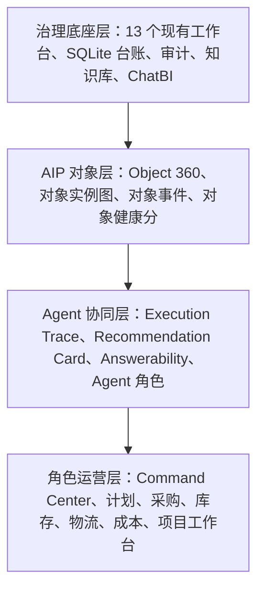
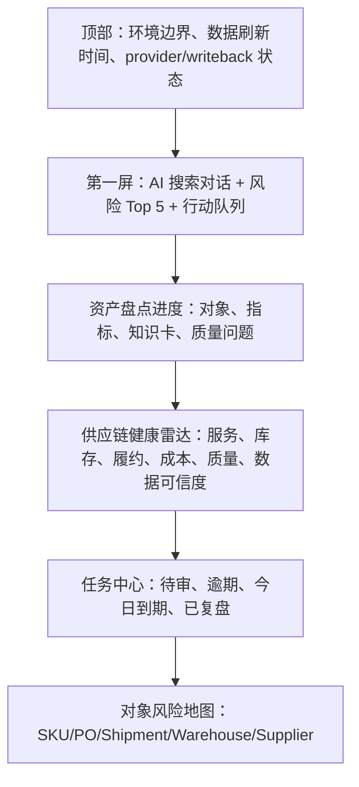
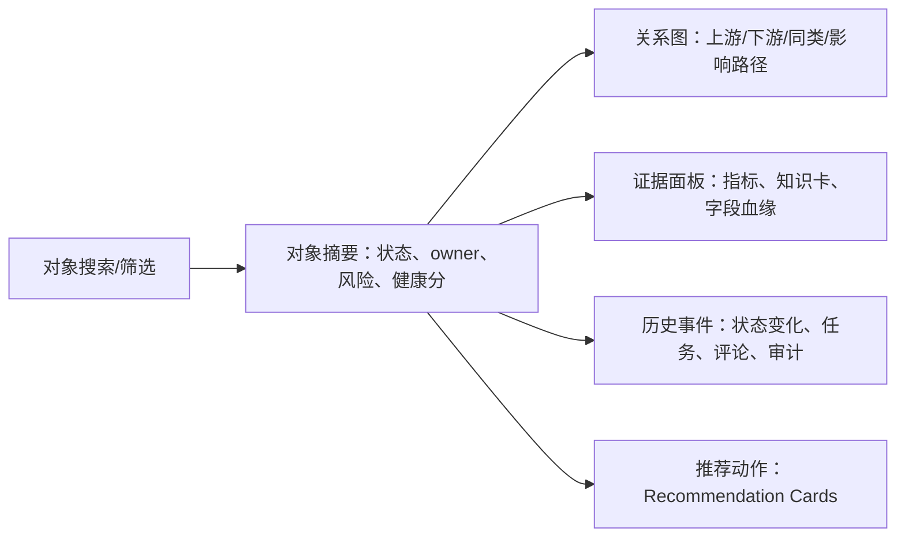
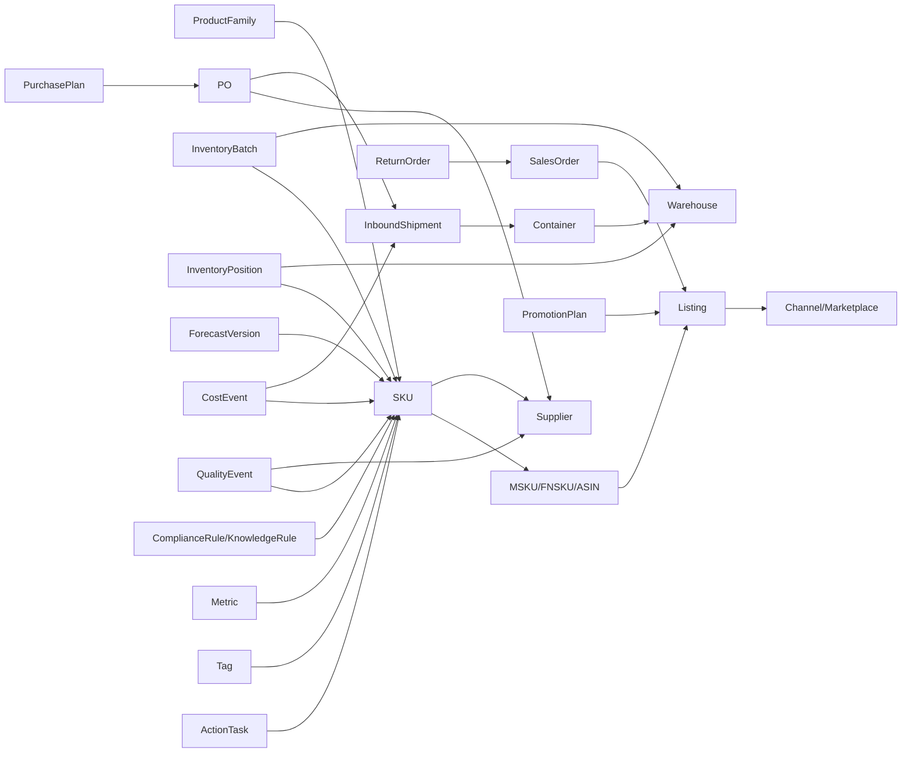
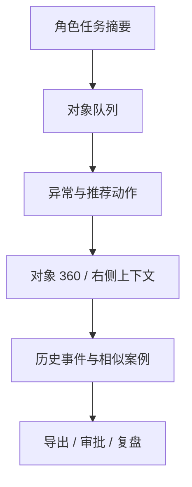

# 供应链 AIP 数据开发治理工作台 PRD v2.0

## 1. 文档定位

PRD v2.0 是对现有“供应链数据开发治理工作台二次迭代 PRD”的增量升级，不删除、不覆盖已实现能力。

本版本的核心目标是：在保留 13 个治理工作台、SQLite 台账、本地知识库检索、ChatBI 认证语义治理、指标体系画布、审计日志和决策闭环的基础上，把产品形态升级为“母婴跨境供应链 AIP Operating System”的第一阶段蓝图。

### 1.1 必须保留的既有能力

以下能力已经在当前 PRD 或实现记录中存在，PRD v2.0 只能增量调优或重组，不允许删除：

| 已有能力 | 保留方式 | V2.0 增量 |
|---|---|---|
| 13 个工作台模块 | 全部保留 | 重组为治理底座层、AIP 对象层、角色操作层 |
| SQLite 治理台账 | 保留为当前原型账本 | 增加对象实例、执行轨迹、推荐动作、场景任务等表 |
| 本体只读 | 保留 | 新增对象 360，只允许注解、评论、修订建议 |
| 指标字典 2.0 只读 | 保留 | 指标仍只读，但可进入 Agent 证据链和 Recommendation Card |
| KPI 画布 | 保留 | 增加 Palantir 对象图谱模式、路径解释和场景入口 |
| AI 知识库 | 保留 | 从文档检索升级为规则运行层和对象证据层 |
| AI 对话 | 保留 | 增加 Agent Execution Trace、问法分层、推荐动作入口 |
| ChatBI 语义治理 | 保留 | 明确 NL2Metric/NL2Object，不允许自由 NL2SQL |
| 决策闭环 | 保留 | 升级为 Action Tier 分级和推荐动作卡 |
| 审计日志 | 保留 | 增加 AI trace、action transition、object event 追踪 |
| no login | 保留短期边界 | 预留 actor、role、permission，但不在当前阶段强制实现 |
| no provider call | 保留短期边界 | P2/P3 后置 DeepSeek/Kimi provider gateway |
| no ERP/Jijia writeback | 保留短期边界 | 先导出/任务/审批，再评估 API write-back |

### 1.2 当前事实边界

- 当前线上站点应表述为“已部署可访问原型”，不是正式生产 AIP 系统。
- 当前知识库仍以 `drafts/analysis/` 中的草稿知识库和本地索引为输入，不等同于已经被 ERP/API/生产数据全量验证。
- Palantir 视频无官方字幕或自动字幕；本文的视频启发来自本地抽帧、OCR 和官方 AIP/Ontology/Action 文档，不构成逐字稿。
- 本 PRD 是产品规划和实施设计，不执行代码变更、不部署、不调用外部模型、不写回业务系统。

## 2. 战略目标

### 2.1 一句话定义

面向母婴跨境品牌的供应链 AIP 数据开发治理工作台，是一个以对象本体为核心、以认证语义层为边界、以 AI 证据链为交互入口、以推荐动作和复盘为闭环的供应链运营系统。

### 2.2 北极星目标

把当前平台从“指标和知识库治理后台”升级为“供应链经营动作系统”：

```text
数据资产
-> 业务对象
-> 标签/维度/指标
-> 证据链
-> AI 解释
-> 推荐动作
-> 审批执行
-> 结果复盘
-> 知识沉淀
```

### 2.3 V2.0 的产品判断

Palantir 视频给出的核心启发是：真正有价值的 AIP 不是通用聊天框，而是嵌入具体业务对象和工作流的操作系统。

因此 V2.0 的产品路线不是：

```text
更多页面 + 更大 BI 图表 + 更强聊天
```

而是：

```text
对象 360 + Agent Execution Trace + 推荐动作卡 + 角色工作台 + 受控 Action
```

## 3. 视频截图启发与产品采纳矩阵

### 3.1 截图证据总览

| 截图证据 | 视频段落 | 观察到的产品模式 | V2.0 采纳 |
|---|---|---|---|
| `keyframes-contact-02.jpg` | Kirkland Fund Formation Engine | 文档、对象图谱、Agent Execution Trace、导出、Obligations Assistant | 采纳为 AI 执行轨迹、知识规则图谱、文档规则助手 |
| `keyframes-contact-03.jpg` | PartsIQ / Service Order | 零件搜索、设备对象、客户现场、历史工单、相似订单 | 采纳为 SKU/Listing/售后/退货对象 360 与相似案例 |
| `keyframes-contact-04.jpg` | USDA | 地图、申请路径、支付状态、推荐动作、国家指挥中心 | 采纳为供应链 Command Center、对象路径、行动建议 |
| `keyframes-contact-06.jpg` | Hertz + McCarthy | 车队网络、action required、地图、排程、预算、open issue | 采纳为库存物流控制塔、供应链项目工作台、异常行动队列 |
| `keyframes-contact-07.jpg` | McCarthy 延续 | 文档包、项目内容组合、对象/文档/计划联动 | 采纳为大促/新品/渠道备货项目包 |

### 3.2 从截图提炼的 UI/交互原则

| 原则 | 截图来源 | 供应链平台转译 |
|---|---|---|
| 工作台围绕任务，而不是围绕菜单 | Hertz、McCarthy、PartsIQ | 每页必须有当前对象、当前问题、下一动作 |
| 对象图谱嵌入业务页面 | Kirkland、PartsIQ、USDA | SKU/PO/Shipment/InventoryBatch 的上下游路径必须可见 |
| AI 过程必须可审计 | Kirkland | AI 回答展示 execution trace，不只给结论 |
| 推荐动作必须可审批 | Hertz、USDA | action required / recommended actions 转为 Recommendation Card |
| 业务文档是可运行证据 | Kirkland、McCarthy | 知识库卡片进入规则运行层，绑定对象、指标、动作 |
| 一屏多视角联动 | PartsIQ、McCarthy | 对象详情、历史记录、相似案例、证据、任务并列显示 |
| 指挥中心聚焦异常和行动 | Hertz、USDA | 总览页第一屏是风险、任务、AI 搜索和行动队列 |

## 4. 目标用户与场景

### 4.1 用户分层

| 用户 | V1/V2 已有诉求 | V2.0 AIP 增量诉求 |
|---|---|---|
| 管理层 | 看治理状态和指标体系 | 看供应链风险、经营影响、行动进度和复盘结论 |
| 供应链负责人 | 建指标体系、看任务 | 用对象图谱追踪断货、积压、延期、成本异常 |
| 计划员 | 看备货规则、计划库存 | 生成补货建议、解释预测偏差、管理 ForecastVersion |
| 采购员 | 看 PO、供应商、采购指标 | 追踪 PO 风险、供应商履约、MOQ/交期异常 |
| 仓库/库存负责人 | 看仓库库存、库龄、批次 | 诊断负库存、批次状态、库龄、调拨建议 |
| 物流协调 | 看物流节点和货件 | 管理 Shipment、Container、延误、费用异常 |
| 财务/经营分析 | 看成本和毛利 | 对 SKU/渠道/货件做成本归因和现金占用分析 |
| 数据开发/BI | 看字段、血缘、质量 | 把对象、指标、规则、Agent trace 落到可执行数据资产 |

### 4.2 高价值业务场景

| 场景 | 当前痛点 | AIP 工作台目标 |
|---|---|---|
| FBA 可用库存为负 | 难判断是预占、同步、扣减、调拨、平台差异还是规则问题 | 自动拉出库存对象、字段血缘、规则证据、推荐排查路径 |
| 断货风险 | 销售、库存、采购、物流割裂 | 从 SKU/Listing 到 PO/Shipment/InventoryBatch 做路径解释 |
| 超储/库龄 | 只看结果，难连接促销和渠道分配 | 识别积压对象，推荐调拨、促销、停售、清仓动作 |
| 采购延期 | PO 状态和供应商履约未进入统一对象图谱 | 把 PO、Supplier、Shipment、销售影响联动 |
| 物流延误 | 运输节点与销售风险/库存风险割裂 | 建 Logistics Control Tower 和延误 action cards |
| 大促备货 | 项目、排程、预算、风险分散 | 建供应链项目工作台，管理里程碑、open issue、推荐动作 |
| 新品爬坡 | 预测、采购、仓储、Listing、内容节奏不同步 | 建新品项目包和 ForecastVersion 复盘 |
| 售后/退货 | 退货原因、配件、质量和供应链动作未闭环 | 类 PartsIQ 建 SKU/配件/售后问题对象链 |

## 5. V2.0 产品架构

### 5.1 四层产品架构



### 5.2 与现有 13 模块的关系

| 现有模块 | V2.0 定位 | 增量调优 |
|---|---|---|
| 治理链路总览 | Command Center 第一屏 | 增加对象风险、AI 搜索、行动队列、资产盘点进度 |
| AI 对话 | AIP 入口之一 | 增加 execution trace、对象识别、推荐动作生成 |
| 对象本体工作台 | 对象类型治理 | 增加 Object 360 和对象实例图，只读本体不变 |
| 标签工程工作台 | 对象标签规则治理 | 增加标签适用对象、触发条件、动作关联 |
| 维度工程工作台 | 分析维度治理 | 增加维度与对象/角色工作台适配矩阵 |
| 指标工程工作台 | 指标资产治理 | 增加指标到对象、场景和推荐动作的映射 |
| 指标字典工作台 | canonical 指标口径 | 保持只读，增加作为 AI 证据源和 action impact 指标 |
| 指标体系编排台 | KPI 画布 | 增加对象图谱模式、场景路径、注解式分析 |
| 血缘与质量工作台 | 数据可信度治理 | 增加对象级质量问题和 evidence gap |
| ChatBI 语义治理台 | 认证语义层 | 增加 NL2Object/NL2Metric 可回答性门禁 |
| AI 知识库 | 规则与证据层 | 增加规则运行层、知识卡到对象/动作的映射 |
| 决策闭环工作台 | Action 账本 | 增加 Action Tier、Recommendation Card、执行复盘 |
| 审计日志工作台 | 统一审计 | 增加 AI trace、对象事件、动作审批审计 |

## 6. 新增模块 1：Supply Chain Command Center

### 6.1 截图灵感

- Hertz：地图、车队网络、fleet events、action required、对象状态。
- USDA：National Command Center、Drought Analysis、Recommended Actions。

### 6.2 产品目标

把现有治理总览页升级为管理层第一屏。第一屏必须回答：

- 今天最重要的供应链风险是什么？
- 影响哪些 SKU、Listing、PO、Shipment、Warehouse？
- 影响销量、毛利、现金、库存健康多少？
- 哪些行动已经生成，谁负责，什么时候到期？
- AI 能否基于当前认证证据解释这个问题？

### 6.3 页面结构



### 6.4 功能需求

| ID | 需求 | 优先级 | 验收 |
|---|---|---:|---|
| CC-001 | 第一屏内嵌 AI 搜索/对话入口 | P0 | 不跳转即可提问，回答展示证据和可回答性 |
| CC-002 | 风险 Top 5 卡片 | P0 | 展示对象、风险类型、影响指标、owner、SLA |
| CC-003 | 行动队列 | P0 | 展示 Recommendation Card 状态和审批节点 |
| CC-004 | 资产盘点进度 | P0 | 展示对象、指标、知识卡、质量规则覆盖率 |
| CC-005 | 供应链健康雷达 | P1 | 支持服务、库存、履约、成本、质量、可信度维度 |
| CC-006 | 对象风险地图 | P1 | 点击 SKU/PO/Shipment 可进入 Object 360 |
| CC-007 | 管理层导出 | P1 | 导出 JSON/Excel，后续支持 PPT 包 |

### 6.5 保留既有能力

- 保留现有治理健康、workflow board、导出入口、模块卡片。
- 现有总览中的工作流状态不下线，只并入行动队列和任务中心。

## 7. 新增模块 2：Object 360

### 7.1 截图灵感

- PartsIQ：零件对象、设备对象、客户现场、历史工单、相似订单并列显示。
- Kirkland：业务文档与对象图谱联动。
- Hertz：车辆对象状态、网络、action required。

### 7.2 产品目标

Object 360 是 AIP 化的核心页面。它把一个业务对象的属性、关系、指标、标签、知识证据、事件、质量问题和行动任务放在同一上下文中。

### 7.3 首批对象范围

| 对象 | 为什么优先 | 核心问题 |
|---|---|---|
| SKU | 所有供应链动作的最小经营单元 | 断货、超储、毛利、质量、生命周期 |
| Listing | 连接渠道销售和库存 | 哪些销售前台受供应链影响 |
| Supplier | 连接采购履约和质量 | 谁影响交期、成本、质量 |
| PO | 采购执行核心对象 | 哪些订单延期，影响哪些 SKU |
| Shipment | 物流履约核心对象 | 哪些货件延误，影响哪些库存 |
| Warehouse | 库存位置核心对象 | 哪些仓库有负库存/库龄/状态异常 |
| InventoryBatch | 库存质量和库龄核心对象 | 批次归属、库龄、不良、可售状态 |
| ForecastVersion | 计划推演核心对象 | 哪个预测版本导致计划偏差 |
| CostEvent | 成本归因核心对象 | 哪些费用影响 SKU/渠道毛利 |
| ReturnOrder | 质量和售后核心对象 | 哪些退货原因触发供应链动作 |

### 7.4 页面结构



### 7.5 功能需求

| ID | 需求 | 优先级 | 验收 |
|---|---|---:|---|
| OBJ-001 | 支持对象搜索和对象类型筛选 | P0 | 可按 SKU/PO/Shipment 等对象类型查询 |
| OBJ-002 | 对象摘要卡 | P0 | 展示对象状态、owner、风险等级、健康分 |
| OBJ-003 | 对象关系路径 | P0 | 展示上游、下游、关联指标、标签、知识卡 |
| OBJ-004 | 对象证据面板 | P0 | 展示指标、字段、知识卡和数据质量状态 |
| OBJ-005 | 对象事件时间线 | P1 | 展示状态变化、任务、评论、审计 |
| OBJ-006 | 对象推荐动作 | P1 | 可从对象页创建 Recommendation Card |
| OBJ-007 | 对象相似案例 | P2 | 类 PartsIQ 展示相似 SKU/PO/异常案例 |

### 7.6 写入边界

- 不直接编辑 canonical 本体对象。
- 允许写入对象注解、评论、修订建议、对象事件、推荐动作。
- 对象实例初期来自本地导出和种子表，不代表生产实时真相。

## 8. 新增模块 3：Agent Execution Trace

### 8.1 截图灵感

Kirkland Fund Formation Engine 页面中的 Agent Execution Trace 展示了 AI 如何解析请求、遍历本体、拉取文档、构建结果。

### 8.2 产品目标

AI 的每次回答和推荐动作都必须可审计。用户要能看到：

- AI 识别了什么对象；
- 使用了哪些指标和维度；
- 检索了哪些知识卡；
- 走过哪些对象关系；
- 哪些证据足够，哪些证据不足；
- 为什么给出这个推荐动作。

### 8.3 Trace 结构

```text
用户问题
-> 意图识别
-> 对象识别
-> 指标/维度匹配
-> 知识卡检索
-> 对象关系遍历
-> 质量/血缘检查
-> 结论生成
-> 推荐动作生成
-> 人工审核
```

### 8.4 功能需求

| ID | 需求 | 优先级 | 验收 |
|---|---|---:|---|
| TRACE-001 | AI 回答记录 trace | P0 | 每条 AI 回答有 trace_id |
| TRACE-002 | trace 步骤可视化 | P0 | 展示步骤、输入、输出、证据 refs |
| TRACE-003 | 支持 answerability | P0 | supported/partial/insufficient/conflict |
| TRACE-004 | 支持 evidence gap | P0 | 证据不足时列出缺失数据 |
| TRACE-005 | trace 生成推荐动作 | P1 | 可从 trace 创建 Recommendation Card |
| TRACE-006 | trace 进入审计日志 | P1 | 审计页可查 AI trace 和用户反馈 |
| TRACE-007 | trace 评测集 | P2 | 与问法样本库联动，形成 eval cases |

### 8.5 不展示隐藏思维链

`Agent Execution Trace` 是业务执行轨迹，不是模型隐藏思维链。页面只展示可审计的检索、匹配、证据、规则、对象路径和操作记录。

## 9. 新增模块 4：Recommendation Card

### 9.1 截图灵感

- Hertz：Action Required。
- USDA：Recommended Actions。
- McCarthy：suggested、open issue、项目风险。

### 9.2 产品目标

把 AI 洞察从“文本结论”变成可审批、可执行、可复盘的行动卡。

### 9.3 卡片字段

| 字段 | 说明 |
|---|---|
| `recommendation_id` | 推荐动作 ID |
| `scenario` | 断货、超储、延期、成本异常、质量风险等 |
| `target_object_type` | SKU、PO、Shipment、InventoryBatch 等 |
| `target_object_id` | 目标对象实例 |
| `business_impact` | 销售、毛利、现金、服务水平、风险说明 |
| `evidence_refs` | 指标、字段、知识卡、trace、历史事件 |
| `confidence_level` | high/medium/low |
| `risk_level` | P0/P1/P2/P3 |
| `owner` | 负责人 |
| `sla_due_at` | 截止时间 |
| `action_options` | 可选动作集合 |
| `approval_status` | draft/submitted/reviewed/approved/rejected |
| `execution_status` | not_started/in_progress/done/replayed |
| `postmortem` | 复盘记录 |

### 9.4 Action Tier

| Tier | 权限 | 当前阶段 |
|---|---|---|
| L0 | 只读解释 | 立即实现 |
| L1 | 生成建议 | 立即实现 |
| L2 | 创建治理任务 | 立即实现 |
| L3 | 审批后导出 JSON/Excel 或创建待办 | P1/P2 |
| L4 | 审批后调用外部系统 API | 未来布局 |
| L5 | 受控自动执行 | 远期布局 |

### 9.5 功能需求

| ID | 需求 | 优先级 | 验收 |
|---|---|---:|---|
| REC-001 | 支持从 AI trace 创建行动卡 | P0 | AI 回答页可生成 Recommendation Card |
| REC-002 | 支持从 Object 360 创建行动卡 | P0 | 对象页可创建行动卡 |
| REC-003 | 支持审批状态流 | P0 | draft/submitted/approved/rejected 可流转 |
| REC-004 | 支持 owner 和 SLA | P0 | 任务中心可按 owner/SLA 筛选 |
| REC-005 | 支持导出 | P1 | JSON/Excel 导出行动卡 |
| REC-006 | 支持执行反馈和复盘 | P1 | done 后必须填写结果和复盘 |
| REC-007 | 支持 Action Tier 策略 | P2 | 系统限制不同动作权限 |

## 10. 新增模块 5：供应链对象图谱

### 10.1 产品目标

把指标、标签、维度、知识卡、质量问题和行动任务挂到真实业务对象上，形成可被 AI 和人共同使用的供应链本体。

### 10.2 核心对象图谱



### 10.3 母婴行业特有扩展

| 扩展属性 | 适用对象 | 价值 |
|---|---|---|
| 年龄段/月龄段 | SKU/ProductFamily | 支撑需求预测和套装组合 |
| 尺码/阶段 | SKU/Listing | 支撑库存分层和退换货分析 |
| 材质/认证/安全等级 | SKU/ComplianceRule | 支撑合规和质量闭环 |
| 批次与包装版本 | InventoryBatch/SKU | 支撑召回、差评、库存状态 |
| 套装/组合/替代关系 | SKU/Listing | 支撑断货替代和促销策略 |
| 内容营销活动 | PromotionPlan/Listing | 支撑需求脉冲解释 |
| 平台履约模式 | Channel/Warehouse | 支撑 FBA/FBT/Walmart/TikTok 库存分配 |

### 10.4 功能需求

| ID | 需求 | 优先级 | 验收 |
|---|---|---:|---|
| GRAPH-001 | 对象类型全覆盖 | P0 | 关键对象类型在本体工作台可查看 |
| GRAPH-002 | 关键对象实例入图 | P0 | 核心 SKU、PO、Shipment、Warehouse 可进入 Object 360 |
| GRAPH-003 | 对象关系路径解释 | P0 | 可回答“某 SKU 为什么断货/超储” |
| GRAPH-004 | 指标/标签/知识卡挂对象 | P0 | 对象页能看到关联指标和知识证据 |
| GRAPH-005 | 对象健康分 | P1 | 每类对象有可解释健康评分 |
| GRAPH-006 | 图谱搜索 | P1 | 可从对象、指标、知识卡反向搜索关系 |
| GRAPH-007 | 图谱导出 | P2 | 支持 JSON/Excel 导出节点和边 |

## 11. 新增模块 6：角色型工作台

### 11.1 产品目标

现有 13 个工作台偏治理后台。V2.0 在其上增加角色型操作入口，让管理层和业务团队围绕对象完成日常工作。

### 11.2 工作台清单

| 角色工作台 | 截图灵感 | 核心对象 | 核心输出 |
|---|---|---|---|
| 管理层 Command Center | Hertz/USDA | 全局对象与行动卡 | 风险摘要、经营影响、行动进度 |
| 计划员工作台 | McCarthy 排程 | SKU、ForecastVersion、PurchasePlan | 补货建议、预测偏差、计划复盘 |
| 采购员工作台 | PR/PO 运营演示 | Supplier、PO、Shipment | PO 风险、供应商履约、交期建议 |
| 仓库库存工作台 | Hertz 状态网络 | Warehouse、InventoryBatch | 负库存、库龄、调拨、盘点任务 |
| 物流控制塔 | Hertz/USDA 地图 | Shipment、Container、Warehouse | 延误风险、节点异常、替代动作 |
| 财务成本工作台 | McCarthy 预算 | CostEvent、SKU、Shipment | 成本归因、现金占用、毛利影响 |
| 供应链项目工作台 | McCarthy 项目页 | PromotionPlan、NewProductProject | 大促/新品/渠道备货项目管理 |
| 售后质量工作台 | PartsIQ | ReturnOrder、QualityEvent、SKU | 退货原因、配件问题、质量行动 |

### 11.3 标准角色工作台结构



### 11.4 功能需求

| ID | 需求 | 优先级 | 验收 |
|---|---|---:|---|
| ROLE-001 | 角色工作台入口 | P1 | 导航可进入至少 3 个角色工作台 |
| ROLE-002 | 角色任务摘要 | P1 | 展示该角色今日风险、待办、逾期 |
| ROLE-003 | 对象队列 | P1 | 按角色显示 SKU/PO/Shipment 等对象 |
| ROLE-004 | 推荐动作联动 | P1 | 角色页可审核或创建行动卡 |
| ROLE-005 | 相似案例 | P2 | 展示历史相似异常和处理结果 |
| ROLE-006 | 角色导出 | P2 | 支持导出该角色待办与对象队列 |

## 12. 新增模块 7：知识规则运行层

### 12.1 截图灵感

Kirkland 的文档和 obligations assistant 表明：知识库不是静态资料库，而是可被 Agent 检索、解释、引用、导出和执行的规则层。

### 12.2 产品目标

把现有 AI 知识库从“主题域检索”升级为“规则运行层”。

### 12.3 知识规则字段

| 字段 | 说明 |
|---|---|
| `rule_id` | 知识规则 ID |
| `source_card_id` | 来源知识卡 |
| `rule_type` | 计算规则、判断规则、SOP、异常解释、审批规则 |
| `applies_to_object_type` | SKU、PO、InventoryBatch 等 |
| `trigger_condition` | 触发条件 |
| `required_metrics` | 需要的指标 |
| `required_dimensions` | 需要的维度 |
| `evidence_level` | 证据等级 |
| `owner` | 规则 owner |
| `effective_from/to` | 生效期 |
| `conflict_refs` | 冲突规则 |
| `action_template_id` | 对应推荐动作模板 |

### 12.4 功能需求

| ID | 需求 | 优先级 | 验收 |
|---|---|---:|---|
| RULE-001 | 从知识卡生成规则候选 | P1 | 可提交规则候选进入审核 |
| RULE-002 | 规则绑定对象类型 | P1 | 规则可声明适用 SKU/PO/库存批次等 |
| RULE-003 | 规则绑定指标和维度 | P1 | 规则页展示所需指标和维度 |
| RULE-004 | 规则冲突检测 | P2 | 同对象同条件规则冲突进入治理任务 |
| RULE-005 | 规则触发 Recommendation Card | P2 | 满足条件后可生成推荐动作 |
| RULE-006 | 规则版本管理 | P2 | 规则有版本、有效期和 owner 审核 |

## 13. 数据模型增量设计

### 13.1 新增表清单

| 表 | 说明 | 阶段 |
|---|---|---|
| `object_instances` | 关键对象实例 | Phase 1 |
| `object_identity_links` | SKU/MSKU/FNSKU/ASIN 等身份映射 | Phase 1 |
| `object_events` | 对象状态变化和业务事件 | Phase 1 |
| `object_health_scores` | 对象健康分 | Phase 2 |
| `agent_execution_traces` | AI 执行轨迹 | Phase 1 |
| `agent_trace_steps` | trace 步骤 | Phase 1 |
| `recommendation_cards` | 推荐动作卡 | Phase 1 |
| `recommendation_transitions` | 行动卡状态流转 | Phase 1 |
| `knowledge_rules` | 知识规则候选/规则 | Phase 2 |
| `scenario_workbenches` | 场景工作台配置 | Phase 2 |
| `role_task_queues` | 角色待办队列 | Phase 2 |
| `action_policy_tiers` | Action Tier 策略 | Phase 3 |

### 13.2 核心表草案

```sql
CREATE TABLE object_instances (
  id TEXT PRIMARY KEY,
  object_type TEXT NOT NULL,
  object_key TEXT NOT NULL,
  display_name TEXT NOT NULL,
  lifecycle_status TEXT NOT NULL DEFAULT 'active',
  owner TEXT,
  source_system TEXT,
  source_ref TEXT,
  attributes_json TEXT NOT NULL DEFAULT '{}',
  evidence_refs_json TEXT NOT NULL DEFAULT '[]',
  created_at TEXT NOT NULL,
  updated_at TEXT NOT NULL
);

CREATE TABLE object_events (
  id TEXT PRIMARY KEY,
  object_type TEXT NOT NULL,
  object_id TEXT NOT NULL,
  event_type TEXT NOT NULL,
  event_time TEXT NOT NULL,
  event_payload_json TEXT NOT NULL,
  evidence_refs_json TEXT NOT NULL DEFAULT '[]',
  created_at TEXT NOT NULL
);

CREATE TABLE agent_execution_traces (
  id TEXT PRIMARY KEY,
  source_type TEXT NOT NULL,
  source_id TEXT NOT NULL,
  user_question TEXT,
  intent TEXT,
  answerability TEXT NOT NULL,
  matched_objects_json TEXT NOT NULL DEFAULT '[]',
  matched_metrics_json TEXT NOT NULL DEFAULT '[]',
  matched_knowledge_cards_json TEXT NOT NULL DEFAULT '[]',
  evidence_gap_json TEXT NOT NULL DEFAULT '[]',
  recommendation_id TEXT,
  status TEXT NOT NULL DEFAULT 'active',
  created_at TEXT NOT NULL
);

CREATE TABLE agent_trace_steps (
  id TEXT PRIMARY KEY,
  trace_id TEXT NOT NULL,
  step_order INTEGER NOT NULL,
  step_type TEXT NOT NULL,
  step_title TEXT NOT NULL,
  input_refs_json TEXT NOT NULL DEFAULT '[]',
  output_refs_json TEXT NOT NULL DEFAULT '[]',
  evidence_refs_json TEXT NOT NULL DEFAULT '[]',
  status TEXT NOT NULL DEFAULT 'completed',
  created_at TEXT NOT NULL,
  FOREIGN KEY (trace_id) REFERENCES agent_execution_traces(id)
);

CREATE TABLE recommendation_cards (
  id TEXT PRIMARY KEY,
  scenario TEXT NOT NULL,
  target_object_type TEXT NOT NULL,
  target_object_id TEXT NOT NULL,
  title TEXT NOT NULL,
  business_impact_json TEXT NOT NULL DEFAULT '{}',
  evidence_refs_json TEXT NOT NULL DEFAULT '[]',
  confidence_level TEXT NOT NULL DEFAULT 'medium',
  risk_level TEXT NOT NULL DEFAULT 'P2',
  owner TEXT,
  sla_due_at TEXT,
  action_options_json TEXT NOT NULL DEFAULT '[]',
  approval_status TEXT NOT NULL DEFAULT 'draft',
  execution_status TEXT NOT NULL DEFAULT 'not_started',
  action_tier TEXT NOT NULL DEFAULT 'L1',
  created_by TEXT NOT NULL DEFAULT 'local_user',
  created_at TEXT NOT NULL,
  updated_at TEXT NOT NULL
);
```

### 13.3 兼容原则

- 不改写现有 `workbench_operations`，而是让 Recommendation Card 可生成 operation。
- 不改写现有 `ai_chat_messages`，而是通过 `source_type/source_id` 关联 trace。
- 不改写现有 `kb_cards`，而是新增 `knowledge_rules` 作为治理候选。
- 不改写 canonical `metrics/kpi_tree`，而是通过映射表挂接对象和场景。

## 14. API 增量设计

| API | 方法 | 说明 | 阶段 |
|---|---|---|---|
| `/api/aip/objects` | GET | 查询对象实例 | Phase 1 |
| `/api/aip/objects/:id` | GET | 对象 360 详情 | Phase 1 |
| `/api/aip/objects/:id/events` | GET | 对象事件时间线 | Phase 1 |
| `/api/aip/objects/:id/recommendations` | GET/POST | 对象推荐动作 | Phase 1 |
| `/api/aip/traces` | GET/POST | AI execution trace | Phase 1 |
| `/api/aip/traces/:id` | GET | trace 详情 | Phase 1 |
| `/api/aip/recommendations` | GET/POST | 推荐动作卡 | Phase 1 |
| `/api/aip/recommendations/:id/review` | POST | 审批推荐动作 | Phase 1 |
| `/api/aip/recommendations/:id/transition` | POST | 执行状态流转 | Phase 1 |
| `/api/aip/knowledge-rules` | GET/POST | 知识规则候选 | Phase 2 |
| `/api/aip/role-workbenches/:role` | GET | 角色工作台数据 | Phase 2 |
| `/api/aip/action-policy` | GET | Action Tier 策略 | Phase 3 |

## 15. UI 信息架构 v2.0

### 15.1 导航重组

现有 13 模块不删除，但侧边导航建议重组为 5 组：

| 分组 | 保留模块 | 新增/增强入口 |
|---|---|---|
| 指挥中心 | 治理链路总览、AI 对话 | Supply Chain Command Center、行动队列 |
| AIP 对象 | 对象本体工作台、标签工程、维度工程 | Object 360、对象图谱 |
| 指标与语义 | 指标工程、指标字典、指标体系、血缘质量、ChatBI | NL2Object/NL2Metric、指标影响路径 |
| 知识与 Agent | AI 知识库、AI 对话 | Agent Execution Trace、知识规则运行层 |
| 决策闭环 | 决策闭环、审计日志 | Recommendation Card、Action Tier、复盘中心 |

### 15.2 页面布局原则

从 Palantir 截图采纳的布局方式：

- 中心工作区承载对象、图谱、表格、地图、排程或文档。
- 右侧上下文栏承载 AI、推荐动作、证据、评论。
- 底部或侧栏承载历史事件、相似案例、审计记录。
- 页面顶部显示环境边界：本地证据、provider off、writeback off、数据刷新时间。

### 15.3 核心组件

| 组件 | 用途 |
|---|---|
| `CommandCenterHero` | 总览第一屏，含 AI 搜索、风险、行动队列 |
| `Object360Panel` | 对象详情、关系、指标、知识卡、事件 |
| `ObjectGraphCanvas` | Palantir 风格对象图谱 |
| `AgentTraceTimeline` | AI 执行轨迹 |
| `RecommendationCard` | 推荐动作卡 |
| `ActionTierBadge` | 动作权限等级 |
| `EvidenceGapPanel` | 证据缺口 |
| `RoleWorkbenchShell` | 角色工作台通用框架 |
| `KnowledgeRuleEditor` | 知识规则候选编辑 |
| `PostmortemPanel` | 复盘面板 |

## 16. 30 天实施计划

### Week 1：AIP 骨架补齐

| 任务 | 输出 | Done Criteria |
|---|---|---|
| 建 AIP Pattern Register | `aip_pattern_register` 文档/页面 | 视频截图模式沉淀为设计规范 |
| 新增 Object 360 原型 | 对象详情页 | SKU/PO/Shipment/InventoryBatch 可打开详情 |
| 新增 Agent Trace schema | migration + API 草案 | AI 回答可关联 trace_id |
| 新增 Recommendation Card schema | migration + API 草案 | 可创建、查询、审批行动卡 |
| 总览页增强 | 第一屏改为 Command Center | AI 搜索、风险 Top、行动队列同屏 |

### Week 2：对象实例种子

| 任务 | 输出 | Done Criteria |
|---|---|---|
| 抽取 SKU 对象种子 | object_instances | 核心 SKU 可检索 |
| 抽取 PO/Shipment/Warehouse 种子 | object_instances | 采购/物流/仓库对象可进入详情 |
| 建 identity mapping | object_identity_links | SKU/MSKU/FNSKU/ASIN 映射可查 |
| 对象挂指标/知识卡 | crosswalk | 对象页展示关联指标和知识证据 |
| 对象事件初版 | object_events | 负库存/断货/库龄事件可记录 |

### Week 3：三大场景闭环

| 场景 | 输出 | Done Criteria |
|---|---|---|
| FBA 可用库存为负 | 诊断 trace + 推荐动作 | 可解释业务场景、证据缺口、排查动作 |
| 断货风险 | 对象路径 + 行动卡 | SKU -> PO/Shipment/Inventory 路径可视化 |
| 库龄/超储 | 对象健康 + 行动卡 | 可生成调拨/清仓/促销建议 |

### Week 4：管理层演示版

| 任务 | 输出 | Done Criteria |
|---|---|---|
| Command Center 演示流 | 页面与数据 | 10 分钟讲清风险、证据、行动 |
| Agent Trace 演示流 | trace 面板 | 可展示 AI 如何得出建议 |
| Object 360 演示流 | 对象详情 | SKU/PO/Shipment 可点击穿透 |
| Recommendation Card 演示流 | 行动卡 | 审批、导出、复盘可演示 |
| PRD/验收更新 | docs | v2.0 功能验收矩阵完成 |

## 17. Phase 1-6 宏大路线图

### Phase 1：AIP-ready 治理基座

目标：当前平台从“可访问治理原型”升级为“可审计 AIP 基座”。

核心交付：

- Object 360；
- Agent Execution Trace；
- Recommendation Card；
- Command Center 第一屏；
- 对象实例种子；
- 3 个供应链场景闭环。

边界：

- 不接外部模型；
- 不写回 ERP/积加；
- 不改 canonical 指标和本体。

### Phase 2：供应链对象图谱

目标：让平台能围绕对象理解供应链。

核心交付：

- SKU/MSKU/FNSKU/ASIN identity resolution；
- PO/Shipment/InventoryBatch/Supplier/Warehouse 实例图；
- 对象事件模型；
- 对象健康分；
- 对象级数据质量。

### Phase 3：角色型供应链工作台

目标：从治理后台进入日常业务操作。

核心交付：

- 管理层 Command Center；
- 计划员工作台；
- 采购员工作台；
- 仓库库存工作台；
- 物流控制塔；
- 财务成本工作台；
- 供应链项目工作台；
- 售后质量工作台。

### Phase 4：Controlled AIP Agents

目标：在认证语义层和审计体系稳定后，接入 DeepSeek/Kimi 或其他模型。

核心交付：

- Provider gateway；
- Prompt version；
- Provider call audit；
- Agent eval cases；
- Answerability score；
- Human approval gate。

### Phase 5：决策闭环与受控 write-back

目标：从建议进入受控执行。

核心交付：

- DingTalk/飞书任务连接器；
- JSON/Excel/PPT 导出；
- 积加/ERP API 可行性评估；
- Action Tier L3/L4；
- 审批矩阵；
- 回滚和复盘。

### Phase 6：母婴跨境供应链 AIP Operating System

目标：形成公司级供应链经营操作系统。

核心交付：

- 多 Agent 编排；
- 新品备货沙盘；
- 大促风险推演；
- 渠道库存分配优化；
- 成本与现金联动；
- 质量合规闭环；
- 管理层会议自动包。

## 18. 多智能体角色设计

| Agent | 职责 | 输入 | 输出 | 权限边界 |
|---|---|---|---|---|
| Supply Chain Governor | 总控、冲突裁决、管理层摘要 | 所有对象、指标、行动卡 | 风险优先级、复盘摘要 | L0-L2 |
| Demand Planner Agent | 需求预测和备货建议 | 销量、库存、活动、ForecastVersion | 补货建议、预测偏差 | L0-L2 |
| Buyer Agent | 采购履约和供应商风险 | Supplier、PO、MOQ、交期 | PO 调整建议、供应商风险 | L0-L2 |
| Inventory Health Agent | 库存健康诊断 | InventoryBatch、Warehouse、Listing | 断货/超储/负库存/库龄建议 | L0-L2 |
| Logistics Control Agent | 物流节点控制 | Shipment、Container、Warehouse | 延误风险、替代路线、费用异常 | L0-L2 |
| Cost & Cash Agent | 成本和现金占用 | CostEvent、SKU、Shipment、PO | 毛利影响、现金占用、降本建议 | L0-L2 |
| Quality & Compliance Agent | 质量与合规 | ReturnOrder、QualityEvent、ComplianceRule | 停售/召回/质检建议 | L0-L2 |

未来只有在人审、权限、日志、回滚完善后，部分 Agent 才能进入 L3/L4。

## 19. 验收标准

### 19.1 功能验收

- 13 个原有工作台仍可访问，原有工作流不下线。
- Command Center 第一屏包含 AI 搜索、风险 Top、行动队列、资产盘点进度。
- Object 360 可展示对象摘要、关系、指标、标签、知识卡、质量问题、行动卡。
- AI 对话或 ChatBI dry-run 能生成 Agent Execution Trace。
- Recommendation Card 可创建、审批、导出、复盘。
- KPI 画布保留思维导图和 Palantir 对象图谱两个视角。
- AI 知识库保留主题域检索，同时增加规则候选和对象映射。
- 未认证指标仍不能作为正式 ChatBI 答案来源。

### 19.2 数据治理验收

- 每个对象实例有 source_system/source_ref/evidence_refs。
- 每条 AI trace 有 matched_objects、matched_metrics、matched_knowledge_cards、answerability。
- 每张行动卡有 target_object、evidence_refs、owner、SLA、approval_status。
- 知识规则候选必须关联 source_card_id。
- 所有写入只进入 SQLite 治理台账，不覆盖 canonical 正本。

### 19.3 安全与边界验收

- `/api/deploy/health` 继续展示 `productionWrites=false`、`providerCalls=false`、`erpWriteback=false`。
- 外部模型 provider 默认关闭。
- 自由 NL2SQL 禁止。
- 本体和指标字典 2.0 只读。
- 所有 action 都遵循 Action Tier。

### 19.4 业务验收

平台必须能以证据链回答：

- 某 SKU 为什么有断货风险？
- 某 FBA 可用库存为负可能反映哪些业务场景？
- 某 PO 延期会影响哪些 Listing、渠道和销售？
- 某货件延误会影响哪些库存批次？
- 某条 AI 建议使用了哪些指标、知识卡和字段血缘？
- 某行动卡执行后是否改善了库存、履约或成本指标？

## 20. 风险与对策

| 风险 | 表现 | 对策 |
|---|---|---|
| AIP 化变成页面堆叠 | 新页面很多，但不能闭环 | 所有新增模块必须绑定对象、证据、动作、复盘 |
| 对象实例数据不足 | Object 360 空洞 | 先用 system_data 和现有知识库做关键对象种子 |
| AI trace 变成伪解释 | 看起来像推理，其实无证据 | trace 只展示可审计步骤和 evidence refs |
| 推荐动作无 owner | 行动卡无人处理 | owner/SLA 是 P0 字段 |
| 过早接外部模型 | 模型绕过认证语义层 | Phase 4 以后接 provider gateway |
| 过早 write-back | 误写业务系统 | L0-L2 当前阶段，L3+ 后置审批和回滚 |
| 文档快照混乱 | 验收无法追溯 | 建 release register，统一 PRD/部署/验收源 |

## 21. 待拆分实施 Epic

| Epic | 范围 | 建议阶段 |
|---|---|---|
| EPIC-AIP-001 | Command Center 第一屏改造 | Phase 1 |
| EPIC-AIP-002 | Object 360 与对象实例种子 | Phase 1 |
| EPIC-AIP-003 | Agent Execution Trace | Phase 1 |
| EPIC-AIP-004 | Recommendation Card 与 Action Tier L0-L2 | Phase 1 |
| EPIC-AIP-005 | 三大场景闭环：负库存、断货、库龄/超储 | Phase 1 |
| EPIC-AIP-006 | 知识规则运行层 | Phase 2 |
| EPIC-AIP-007 | 角色型工作台 | Phase 3 |
| EPIC-AIP-008 | Provider gateway 与 eval | Phase 4 |
| EPIC-AIP-009 | 受控 write-back 与任务连接器 | Phase 5 |
| EPIC-AIP-010 | 多 Agent 编排与经营模拟器 | Phase 6 |

## 22. 下一步执行建议

建议不要先改所有页面，也不要先接模型。下一步按这个顺序落地：

1. `EPIC-AIP-001`：把总览页第一屏改为 Command Center。
2. `EPIC-AIP-002`：建立 Object 360 和对象实例种子。
3. `EPIC-AIP-003`：建立 Agent Execution Trace schema 和 UI。
4. `EPIC-AIP-004`：建立 Recommendation Card schema、API 和基础审批。
5. `EPIC-AIP-005`：用负库存、断货、库龄/超储三个场景做端到端验收。

完成这五个 Epic 后，当前平台就会从“供应链数据治理工作台”实质性迈向“母婴跨境供应链 AIP 操作系统”的第一阶段。
