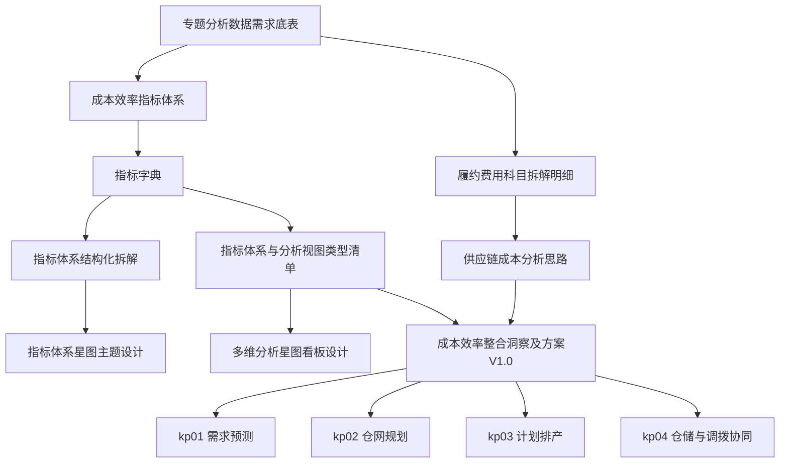

# 供应链成本指标全链路优化专题包本地化与资产分层蓝图

## 1. 核心判断

`供应链成本指标全链路优化/` 是 `scm/` 分枝中最需要重点处理的专题包。它不是普通归档，也不是可忽略的外部链接集合。

当前 16 个文件的真实状态是：

- 每个文件都保留了钉钉外部文档 `source_url`、原始文件名、迁移路径和相关链接。
- 本地正文目前主要是“原始信息 + 相关链接”，不是完整业务正文。
- 外部链接实测会跳转到 `login.dingtalk.com`，当前环境无法直接抓取正文。
- 因此本专题包应按“外部文档占位 + 本地重建任务包 + 供应链专题核心索引”处理。

## 2. 专题包定位

这个文件夹承接的是“供应链成本效率”专项，不应被简单归入 `ref/`。它对应供应链专题的项目工作流主线：

```text
data 数据底座
  -> plan 分析与看板方案
  -> reference 业务问答与背景
  -> report 管理层整合洞察
  -> tactic 四个执行节点
```

它与 `ref/books/供应链36%方案_Page6节点/` 的关系是：

| 位置 | 角色 |
|---|---|
| `scm/供应链成本指标全链路优化/` | 当前供应链成本专题包入口，保留外部文档关系和项目任务拆分 |
| `ref/books/供应链36%方案_Page6节点/` | 目前更完整的本地推理链、成本分析正式稿、Page6 节点方案和汇报资产 |
| `scm/02_Momcozy_KPI体系设计.md` | 指标体系和公式来源 |
| `scm/03_指标树图可视化/` | 指标树可视化和综合满意度框架 |

## 3. 文件分层与优先级

### 3.1 Data 层

| 文件 | 项目角色 | 优先级 | 本地化策略 |
|---|---|---:|---|
| `（data）课题一：专题分析数据需求底表.md` | 数据需求入口 | P0 | 重建为字段需求表，明确数据源、字段、粒度、口径、Owner |
| `（data）课题一：供应链履约费用科目拆解明细.md` | 费用科目入口 | P0 | 重建采购、头程、仓储、尾程、退换补发、小包直邮费用科目 |
| `（data）课题一：供应链成本效率-指标体系.md` | 成本效率指标入口 | P0 | 对齐 `SC-*` 指标，建立成本效率指标字典 |
| `（data）课题一：供应链指标体系-指标字典.md` | 指标字典入口 | P0 | 从 `scm/02` 抽出结构化指标字段 |
| `（data）课题一：供应链指标体系-结构化拆解.md` | 指标分层入口 | P0 | 建立 L1/L2/L3/L4 指标树与节点映射 |

### 3.2 Plan 层

| 文件 | 项目角色 | 优先级 | 本地化策略 |
|---|---|---:|---|
| `（plan）课题一：供应链成本分析思路.md` | 成本分析方法入口 | P0 | 对齐 `ref/books/供应链36%方案_Page6节点/供应链课题/供应链成本分析思路.md` |
| `（plan）课题一：供应链指标体系与分析视图类型清单.md` | 指标与视图映射入口 | P0 | 建立指标 -> 图表 -> 问题 -> 动作映射 |
| `（plan）课题一：供应链指标体系-星图主题设计.md` | 星图主题入口 | P1 | 对齐 `03_指标树图可视化/`，转化为看板信息架构 |
| `（plan）课题一：供应链多维分析星图看板设计.md` | 看板设计入口 | P1 | 设计专题总览、成本深拆、节点归因、执行闭环四类页面 |
| `（plan）课题一：供应链洞察故事线与指标体系.md` | 管理层叙事入口 | P1 | 对齐 `07-供应链成本优化方案评估报告_故事线与指标体系.md` |

### 3.3 Reference / Report 层

| 文件 | 项目角色 | 优先级 | 本地化策略 |
|---|---|---:|---|
| `（reference）课题一：电商供应链业务QA.md` | 业务问答入口 | P2 | 用于沉淀术语解释、口径争议、业务判断边界 |
| `（report）课题一：供应链成本效率整合洞察及方案V1.0.md` | 管理层报告入口 | P0 | 对齐本地正式稿，形成可汇报版本 |

### 3.4 Tactic 层

| 文件 | 项目角色 | 优先级 | 本地化策略 |
|---|---|---:|---|
| `（tactic）课题一：kp01-需求预测执行方案.md` | 预测节点执行包 | P1 | 重建输入字段、预测粒度、回测指标、补货触发动作 |
| `（tactic）课题一：kp02-仓网规划执行方案.md` | 仓网节点执行包 | P1 | 重建区域仓角色、仓网评分、调拨收益、服务半径 |
| `（tactic）课题一：kp03-计划排产执行方案.md` | 计划节点执行包 | P1 | 重建 PSI、PO、在途、补货版本和计划节奏 |
| `（tactic）课题一：kp04-仓储与调拨协同执行方案.md` | 调拨节点执行包 | P1 | 重建缺货/库龄双阈值、调拨优先级、执行闭环 |

## 4. 文件依赖关系



## 5. 可用本地重建来源

| 待重建内容 | 优先使用的本地来源 |
|---|---|
| 成本分析思路与正式稿 | `ref/books/供应链36%方案_Page6节点/供应链课题/供应链成本分析思路.md`、`供应链成本分析正式稿_费用深拆版.md`、`供应链成本分析正式稿_叙事版.md` |
| 经营问题树与指标口径 | `ref/books/供应链36%方案_Page6节点/02-企业问题树与指标口径重构.md` |
| 八节点治理框架 | `ref/books/供应链36%方案_Page6节点/03-Page6八节点战略战术战斗全景方案.md` |
| 平台与主题宽表 | `ref/books/供应链36%方案_Page6节点/04-供应链大数据平台与算法模型方案.md` |
| 路线与执行计划 | `ref/books/供应链36%方案_Page6节点/06-实施路线图与执行计划.md` |
| 四个重点节点执行方案 | `ref/books/供应链36%方案_Page6节点/08-重点节点01-需求预测执行方案.md` 到 `11-重点节点04-仓储与调拨协同执行方案.md` |
| 指标和公式 | `scm/02_Momcozy_KPI体系设计.md`、`scm/03_指标树图可视化/xmind/Momcozy_融合指标树_完整版.md` |

## 6. 执行顺序与状态

### Phase A. Data 层本地化

**状态**：已完成首版本地重建。

1. 已重建 `专题分析数据需求底表`，补充统一维度、主题宽表、P0 取数清单和数据质量验收。
2. 已重建 `供应链履约费用科目拆解明细`，补充节点成本科目、分摊规则、指标映射和核算验收。
3. 已重建 `供应链成本效率-指标体系`，补充经营层、节点层、执行层指标和诊断规则。
4. 已重建 `供应链指标体系-指标字典`，从 `scm/02` 抽取 `SC-*` 与 `FD-*` 核心指标，形成公式、维度、频率、Owner 和主题宽表映射。
5. 已重建 `供应链指标体系-结构化拆解`，连接 L1 经营指标、L2 成本/履约维度、L3 节点指标、L4 执行动作和四个 tactic 文件。

### Phase B. Plan / Report 层本地化

**状态**：已完成首版本地重建。

1. 已重建 `供应链成本分析思路`，补充分析目标、链路、输入数据、诊断规则和输出物。
2. 已重建 `供应链指标体系与分析视图类型清单`，补充指标到视图、主题宽表和图表选型映射。
3. 已重建 `供应链指标体系-星图主题设计`，补充主题树、节点主题卡和星图导航规则。
4. 已重建 `供应链多维分析星图看板设计`，补充页面架构、交互规则、RAG 健康规则和 MVP 范围。
5. 已重建 `供应链洞察故事线与指标体系`，补充五幕叙事、指标故事线和报告结构。
6. 已重建 `供应链成本效率整合洞察及方案 V1.0`，补充高管摘要、结构洞察、八节点治理、路线图、验收和拍板事项。

### Phase C. Tactic 层本地化

**状态**：已完成首版本地重建。

1. 已重建 `kp01` 需求预测，补充输入字段、指标阈值、执行 SOP、升级规则、阶段目标和节点接口。
2. 已重建 `kp02` 仓网规划，补充区域策略、仓型角色、调拨候选池、红线规则和节点接口。
3. 已重建 `kp03` 计划排产，补充 RCCP/MPS/PSI、PO 管控、冻结窗口、红线规则和节点接口。
4. 已重建 `kp04` 仓储与调拨协同，补充库龄治理、调拨决策、逆向恢复、阶段目标和节点接口。

### Phase D. 产品化拆分与数据任务蓝图

**状态**：已完成首版产品化拆分。

1. 已新增 `01_专题包_产品化拆分与数据任务蓝图.md`，将专题包从文档重建推进到产品化任务拆分。
2. 已明确 `指标字典 -> 主题宽表 -> 看板 PRD -> SQL / Agent 数据任务 -> 验收治理` 的落地链路。
3. 已筛出 P0 指标种子、6 类主题宽表、MVP 看板页面和 `SCM-DATA-*`、`SCM-BI-*`、`SCM-AGENT-*` 任务清单。
4. 已完成 `SCM-DATA-001` 指标字典种子表规格和 `SCM-DATA-002` 成本主题宽表规格；真实 SQL 需等源系统、源表和字段确认后再落盘。
5. 已完成 `SCM-BI-001` 经营结果总览 PRD 和 `SCM-BI-002` 成本结构归因 PRD，并同步 V01-V07 视图组件清单。
6. 已完成 `SCM-BI-003` 库存健康 PRD 和 `SCM-BI-004` 逆向闭环 PRD，并同步 V08、V11、V12 视图组件清单。
7. 已完成 `SCM-DATA-003` 库存健康宽表规格和 `SCM-DATA-006` 逆向物流宽表规格。
8. 已完成 `SCM-DATA-004` 供应商绩效宽表规格和 `SCM-DATA-005` 履约稳定宽表规格。
9. 已完成 `SCM-AGENT-001/002/003` 任务规格，固定成本异常诊断、库存健康诊断和管理层摘要的触发条件、输入、输出结构、推理链、护栏和验收规则。
10. 已完成 `SCM-RUNTIME-001` 原型运行时规格路由，三类 SCM 输入可命中对应 `scm-*` 虚拟任务；真实宽表未接入时只输出 Grey 状态、任务规格和数据缺口。
11. 已完成 `SCM-SOURCE-001` 真实数据源确认矩阵，明确本地参考工作簿、主项目数据契约和 Phase mock 不能替代生产源表；下一步需要补真实库名、表名、字段、Owner、权限和样本数据。
12. 已完成 `SCM-SOURCE-002` 真实源系统确认包，明确源域登记、目标宽表样本包、权限环境、验收状态和外部确认决策；真实源表、Owner、权限和样本仍需外部业务/数据团队提供。
13. 已完成 `SCM-DQ-001` 样本质量校验规格，明确通用 DQ 检查项、目标宽表专项检查、结果记录模板、验收门槛和输出边界；真实 DQ 执行仍等待外部样本。
14. 已完成 `SCM-SQL-001` SQL 初稿前置规格，明确 SQL 构建顺序、宽表结构契约、P0 字段契约、审查清单和非生产模板；真实 SQL 文件仍需等待 DQ 通过后再落盘。

## 7. 当前约束

- 钉钉外部链接当前不可直接读取，实测跳转到登录页。
- 本地文件已保留外部关系图谱；Data、Plan、Report、Tactic 层均已完成首版本地重建。
- 已完成产品化拆分蓝图、`SCM-DATA-001/002/003/004/005/006` 首版规格、`SCM-BI-001/002/003/004` 首版 PRD、`SCM-AGENT-001/002/003` 首版任务规格、`SCM-RUNTIME-001` 原型运行时规格路由、`SCM-SOURCE-001` 真实数据源确认矩阵、`SCM-SOURCE-002` 真实源系统确认包、`SCM-DQ-001` 样本质量校验规格和 `SCM-SQL-001` SQL 初稿前置规格；但尚未确认真实生产数据源、表名、字段和样本，因此不能伪造可执行 SQL。
- 在没有外部授权正文前，本地化应明确标注“基于本地资料重建”，不能伪装成钉钉原文复制。
- 若后续拿到钉钉正文，应以本蓝图为核对清单，逐项合并差异，而不是覆盖本地重建稿。
