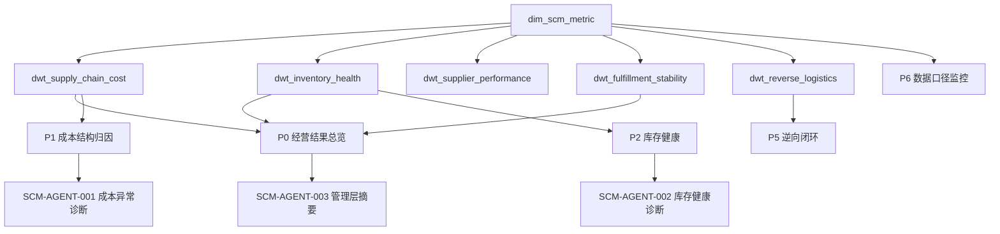

# 供应链成本指标全链路优化专题包产品化拆分与数据任务蓝图

## 1. 定位

本文件把 `供应链成本指标全链路优化/` 从研究专题包推进到数据产品任务包。

当前专题包已经完成：

- Data 层：字段、费用科目、指标体系、指标字典、结构化拆解。
- Plan 层：分析思路、视图清单、星图主题、看板设计、故事线。
- Report 层：管理层整合洞察及方案 V1.0。
- Tactic 层：`kp01` 需求预测、`kp02` 仓网规划、`kp03` 计划排产、`kp04` 仓储与调拨协同。

下一步不再继续扩写研究正文，而是拆成可执行的数据产品交付链：

```text
指标字典
  -> 主题宽表
  -> 看板 PRD
  -> SQL / Agent 数据任务
  -> 验收与治理
```

## 2. 产品化边界

| 不做 | 原因 |
|---|---|
| 不直接写生产 SQL | 当前缺少真实库表名、字段类型和数据库环境 |
| 不伪造钉钉原文 | 外部链接仍需登录，当前只能基于本地资料重建 |
| 不把所有指标一次性上线 | 首版应先覆盖 P0 经营判断和高价值下钻 |
| 不把模型自动执行 | 预测、调拨、预警先做建议和人工确认 |

| 要做 | 交付形态 |
|---|---|
| 固定 P0 指标 | 指标字典种子表 |
| 固定主题宽表 | DWT 宽表任务说明 |
| 固定 MVP 看板 | 看板 PRD 页面清单 |
| 固定 Agent 任务 | 可由 Data Agent 执行的查询/诊断任务 |
| 固定验收规则 | 数据质量、口径、看板、动作闭环验收 |

## 3. P0 指标种子

首版只抽取能支撑管理层判断和节点动作的 P0 指标。

| metric_code | metric_name | domain | source_table | 用途 | 上线优先级 |
|---|---|---|---|---|---:|
| SC-L1-001 | 全链路供应链成本率 | 成本 | `dwt_supply_chain_cost` | 北极星指标 | P0 |
| SC-L1-002 | 物流费用增长率/销售额增长率 | 成本 | `dwt_supply_chain_cost` | 判断成本增速是否跑赢收入 | P0 |
| SC-L1-003 | 全链路同比降本率 | 成本 | `dwt_supply_chain_cost` | 评估真实降本 | P0 |
| SC-IN-L3-003 | 采购物流成本优化率 | 采购 | `dwt_supplier_performance` | 采购端对冲诊断 | P0 |
| SC-IN-L3-001 | 头程运输成本率 | 头程 | `dwt_supply_chain_cost` | 头程成本诊断 | P0 |
| SC-IV-L4-002 | 库存周转天数 | 库存 | `dwt_inventory_health` | 库存现金流诊断 | P0 |
| SC-IV-L3-004 | 长期仓储费占比 | 库存 | `dwt_inventory_health` | 超龄库存诊断 | P0 |
| SC-OUT-L3-001 | 尾程配送成本率 | 尾程 | `dwt_fulfillment_stability` | 成本体验联动 | P0 |
| FD-L1-001 | 综合履约满意度指数 | 履约 | `dwt_fulfillment_stability` | 降本护栏 | P0 |
| FD-IV-L4-003 | 缺货率 | 库存 | `dwt_inventory_health` | 降库存护栏 | P0 |

## 4. 主题宽表任务

### 4.1 `dwt_supply_chain_cost`

| 项 | 定义 |
|---|---|
| 粒度 | 月/区域/国家/渠道/GTM/品类/SKU/成本节点 |
| 核心字段 | `biz_date`、`year_month`、`region`、`country`、`channel`、`gtm_group`、`category`、`sku`、`sales_amount`、`procurement_cost`、`first_mile_cost`、`warehousing_cost`、`last_mile_cost`、`return_reship_cost`、`direct_mail_cost`、`total_sc_cost`、`total_sc_cost_rate` |
| 支撑视图 | V01、V02、V03、V04、V05、V06、V07 |
| 数据来源 | 财务、ERP、物流对账、平台账单 |
| 验收 | 四项费用率可复现 MAT2025P2/MAT2026P2 对比 |

### 4.2 `dwt_inventory_health`

| 项 | 定义 |
|---|---|
| 粒度 | 日/区域/国家/仓/SKU/渠道/GTM |
| 核心字段 | `biz_date`、`region`、`country`、`warehouse_id`、`warehouse_type`、`channel`、`gtm_group`、`sku`、`on_hand_qty`、`in_transit_qty`、`open_po_qty`、`available_qty`、`inv_amount`、`inv_days`、`aging_90p_amount`、`aging_180p_amount`、`stockout_flag`、`stockout_risk_score` |
| 支撑视图 | V01、V08、V09、V12 |
| 数据来源 | ERP、WMS、采购系统、计划系统 |
| 验收 | 能计算全链条库存、周转、90+/180+ 库龄和缺货风险 |

### 4.3 `dwt_supplier_performance`

| 项 | 定义 |
|---|---|
| 粒度 | 月/供应商/GTM/品类/SKU |
| 核心字段 | `biz_date`、`supplier_id`、`supplier_name`、`gtm_group`、`category`、`sku`、`purchase_amount`、`baseline_cost`、`actual_cost`、`cost_down_rate`、`on_time_rate`、`quality_pass_rate`、`price_competitiveness`、`supplier_level` |
| 支撑视图 | V02、V04、V09、采购专题页 |
| 数据来源 | ERP、采购系统、质检系统 |
| 验收 | 能解释采购费率上行和供应商结构差异 |

### 4.4 `dwt_fulfillment_stability`

| 项 | 定义 |
|---|---|
| 粒度 | 订单/包裹/国家/渠道/仓/物流商 |
| 核心字段 | `order_id`、`shipment_id`、`biz_date`、`country`、`channel`、`warehouse_id`、`carrier_id`、`ship_cost`、`first_mile_hours`、`warehouse_process_hours`、`last_mile_hours`、`delivery_success_flag`、`damage_lost_flag`、`sla_met_flag`、`fulfillment_score` |
| 支撑视图 | V01、V10、P4 履约成本与体验 |
| 数据来源 | OMS、WMS、TMS、平台物流 |
| 验收 | 能同时展示尾程成本率、时效、妥投、异常件率 |

### 4.5 `dwt_reverse_logistics`

| 项 | 定义 |
|---|---|
| 粒度 | 退货单/SKU/渠道/国家/原因 |
| 核心字段 | `return_id`、`order_id`、`biz_date`、`sku`、`channel`、`country`、`return_reason_code`、`responsibility_type`、`return_shipping_cost`、`reship_cost`、`inspection_cost`、`repack_cost`、`sellable_recovery_flag`、`processing_hours` |
| 支撑视图 | V11、P5 逆向与治理闭环 |
| 数据来源 | 退货系统、客服、WMS、财务 |
| 验收 | 退货原因编码覆盖率、返仓可售率、48h 归因达标率可计算 |

### 4.6 `scm_action_tracking`

| 项 | 定义 |
|---|---|
| 粒度 | action_id |
| 核心字段 | `action_id`、`metric_code`、`node_name`、`owner_name`、`issue_type`、`root_cause`、`action_desc`、`due_date`、`status`、`expected_metric_delta`、`actual_metric_delta`、`closed_at` |
| 支撑视图 | V12、P5、管理层待拍板事项 |
| 数据来源 | PMO、业务 Owner、看板异常工单 |
| 验收 | 红色异常必须能落到 Owner、动作、截止日和验收指标 |

## 5. MVP 看板 PRD

### 5.1 P0 经营结果总览

| 项 | 定义 |
|---|---|
| 用户 | CFO、供应链 VP、经营管理层 |
| 核心问题 | 成本改善是否真实且可持续 |
| 模块 | 北极星、目标区间、成本对冲、区域差异、待拍板事项 |
| 指标 | `SC-L1-001`、`SC-L1-002`、`SC-L1-003`、`SC-IV-L4-002`、`FD-L1-001` |
| 图表 | KPI 卡、趋势线、瀑布图、RAG 矩阵 |
| 验收 | 首页能同时回答“改善、对冲、风险、动作” |

### 5.2 P1 成本结构归因

| 项 | 定义 |
|---|---|
| 用户 | 财务 BP、供应链总监、节点 Owner |
| 核心问题 | 哪个节点驱动成本率异常 |
| 模块 | 六类成本、四项重算、区域瀑布、渠道指纹、负责人矩阵 |
| 指标 | 采购、头程、仓储、尾程、退换补发、直邮成本率 |
| 图表 | 费用堆叠、瀑布、热力矩阵、排序表 |
| 验收 | 每个高成本组合显示第一/第二驱动项 |

### 5.3 P2 库存健康与现金流

| 项 | 定义 |
|---|---|
| 用户 | 计划、仓储、采购、供应链 VP |
| 核心问题 | 库存是否拖累现金流和仓储成本 |
| 模块 | 在库/在途/未交 PO、库龄、周转、现货满足、调拨候选 |
| 指标 | `SC-IV-L4-002`、`SC-IV-L3-004`、`FD-IV-L4-003` |
| 图表 | 库龄瀑布、库存热力图、供需缺口矩阵 |
| 验收 | 90+/180+ 库存和缺货风险能联动展示 |

### 5.4 P5 逆向与治理闭环

| 项 | 定义 |
|---|---|
| 用户 | 客服、质控、仓储、PMO |
| 核心问题 | 退货补发是否重复发生，是否闭环 |
| 模块 | 退货原因、责任归因、返仓恢复、动作闭环 |
| 指标 | 退货率、补发率、返仓可售率、48h 归因达标率 |
| 图表 | 帕累托、归因矩阵、闭环漏斗 |
| 验收 | TOP 原因必须绑定责任人和整改状态 |

### 5.5 P6 数据口径与模型监控

| 项 | 定义 |
|---|---|
| 用户 | 数据 Owner、IT、BI、算法 |
| 核心问题 | 指标能不能信，数据能不能用 |
| 模块 | 指标状态、宽表质量、刷新状态、预警命中、模型漂移 |
| 指标 | 完整性、一致性、及时性、唯一性、预警闭环率 |
| 图表 | 状态表、质量趋势、预警漏斗 |
| 验收 | Grey 状态禁止输出强结论 |

## 6. SQL / Agent 任务拆分

| task_id | 任务 | 输入 | 输出 | Done 标准 |
|---|---|---|---|---|
| SCM-DATA-001 | 指标字典种子表 | 指标字典文件 | `dim_scm_metric` 设计 | P0 指标有 code、公式、Owner、宽表 |
| SCM-DATA-002 | 成本宽表任务 | 成本数据需求底表、费用科目拆解 | `dwt_supply_chain_cost` 规格 | 可计算四项费用率和总成本率 |
| SCM-DATA-003 | 库存健康宽表任务 | 库存字段、kp02、kp04 | `dwt_inventory_health` 规格 | 可计算周转、库龄、缺货 |
| SCM-DATA-004 | 供应商绩效宽表任务 | 指标字典、kp03 | `dwt_supplier_performance` 规格 | 可解释采购端上行 |
| SCM-DATA-005 | 履约稳定宽表任务 | 指标字典、kp04 | `dwt_fulfillment_stability` 规格 | 可联动尾程成本和体验 |
| SCM-DATA-006 | 逆向物流宽表任务 | 费用科目、kp04 | `dwt_reverse_logistics` 规格 | 可计算退货、补发、返仓恢复 |
| SCM-BI-001 | 经营结果总览 PRD | V01、P0 页面 | 看板 PRD | 能回答改善、对冲、风险、动作 |
| SCM-BI-002 | 成本结构归因 PRD | V02-V07 | 看板 PRD | 高成本组合能下钻第一/第二驱动 |
| SCM-BI-003 | 库存健康 PRD | V08、kp02、kp04 | 看板 PRD | 库龄、周转、缺货可联动 |
| SCM-BI-004 | 逆向闭环 PRD | V11、动作台账 | 看板 PRD | TOP 原因绑定整改状态 |
| SCM-AGENT-001 | 成本异常诊断 Agent 任务 | `dwt_supply_chain_cost` | 异常解释文本 | 输出驱动项、Owner、建议动作 |
| SCM-AGENT-002 | 库存健康诊断 Agent 任务 | `dwt_inventory_health` | 库存风险文本 | 输出超龄/缺货/调拨候选 |
| SCM-AGENT-003 | 管理层摘要 Agent 任务 | P0/P1/P2/P5 数据 | 高管摘要 | 按故事线输出 5 条事实和 3 个动作 |
| SCM-RUNTIME-001 | SCM Agent 运行时规格路由 | `SCM-AGENT-001/002/003` | `scm-*` 虚拟任务输出 | 三类输入可命中对应任务，真实宽表未接入时输出 Grey |
| SCM-SOURCE-001 | 真实数据源确认矩阵 | 本地工作簿、全局数仓契约、SCM 宽表规格 | 源系统矩阵和阻断项 | 区分本地参考与生产待确认，不进入 SQL |
| SCM-SOURCE-002 | 真实源系统确认包 | `SCM-SOURCE-001`、目标宽表规格 | 源域登记表、样本包要求、权限与验收门槛 | 明确外部确认项，未拿到真实库表和样本前不进入 SQL |
| SCM-DQ-001 | 样本质量校验规格 | `SCM-SOURCE-002`、目标宽表样本 | DQ 检查项、专项校验、结果模板和验收门槛 | 未拿到真实样本前只保留规格，P0 通过后才进入 SQL |
| SCM-SQL-001 | SQL 初稿前置规格 | `SCM-DQ-001`、P0 宽表规格 | SQL 构建顺序、结构契约、字段契约和审查清单 | 未通过 DQ 前不创建正式 SQL 文件 |

## 7. Agent 任务规格

### 7.1 `SCM-AGENT-001` 成本异常诊断

| 项 | 规格 |
|---|---|
| 用户 | CFO、供应链 VP、财务 BP、成本节点 Owner |
| 触发条件 | `SC-L1-001` 或节点成本率进入 Red / Amber；物流费用增速高于销售额增速；区域、渠道、GTM、SKU 组合出现高成本异常 |
| 输入宽表 | `dim_scm_metric`、`dwt_supply_chain_cost`、`dwt_supplier_performance`、`dwt_fulfillment_stability`、`scm_action_tracking` |
| 必需筛选 | `year_month`、`mat_period`、`region`、`country`、`channel`、`gtm_group`、`category`、`sku`、`cost_node` |
| 输出形态 | 异常解释文本、驱动项列表、责任人、建议动作、证据引用 |
| 禁止输出 | 数据 Grey 状态下的强结论；没有指标和宽表证据的根因判断；没有 Owner 的动作建议 |

标准输出字段：

| 字段 | 含义 |
|---|---|
| `agent_task_id` | 固定为 `SCM-AGENT-001` |
| `metric_code` | 异常指标，如 `SC-L1-001`、`SC-IN-L3-001`、`SC-OUT-L3-001` |
| `scope` | 异常范围，按区域、渠道、GTM、品类、SKU、成本节点表达 |
| `current_value` | 当前指标值 |
| `target_value` | 指标目标或阈值 |
| `delta_vs_baseline` | 相对同期、目标或基线的偏差 |
| `first_driver` | 第一驱动项 |
| `second_driver` | 第二驱动项 |
| `owner_name` | 责任 Owner |
| `recommended_action` | 建议动作 |
| `confidence_level` | `high` / `medium` / `low` |
| `data_quality_status` | `Green` / `Amber` / `Red` / `Grey` |
| `evidence_refs` | 指标、宽表、看板页面或动作台账引用 |

推理链：

1. 校验 `metric_code` 是否存在于 `dim_scm_metric`，且 `data_quality_status` 不是 `Grey`。
2. 对比当前值、目标值、同期值或 MAT 基线，确认异常幅度。
3. 按采购、头程、仓储、尾程、退换补发、小包直邮拆分节点贡献。
4. 下钻区域、渠道、GTM、品类、SKU，识别高成本组合。
5. 关联 `scm_action_tracking`，判断是否已有动作、Owner 和截止日。
6. 输出驱动项、责任人和建议动作；若证据不足，输出数据缺口，不输出根因。

Done 标准：

1. 每条异常必须引用至少 1 个 `metric_code` 和 1 个主题宽表。
2. 每条建议动作必须有 `owner_name`，否则只能进入“待分派事项”。
3. `confidence_level=low` 时只能输出“待验证假设”，不能输出确定性结论。

### 7.2 `SCM-AGENT-002` 库存健康诊断

| 项 | 规格 |
|---|---|
| 用户 | 计划、仓储、采购、供应链 VP |
| 触发条件 | 库存周转恶化；90+/180+ 库龄金额上升；缺货率进入 Red / Amber；出现调拨候选组合 |
| 输入宽表 | `dim_scm_metric`、`dwt_inventory_health`、`dwt_supply_chain_cost`、`scm_action_tracking` |
| 必需筛选 | `biz_date`、`region`、`country`、`warehouse_id`、`warehouse_type`、`channel`、`gtm_group`、`category`、`sku` |
| 输出形态 | 库存风险文本、超龄 SKU 列表、缺货风险列表、调拨候选、建议动作 |
| 禁止输出 | 自动调拨指令；缺少在库、在途、未交 PO 任一核心字段时的确定性调拨建议 |

标准输出字段：

| 字段 | 含义 |
|---|---|
| `agent_task_id` | 固定为 `SCM-AGENT-002` |
| `risk_type` | `aging` / `stockout` / `turnover` / `transfer_candidate` |
| `sku` | 风险 SKU |
| `warehouse_id` | 仓库 |
| `inventory_state` | 在库、在途、未交 PO、可用库存的摘要 |
| `risk_value` | 库龄金额、缺货风险分、库存周转天数或调拨收益 |
| `cost_impact` | 对仓储成本、缺货损失或调拨成本的影响 |
| `recommended_action` | 清货、补货、调拨、冻结采购、复盘预测等动作 |
| `owner_name` | 计划、仓储、采购或 PMO Owner |
| `data_quality_status` | `Green` / `Amber` / `Red` / `Grey` |
| `evidence_refs` | 库存宽表、成本宽表、看板页面或动作台账引用 |

推理链：

1. 校验库存核心字段完整性：在库、在途、未交 PO、可用库存、库龄、缺货风险。
2. 分别识别超龄风险、缺货风险、周转风险和调拨候选。
3. 对同一 SKU 同时存在超龄与缺货的跨仓组合，优先进入调拨候选池。
4. 对调拨候选计算预估收益、调拨成本、服务风险和执行优先级。
5. 关联动作台账，避免重复创建同一 SKU 同一仓的未闭环事项。
6. 输出风险摘要和候选动作；证据不足时输出数据缺口。

Done 标准：

1. 超龄、缺货、周转、调拨四类风险至少覆盖前三类。
2. 调拨候选必须同时显示来源仓、目标仓、收益、成本和风险。
3. `data_quality_status=Grey` 时只允许输出“数据不可判定”。

### 7.3 `SCM-AGENT-003` 管理层摘要

| 项 | 规格 |
|---|---|
| 用户 | CEO、CFO、供应链 VP、经营管理层 |
| 触发条件 | 管理层查看 P0 总览；月度或 MAT 周期复盘；成本、库存、履约、逆向任一主题出现 Red |
| 输入数据 | P0 经营结果总览、P1 成本结构归因、P2 库存健康、P5 逆向闭环、`dim_scm_metric`、`scm_action_tracking` |
| 输出形态 | 5 条事实、3 个动作、待拍板事项 |
| 禁止输出 | 没有指标证据的泛化结论；重复事实；没有 Owner 和验收指标的动作 |

摘要结构：

| 模块 | 输出要求 |
|---|---|
| 事实 1 | 北极星结果：成本率、降本率或费用增速关系 |
| 事实 2 | 第一驱动：最大成本节点或区域组合 |
| 事实 3 | 库存风险：周转、库龄或缺货护栏 |
| 事实 4 | 履约护栏：满意度、时效、妥投或事故 |
| 事实 5 | 治理闭环：红色事项、超期动作或责任缺口 |
| 动作 1 | 成本节点治理动作 |
| 动作 2 | 库存或调拨动作 |
| 动作 3 | 管理层待拍板动作 |

每条事实必须包含：

| 字段 | 含义 |
|---|---|
| `metric_code` | 指标编码 |
| `fact_text` | 事实文本 |
| `current_value` | 当前值 |
| `delta_text` | 与目标、同期或基线的差异 |
| `evidence_refs` | 看板页面、宽表或动作台账引用 |

每条动作必须包含：

| 字段 | 含义 |
|---|---|
| `action_text` | 动作内容 |
| `owner_name` | 责任人 |
| `due_date` | 截止日 |
| `expected_metric_delta` | 预期指标改善 |
| `decision_needed` | 是否需要管理层拍板 |

推理链：

1. 从 P0 判断经营结果：成本改善是否真实，是否有库存或履约对冲风险。
2. 从 P1 找第一驱动：成本节点、区域、渠道、GTM 或 SKU 组合。
3. 从 P2 判断库存现金流护栏：周转、库龄、缺货和调拨候选。
4. 从 P5 判断逆向和治理闭环：责任归因、重复发生、超期动作。
5. 压缩为“结果 -> 驱动 -> 风险 -> 动作 -> 拍板”的管理层故事线。

Done 标准：

1. 输出不超过 5 条事实和 3 个动作。
2. 每条事实必须有 `metric_code` 与 `evidence_refs`。
3. 每条动作必须有 Owner、截止日和预期指标影响。
4. 涉及 Grey 数据时必须标注“不可判定”，不能进入管理层强结论。

## 8. 依赖关系



## 9. 验收顺序

1. 指标验收：P0 指标公式、Owner、频率、宽表映射完整。
2. 数据验收：核心宽表满足粒度、字段、刷新和质量规则。
3. 看板验收：P0/P1/P2/P5/P6 能按全局筛选下钻。
4. Agent 验收：输出必须引用指标和数据，不允许凭空给建议。
5. 业务验收：红色异常必须进入 `scm_action_tracking` 并闭环。

## 10. 下一步执行建议

`SCM-DATA-001/002/003/004/005/006`、`SCM-BI-001/002/003/004`、`SCM-AGENT-001/002/003`、`SCM-RUNTIME-001`、`SCM-SOURCE-001`、`SCM-SOURCE-002`、`SCM-DQ-001` 与 `SCM-SQL-001` 已完成首版规格落地：

1. `SCM-DATA-001` 已落入 `（data）课题一：供应链指标体系-指标字典.md`，固定 `dim_scm_metric` 字段结构、P0 种子指标和验收规则。
2. `SCM-DATA-002` 已落入 `（data）课题一：专题分析数据需求底表.md` 与 `（data）课题一：供应链履约费用科目拆解明细.md`，固定 `dwt_supply_chain_cost` 粒度、字段、费用节点、分摊规则和验收条件。
3. `SCM-BI-001` 与 `SCM-BI-002` 已落入 `（plan）课题一：供应链多维分析星图看板设计.md`，固定 `P0 经营结果总览` 和 `P1 成本结构归因` 的页面目标、模块、交互、下钻和验收。
4. V01-V07 的视图组件、指标、图表和输出动作已落入 `（plan）课题一：供应链指标体系与分析视图类型清单.md`。
5. `SCM-BI-003` 与 `SCM-BI-004` 已落入 `（plan）课题一：供应链多维分析星图看板设计.md`，固定 `P2 库存健康与现金流` 和 `P5 逆向与治理闭环` 的页面目标、模块、下钻、闭环规则和验收。
6. V08、V11、V12 的视图组件、指标、图表和输出动作已落入 `（plan）课题一：供应链指标体系与分析视图类型清单.md`。
7. `SCM-DATA-003` 已落入 `（data）课题一：专题分析数据需求底表.md`，固定 `dwt_inventory_health` 粒度、字段、源系统映射和验收规则。
8. `SCM-DATA-006` 已落入 `（data）课题一：专题分析数据需求底表.md` 与 `（data）课题一：供应链履约费用科目拆解明细.md`，固定 `dwt_reverse_logistics` 粒度、字段、费用枚举、原因编码、责任归因和验收规则。
9. `SCM-DATA-004` 与 `SCM-DATA-005` 已落入 `（data）课题一：专题分析数据需求底表.md`，固定 `dwt_supplier_performance` 与 `dwt_fulfillment_stability` 的粒度、字段、源系统映射和验收规则。
10. `SCM-AGENT-001/002/003` 已落入本文件，固定成本异常诊断、库存健康诊断和管理层摘要的触发条件、输入、输出结构、推理链、护栏和验收规则。
11. `SCM-RUNTIME-001` 已落入 `main_project_lute/agent/intent_parser.py`、`main_project_lute/agent/skills_router.py`、`main_project_lute/engine/data_processor.py` 和 `main_project_lute/engine/result_formatter.py`；三类 SCM 输入可命中对应 `scm-*` 任务，当前在真实宽表未接入时只输出 Grey 状态、任务规格和数据缺口。
12. `SCM-SOURCE-001` 已落入 `（data）课题一：专题分析数据需求底表.md`，固定本地证据盘点、目标宽表源表确认矩阵、源表确认问题清单、数据质量状态门槛和 SQL 前置门禁。
13. `SCM-SOURCE-002` 已落入 `（data）课题一：专题分析数据需求底表.md`，固定源域登记表、目标宽表样本包要求、权限环境清单、验收状态和外部确认决策。
14. `SCM-DQ-001` 已落入 `（data）课题一：专题分析数据需求底表.md`，固定通用 DQ 检查项、目标宽表专项检查、结果记录模板、验收门槛和输出边界。
15. `SCM-SQL-001` 已落入 `（data）课题一：专题分析数据需求底表.md`，固定 SQL 构建顺序、宽表 SQL 结构契约、P0 字段契约、审查清单和非生产模板。
16. 下一步等待业务或数据团队补真实 `database.schema.table`、字段清单、Owner、权限和样本数据；拿到样本并通过 DQ 后，才允许创建可执行 SQL 草稿。
