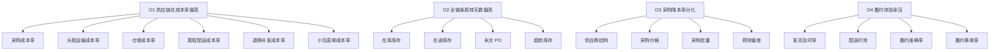

---

entity_id: ecom-70-1-data-2911
entity_type: resource
title: (data)课题一:供应链指标体系-结构化拆解
definition: '文档类型: 文档 > 来源链接: https://alidocs.dingtalk.com/i/nodes/qnYMoO1rWxbPOOYxuQ07LOMrJ47Z3je9?utm_scene=person_space'
taxonomy_path: 外部文档/跨境电商/70-专题研究/课题1:供应链成本指标全链路优化
created: '2026-04-25'
updated: '2026-06-02'
skill_ready: false
product_ready: false
legacy_fields:
  original_filename: (data)课题一:供应链指标体系-结构化拆解.url
  source_folder: 2026_04_25_【专题类】专题研究/【专题类】专题研究/课题1:供应链成本指标全链路优化/(data)课题一:供应链指标体系-结构化拆解.url
  migrated_at: 2026-04-25
doc_type: analysis
source: human+ai
owner: self
topic: "（data）课题一：供应链指标体系-结构化拆解"
module: "scm"
source_url: https://alidocs.dingtalk.com/i/nodes/qnYMoO1rWxbPOOYxuQ07LOMrJ47Z3je9?utm_scene=person_space
migrated_from: 20-Areas/跨境电商工作知识库
migrated_at: '2026-04-29'
related:
- 30-Resources/外部文档/跨境电商/70-专题研究/课题1:供应链成本指标全链路优化/(plan)课题一:供应链指标体系与分析视图类型清单
- 30-Resources/外部文档/跨境电商/70-专题研究/课题1:供应链成本指标全链路优化/(plan)课题一:供应链指标体系-星图主题设计
- 30-Resources/外部文档/跨境电商/70-专题研究/课题1:供应链成本指标全链路优化/(plan)课题一:供应链洞察故事线与指标体系
- 30-resources-moc-indexmocexternal-docs
status: stable
tags:
  - scm
  - supply-chain
  - data-rebuild

---
# （data）课题一：供应链指标体系-结构化拆解

> **文档类型**: 文档
> **来源链接**: [https://alidocs.dingtalk.com/i/nodes/qnYMoO1rWxbPOOYxuQ07LOMrJ47Z3je9?utm_scene=person_space](https://alidocs.dingtalk.com/i/nodes/qnYMoO1rWxbPOOYxuQ07LOMrJ47Z3je9?utm_scene=person_space)

---

## 原始信息
- 原始文件名: `（data）课题一：供应链指标体系-结构化拆解.url`
- 文件类型: URL 快捷方式
- 原始路径: `2026_04_25_【专题类】专题研究/【专题类】专题研究/课题1：供应链成本指标全链路优化/（data）课题一：供应链指标体系-结构化拆解.url`

## 相关链接

- [[40-Archives/url-placeholders/70-专题研究/课题1：供应链成本指标全链路优化/（plan）课题一：供应链指标体系与分析视图类型清单|（plan）课题一：供应链指标体系与分析视图类型清单]]
- [[40-Archives/url-placeholders/70-专题研究/课题1：供应链成本指标全链路优化/（plan）课题一：供应链指标体系-星图主题设计|（plan）课题一：供应链指标体系-星图主题设计]]
- [[40-Archives/url-placeholders/70-专题研究/课题1：供应链成本指标全链路优化/（plan）课题一：供应链洞察故事线与指标体系|（plan）课题一：供应链洞察故事线与指标体系]]

---

## 本地重建说明

本节为基于当前项目本地资料重建的指标结构化拆解，不等同于钉钉原文复制。拆解目标是把经营结果、节点表现、组织机制和数据能力串成可追责的供应链治理树。

## 1. 分层原则

| 层级 | 管理含义 | 典型问题 | 文件承接 |
|---|---|---|---|
| L1 经营结果层 | 判断供应链是否影响利润、现金流和增长质量 | 总成本率高、周转慢、降本无效 | Report 层 |
| L2 管理维度层 | 判断问题属于成本、库存、履约、质量还是组织协同 | 采购上行、库存超龄、尾程偏高 | Plan 层 |
| L3 节点表现层 | 定位到采购、头程、仓储、尾程、逆向、直邮等节点 | 哪个节点驱动异常 | Data + Plan 层 |
| L4 执行动作层 | 绑定 Owner 和动作指标 | 如何改、谁负责、何时验收 | Tactic 层 |

## 2. 经营问题树

## 3. L1 到 L4 指标树

| L1 目标 | L2 维度 | L3 节点指标 | L4 执行指标 | 责任动作 |
|---|---|---|---|---|
| 全链路供应链成本率 | 采购成本 | 采购物流成本优化率、采购费率 | 供应商降本率、采购价差、PO 偏差率 | 供应商分层、价格复盘、采购计划修正 |
| 全链路供应链成本率 | 头程成本 | 头程运输成本率、关税及合规成本率 | 海运单位成本、空运单位成本、整柜率、清关时效 | 运力方式优化、装载率提升、合规前置 |
| 全链路供应链成本率 | 仓储成本 | 仓储成本率、长期仓储费占比 | 库容利用率、月度仓储费/件、盘点准确率 | 仓容治理、长期库存清理、仓储账单核对 |
| 全链路供应链成本率 | 尾程成本 | 尾程配送成本率、订单履约成本率 | 单件发货成本、单订单履约成本、包装成本/件 | 尾程承运商策略、仓配路径优化 |
| 全链路供应链成本率 | 逆向成本 | 退货处理成本率 | 退货处理单成本、退货原因编码覆盖率 | 退货原因治理、补发规则复盘 |
| 全链条周转天数 | 库存健康 | 资金占用成本率、库存损耗率 | 库存周转天数、库龄结构健康度、现货满足率 | 补货节奏、调拨策略、超龄库存治理 |
| 综合履约满意度 | 时效 | 全链路时效达成率、发货及时率 | 订单处理时效、揽收时效、在途时效、末端配送时效 | 履约 SLA、仓内截单规则、承运商治理 |
| 综合履约满意度 | 质量 | 履约准确率、履约事故率、退货率 | 拣货准确率、打包合格率、破损丢失率 | 仓内质控、包装标准、异常闭环 |

## 4. 数据资产承接关系

| Data 文件 | 向下承接 | 向上支撑 |
|---|---|---|
| 专题分析数据需求底表 | 字段、维度、主题宽表、质量验收 | 全部 Data/Plan/Report 文件 |
| 履约费用科目拆解明细 | 成本节点、科目、分摊规则 | 成本分析思路、整合洞察报告 |
| 成本效率指标体系 | 管理指标、诊断规则、看板要求 | 星图主题设计、看板设计 |
| 指标字典 | 指标编码、公式、维度、Owner | 指标体系与分析视图类型清单 |
| 指标体系结构化拆解 | 经营问题树、指标树、责任动作 | 洞察故事线、四个 tactic 执行方案 |

## 5. 与四个 Tactic 文件的映射

| Tactic 文件 | 主要承接指标 | 主要解决问题 |
|---|---|---|
| `kp01-需求预测执行方案` | 预测偏差率、现货满足率、缺货率、库存周转天数 | 需求预测不准导致急采、缺货、库存积压 |
| `kp02-仓网规划执行方案` | 仓储成本率、库容利用率、尾程配送成本率、配送时效达成率 | 区域仓网与需求分布不匹配 |
| `kp03-计划排产执行方案` | PO 偏差率、在途库存、未交 PO、全链条周转天数 | 采购计划、生产计划、补货节奏不同步 |
| `kp04-仓储与调拨协同执行方案` | 库龄结构健康度、调拨成功率、超龄库存占比、现货满足率 | 缺货与超龄库存并存，调拨闭环弱 |

## 6. 视图拆解方向

| 视图 | 指标组合 | 目标用户 |
|---|---|---|
| 经营总览 | 总成本率、销售额、成本增速、全链条周转天数、综合履约满意度 | CEO/CFO/供应链 VP |
| 成本归因 | 采购、头程、仓储、尾程、退换补发、直邮成本率 | 财务 BP/供应链总监 |
| 库存健康 | 在库、在途、未交 PO、库龄、周转、资金占用 | 计划/仓储/采购 |
| 履约稳定 | 时效、准确率、事故率、单均履约成本 | 物流/仓储/客服 |
| 执行闭环 | 异常、责任人、动作、验收指标、复盘状态 | 节点 Owner |

## 7. 结构化验收标准

1. 每个 L1 指标必须能向下追到至少 2 个 L3 节点指标。
2. 每个 P0 节点指标必须绑定数据源、公式、Owner、频率和视图。
3. 每个 Tactic 文件必须引用 Data 层指标，不允许只写方法论。
4. 结构化拆解必须保留“经营问题 -> 节点指标 -> 执行动作 -> 验收指标”的链路。
5. 指标树如进入可视化，应优先使用本文件的层级，而不是重新发明一套结构。
