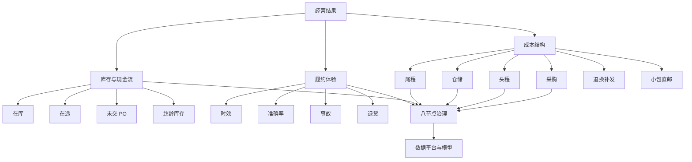

---

entity_id: ecom-70-1-plan-2a7e
entity_type: resource
title: (plan)课题一:供应链指标体系-星图主题设计
definition: '文档类型: 文档 > 来源链接: https://alidocs.dingtalk.com/i/nodes/o14dA3GK8gzPeegAf7kLL34xJ9ekBD76?utm_scene=person_space'
taxonomy_path: 外部文档/跨境电商/70-专题研究/课题1:供应链成本指标全链路优化
created: '2026-04-25'
updated: '2026-06-02'
skill_ready: false
product_ready: false
legacy_fields:
  original_filename: (plan)课题一:供应链指标体系-星图主题设计.url
  source_folder: 2026_04_25_【专题类】专题研究/【专题类】专题研究/课题1:供应链成本指标全链路优化/(plan)课题一:供应链指标体系-星图主题设计.url
  migrated_at: 2026-04-25
doc_type: workflow
source: human+ai
owner: self
topic: "（plan）课题一：供应链指标体系-星图主题设计"
module: "scm"
source_url: https://alidocs.dingtalk.com/i/nodes/o14dA3GK8gzPeegAf7kLL34xJ9ekBD76?utm_scene=person_space
migrated_from: 20-Areas/跨境电商工作知识库
migrated_at: '2026-04-29'
related:
- 30-Resources/外部文档/跨境电商/70-专题研究/课题1:供应链成本指标全链路优化/(plan)课题一:供应链指标体系与分析视图类型清单
- 30-Resources/外部文档/跨境电商/70-专题研究/课题1:供应链成本指标全链路优化/(plan)课题一:供应链洞察故事线与指标体系
- 30-resources-moc-indexmocexternal-docs
status: stable
tags:
  - scm
  - supply-chain
  - plan-rebuild

---
# （plan）课题一：供应链指标体系-星图主题设计

> **文档类型**: 文档
> **来源链接**: [https://alidocs.dingtalk.com/i/nodes/o14dA3GK8gzPeegAf7kLL34xJ9ekBD76?utm_scene=person_space](https://alidocs.dingtalk.com/i/nodes/o14dA3GK8gzPeegAf7kLL34xJ9ekBD76?utm_scene=person_space)

---

## 原始信息
- 原始文件名: `（plan）课题一：供应链指标体系-星图主题设计.url`
- 文件类型: URL 快捷方式
- 原始路径: `2026_04_25_【专题类】专题研究/【专题类】专题研究/课题1：供应链成本指标全链路优化/（plan）课题一：供应链指标体系-星图主题设计.url`

## 相关链接

- [[40-Archives/url-placeholders/70-专题研究/课题1：供应链成本指标全链路优化/（plan）课题一：供应链指标体系与分析视图类型清单|（plan）课题一：供应链指标体系与分析视图类型清单]]
- [[40-Archives/url-placeholders/70-专题研究/课题1：供应链成本指标全链路优化/（plan）课题一：供应链洞察故事线与指标体系|（plan）课题一：供应链洞察故事线与指标体系]]

---

## 本地重建说明

本节为基于当前项目本地资料重建的星图主题设计，不等同于钉钉原文复制。它用于定义“供应链成本效率专题”的主题树、节点关系和看板导航，不直接替代指标字典。

## 1. 星图定位

星图用于把供应链专题从线性报告改造成可导航的分析地图：

```text
经营结果
  -> 成本结构
  -> 节点健康
  -> 机制问题
  -> 数据与模型
  -> 执行动作
```

## 2. 一级主题

| 一级主题 | 主题目标 | 代表指标 | 连接文件 |
|---|---|---|---|
| 经营结果 | 判断成本改善是否真实 | 成本率、周转、超龄、履约满意度 | Report |
| 成本结构 | 判断费用如何拆解与对冲 | 采购、头程、仓储、尾程、逆向、直邮 | Data + Plan |
| 库存与现金流 | 判断库存是否拖累成本 | 在库、在途、未交 PO、库龄 | Tactic kp03/kp04 |
| 履约体验 | 判断降本是否伤害交付 | 时效、准确率、事故率、退货率 | Tactic kp04 |
| 八节点治理 | 判断动作归属和优先级 | 仓网、预测、计划、头程、仓储、调拨、尾程、逆向 | Tactic |
| 数据平台 | 判断能否稳定运营 | 主题宽表、指标服务、预警、模型 | Architecture |

## 3. 二级主题关系



## 4. 节点主题卡

| 节点 | 星图标签 | 关键问题 | 主指标 | 主动作 |
|---|---|---|---|---|
| 仓网规划 | 位置正确 | 库存是否在正确区域 | 区域周转、仓网覆盖、尾程成本率 | 仓网重评估、卫星仓策略 |
| 需求预测 | 判断正确 | 需求是否被正确预判 | MAPE、Bias、缺货率 | 预测回测、旺季修正 |
| 计划排产 | 节奏正确 | PO/补货/在途是否协同 | PO 准时率、未交 PO 周转 | PSI 周会、冻结窗口 |
| 头程 | 运输正确 | 运输方式和装载是否合理 | 头程成本率、整柜率 | 航线比选、批次合并 |
| 仓储 | 仓内正确 | 库龄和仓储成本是否健康 | 仓储成本率、库龄结构 | 清库、库位优化 |
| 调拨 | 匹配正确 | 缺货与冗余是否被动态平衡 | 调拨 ROI、调拨成功率 | 候选池、双阈值调拨 |
| 尾程 | 交付正确 | 成本与体验是否平衡 | 尾程成本率、妥投率 | 承运商分层、路由策略 |
| 逆向 | 闭环正确 | 退货补发是否重复发生 | 退货率、返仓可售率 | 原因编码、责任闭环 |

## 5. 星图导航规则

1. 用户从经营结果进入，不从单个节点进入。
2. 每个主题点击后必须能下钻到指标、视图、异常和动作。
3. 成本节点之间允许横向比较，但执行节点必须显示 Owner。
4. 星图颜色只表达健康状态，不表达美观装饰。
5. 红色节点必须链接到异常清单和责任动作，不允许只显示告警。
