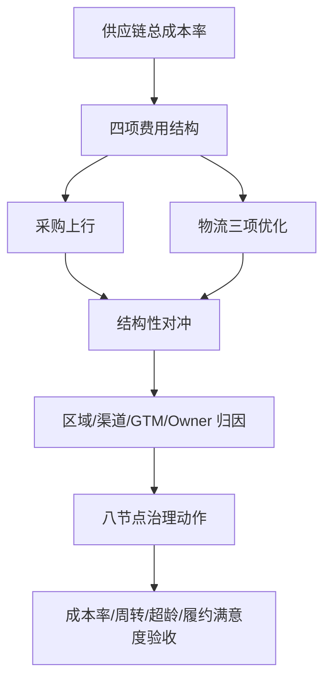

---

entity_id: ecom-70-1-plan-a2d4
entity_type: resource
title: (plan)课题一:供应链洞察故事线与指标体系
definition: '文档类型: 文档 > 来源链接: https://alidocs.dingtalk.com/i/nodes/ZgpG2NdyVXayeeqDhAOROK7PJMwvDqPk?utm_scene=person_space'
taxonomy_path: 外部文档/跨境电商/70-专题研究/课题1:供应链成本指标全链路优化
created: '2026-04-25'
updated: '2026-06-02'
skill_ready: false
product_ready: false
legacy_fields:
  original_filename: (plan)课题一:供应链洞察故事线与指标体系.url
  source_folder: 2026_04_25_【专题类】专题研究/【专题类】专题研究/课题1:供应链成本指标全链路优化/(plan)课题一:供应链洞察故事线与指标体系.url
  migrated_at: 2026-04-25
doc_type: workflow
source: human+ai
owner: self
topic: "（plan）课题一：供应链洞察故事线与指标体系"
module: "scm"
source_url: https://alidocs.dingtalk.com/i/nodes/ZgpG2NdyVXayeeqDhAOROK7PJMwvDqPk?utm_scene=person_space
migrated_from: 20-Areas/跨境电商工作知识库
migrated_at: '2026-04-29'
related:
- 30-Resources/外部文档/跨境电商/70-专题研究/课题1:供应链成本指标全链路优化/(data)课题一:供应链指标体系-指标字典
- 30-resources-moc-indexmocexternal-docs
status: stable
tags:
  - scm
  - supply-chain
  - plan-rebuild

---
# （plan）课题一：供应链洞察故事线与指标体系

> **文档类型**: 文档
> **来源链接**: [https://alidocs.dingtalk.com/i/nodes/ZgpG2NdyVXayeeqDhAOROK7PJMwvDqPk?utm_scene=person_space](https://alidocs.dingtalk.com/i/nodes/ZgpG2NdyVXayeeqDhAOROK7PJMwvDqPk?utm_scene=person_space)

---

## 原始信息
- 原始文件名: `（plan）课题一：供应链洞察故事线与指标体系.url`
- 文件类型: URL 快捷方式
- 原始路径: `2026_04_25_【专题类】专题研究/【专题类】专题研究/课题1：供应链成本指标全链路优化/（plan）课题一：供应链洞察故事线与指标体系.url`

## 相关链接

- [[40-Archives/url-placeholders/70-专题研究/课题1：供应链成本指标全链路优化/（data）课题一：供应链指标体系-指标字典|（data）课题一：供应链指标体系-指标字典]]

---

## 本地重建说明

本节为基于当前项目本地资料重建的洞察故事线，不等同于钉钉原文复制。它用于连接 Data 层指标体系与 Report 层管理结论。

## 1. 一句话故事线

MAT2026 供应链成本率呈现“表观改善、结构承压”：总成本率小幅下降，但采购端上行抵消物流优化，北美与部分渠道/品线的复合高成本说明问题已经从单项费用转为节点治理、仓网计划和数据口径的系统问题。

## 2. 五幕叙事

| 幕 | 叙事问题 | 关键证据 | 管理结论 |
|---|---|---|---|
| 第一幕：现状 | 成本改善是否足够 | 总成本率 `36.98% -> 36.24%`，仅改善 `-0.74pct` | 不能只看总成本率，要看结构 |
| 第二幕：对冲 | 谁抵消了优化 | 采购 `+1.29pct`，物流三项 `-2.01pct` | 采购端必须升级为 P0 战场 |
| 第三幕：差异 | 高成本在哪里 | 北美 vs 欧洲差异 `+10.63pct` | 区域和渠道必须差异化治理 |
| 第四幕：节点 | 为什么会发生 | 八节点：仓网、预测、计划、头程、仓储、调拨、尾程、逆向 | 单项压费不能解决系统失衡 |
| 第五幕：落地 | 如何稳定改善 | 30/60/90/180 路线图 | 以指标、宽表、看板、模型和动作闭环验收 |

## 3. 指标故事线

## 4. 管理层主张

| 主张 | 反面风险 | 指标支撑 |
|---|---|---|
| 从单项降本转为系统降本 | 单项压费可能造成断货、体验下降或成本转移 | 成本率、周转、履约满意度 |
| 把采购端列为 P0 主战场 | 物流侧优化会持续被采购上行吞噬 | 采购费率、采购降本率、供应商绩效 |
| 对北美建立复合治理 | 北美高成本不是单节点问题 | 区域费用瀑布、尾程/采购驱动项 |
| 用节点 Owner 承接行动 | 报告无法转成动作 | 指标 Owner、动作台账、闭环率 |
| 先口径后看板再模型 | 直接建模型会放大口径错误 | 指标字典、主题宽表、数据质量状态 |

## 5. 报告结构建议

| 章节 | 标题 | 目标 |
|---|---|---|
| 0 | 高管摘要 | 用 5 条事实建立决策焦点 |
| 1 | 现状诊断 | 说明总成本率改善不足以支撑效率结论 |
| 2 | 结构拆解 | 展示采购与物流对冲、区域差异、渠道成本指纹 |
| 3 | 组合归因 | 下沉到 GTM、渠道、负责人和国家月份 |
| 4 | 结构性问题 | 归纳 SKU、采购、仓网、尾程、逆向和数据问题 |
| 5 | 优化策略 | 输出 P0/P1/P2/P3 行动 |
| 6 | 路线图 | 对齐 30/60/90/180 天验收 |

## 6. 必须保留的指标

| 报告位置 | 必须指标 | 原因 |
|---|---|---|
| 高管摘要 | 总成本率、销售增速、采购费率、物流三项费率、北美欧洲差异 | 建立核心事实 |
| 结构拆解 | 四项费用率、第一/第二驱动项 | 定位主因 |
| 组合归因 | GTM×区域、GTM×渠道、负责人 | 连接责任 |
| 异常诊断 | 国家月份 z-score、销售环比、成本环比、放大类型 | 支撑预警 |
| 策略章节 | 成本率、周转、超龄、履约满意度、闭环率 | 验收执行 |

## 7. 叙事护栏

1. 不把“总成本率下降”叙述成“供应链效率全面改善”。
2. 不把“采购上行”归因给单一部门，需结合需求预测、计划排产和供应商结构。
3. 不把看板上线当作项目成功，必须回到成本率、周转和超龄库存。
4. 不使用没有 Data 层指标支撑的管理判断。
